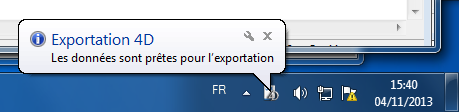

<!--REF #_command_.DISPLAY NOTIFICATION.Syntax-->**DISPLAY NOTIFICATION** ( *titre* ; *contenu* {; *durée*} )<!-- END REF-->
<!--REF #_command_.DISPLAY NOTIFICATION.Params-->
| Paramètre | Type |  | Description |
| --- | --- | --- | --- |
| titre | Text | &#8594;  | Titre de la notification |
| contenu | Text | &#8594;  | Texte de la notification |
| durée | Integer | &#8594;  | Délai d’affichage en secondes |

<!-- END REF-->

#### Description 

<!--REF #_command_.DISPLAY NOTIFICATION.Summary-->La commande **DISPLAY NOTIFICATION** provoque l’affichage d’un message de notification à destination de l'utilisateur.<!-- END REF--> 

Ce type de message est généralement utilisé par le système ou les applications pour informer l’utilisateur d’un événement (déconnexion réseau, disponibilité de mises à jour, etc.)

* Sous Windows, le message apparaît dans la zone de notification de la barre des tâches :  

* Sous OS X (version 10.8 minimum), le message apparaît dans une petite fenêtre glissant dans l’angle supérieur droit de l’écran.  
  
A noter que, conformément aux spécifications d’Apple, la notification n’est affichée que si l’application n’est pas au premier plan. Le message apparaît cependant toujours dans la liste du "notification center".

Passez dans les paramètres *titre* et *contenu* le titre et le texte du message à afficher (dans notre exemple, le titre est "Exportation 4D"). Vous pouvez saisir jusqu’à 255 caractères. 

Sous Windows, la fenêtre du message reste affichée tant qu'aucune activité n'a été détectée sur la machine, ou jusqu’à ce que l’utilisateur clique sur sa case de fermeture. Le paramètre facultatif *durée* permet de modifier la durée d'affichage par défaut. A noter que l'affichage des notifications dépend des configurations système. 

#### Exemple 

```4d
 DISPLAY NOTIFICATION("Exportation 4D";"Les données sont prêtes pour l’exportation")
```

#### Voir aussi 

[ALERT](alert.md)  

#### Propriétés
|  |  |
| --- | --- |
| Numéro de commande | 910 |
| Thread safe | &check; |
| Interdite sur le serveur ||


