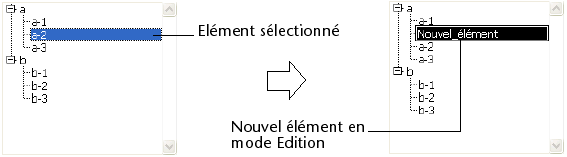
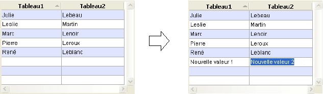

<!--REF #_command_.EDIT ITEM.Syntax-->**EDIT ITEM** ( {* ;} *objet* {; élément} )<!-- END REF-->
<!--REF #_command_.EDIT ITEM.Params-->
| Paramètre | Type |  | Description |
| --- | --- | --- | --- |
| * | Opérateur | &#8594;  | Si spécifié, objet est un nom d’objet (chaîne) Si omis, objet est un table ou une variable |
| objet | any | &#8594;  | Nom d’objet (si * spécifié) ou Table ou variable (si * omis) |
| élément | Integer | &#8594;  | Numéro d’élément |

<!-- END REF-->

*Cette commande n'est pas thread-safe, elle ne peut pas être utilisée dans du code préemptif.*


#### Description 

<!--REF #_command_.EDIT ITEM.Summary-->La commande **EDIT ITEM** permet de passer en “mode édition” l’élément courant ou l’élément de numéro *élément* du tableau ou de la liste désigné(e) par le paramètre *objet*.<!-- END REF-->   
Le mode édition signifie que l’élément est sélectionné et prêt à être modifié : la saisie d’un caractère remplacera intégralement le contenu de l’élément.

Si vous passez le paramètre optionnel *\**, vous indiquez que le paramètre *objet* est un nom d’objet (dans ce cas, passez une chaîne dans *objet*). Si vous ne passez pas le paramètre, vous indiquez que le paramètre *objet* est une table ou une variable. Dans ce cas, vous ne passez pas une chaîne mais une référence de table ou une variable.

Cette commande s’applique aux objets saisissables suivants :

* Listes hiérarchiques
* Colonnes de list box
* Sous-formulaires (dans ce cas, seul un nom d’objet — le sous-formulaire — peut être passé dans *objet*),
* Formulaires liste affichés via la commande [DISPLAY SELECTION](display-selection.md) ou [MODIFY SELECTION](modify-selection.md).

Si la commande est utilisée avec un objet saisissable qui n’est pas une liste, elle équivaut à la commande [GOTO OBJECT](goto-object.md).   
La commande ne fait rien si la liste ou le tableau désigné(e) est vide ou invisible. Si la liste ou le tableau n’est pas saisissable, la commande sélectionne (sans passer en édition) l’élément spécifié.  
Dans le cadre d'une list box, si la colonne n'autorise pas la saisie de texte (saisie par case à cocher ou menu déroulant uniquement), l'élément spécifié prend le focus.

Le paramètre facultatif *élément* vous permet de désigner la position de l’élément (liste hiérarchique) ou le numéro de la ligne (colonnes de list box, formulaire liste et sous-formulaire en mode “multi-sélection”) à passer en édition. Si vous ne passez pas ce paramètre, la commande s’applique à l’élément courant de l'*objet*. S’il n’y a pas d’élément courant, le premier élément de l'*objet* passe en édition.

**Notes :**

* Dans le cadre des sous-formulaires et des formulaires liste, la commande passe en édition le premier champ de la ligne spécifiée, dans l’ordre de saisie.
* Dans le cadre d'une list box affichée en mode hiérarchique, si l'élément visé appartient à un niveau hiérarchique contracté, le niveau ainsi que les éventuels niveaux parents sont automatiquement déployés afin que la ligne soit visible.

#### Exemple 1 

Cette commande peut être utile notamment lors de la création d’un nouvel élément de liste hiérarchique. Au moment de l’appel de la commande, le dernier élément ajouté ou inséré dans la liste devient automatiquement éditable, sans que l’utilisateur n’ait à effectuer d’action spécifique.   
Le code suivant pourrait être la méthode d’un bouton permettant d’insérer un nouvel élément dans une liste existante. Le libellé “Nouvel\_élément” proposé par défaut est automatiquement placé en mode édition :

```4d
 vlUniqueRef:=vlUniqueRef+1
 INSERT IN LIST(hList;*;"Nouvel_élément";vlUniqueRef)
 EDIT ITEM(*;"MaListe")
```



#### Exemple 2 

Soient deux colonnes d’une list box dont les noms de variables associées sont respectivement “Tableau1” et “Tableau2”. L’exemple suivant insère un nouvel élément dans les deux tableaux et passe le nouvel élément du tableau 2 en mode édition : 

```4d
 $vlNumLigne:=Size of array(Tableau1)+1
 LISTBOX INSERT ROWS(*;"MaListBox";$vlNumLigne)
 Tableau1{$vlNumLigne}:="Nouvelle valeur 1"
 Tableau2{$vlNumLigne}:="Nouvelle valeur 2"
 EDIT ITEM(Tableau2;$vlNumLigne)
```



#### Voir aussi 

[GOTO OBJECT](goto-object.md)  
[INSERT IN LIST](insert-in-list.md)  
[SET LIST ITEM](set-list-item.md)  