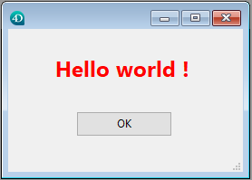

<!--REF #_command_.FORM Convert to dynamic.Syntax-->**FORM Convert to dynamic** ( {*uneTable* ;} *nomFormulaire* ) : Object<!-- END REF-->
<!--REF #_command_.FORM Convert to dynamic.Params-->
| Paramètre | Type |  | Description |
| --- | --- | --- | --- |
| uneTable | Table | &#8594;  | Table du formulaire |
| nomFormulaire | Text | &#8594;  | Nom d'un formulaire projet ou d'un formulaire table "classique" |
| Résultat | Object | &#8592; | formName converti en formulaire dynamique |

<!-- END REF-->

*Cette commande n'est pas thread-safe, elle ne peut pas être utilisée dans du code préemptif.*


#### Description 

<!--REF #_command_.FORM Convert to dynamic.Summary-->La commande **FORM Convert to dynamic** convertit le formulaire classique *nomFormulaire* en formulaire dynamique et le retourne sous forme d'objet.<!-- END REF-->

Les *formulaires classiques* sont des formulaires 4D stockés dans le fichier structure en format binaire. Les **formulaires dynamiques* sont des formulaires dont les structures sont définies via un un objet 4D (ou un fichier .json). Pour plus d'informations, veuillez consulter la section *Formulaires dynamiques*.

Si vous souhaitez convertir un formulaire table, passez la table dans le paramètre *uneTable* puis passez son nom dans la chaîne *nomFormulaire*. Pour un formulaire projet, passez directement le nom du formulaire directement dans *nomFormulaire*.

Pour pouvoir exécuter directement le formulaire en passant l'objet résultant à la commande [DIALOG](dialog.md), **FORM Convert to dynamic** applique des règles spécifiques lors de la conversion du formulaire :

* Les références aux listes sont exportées par nom, au lieu d'un pointeur JSON référençant le fichier lists.json.
* Les références aux filtres nommés et aux formats d'affichage nommés (préfixés par le caractère '|') sont exportées par valeur, au lieu d'un pointeur JSON référençant le fichier filters.json.
* Les images de la bibliothèque d'images n'étant pas exportées par la commande, les objets référençant une image de la bibliothèque d'images continuent de référencer la bibliothèque après la conversion. Dans leur propriété "icon", ils utilisent une URL "pictlib:xx" spécifique, où *xx* correspond à l'identifiant dans la bibliothèque.
* Les images statiques sont converties en propriétés d'objet de type image.
* Les objets obsolètes sont ignorés. Veuillez vous reporter au paragraphe pour consulter la liste des objets ou des propriétés qui ne sont pas pris en charge dans les formulaires dynamiques.

**Note :** Les références aux méthodes formulaire et aux méthodes objets sont exportées avec des ID internes, qui seront valides uniquement dans la base courante tant que les méthodes de *nomFormulaire* ne seront pas modifiées. Si vous souhaitez utiliser le formulaire exporté dans un autre contexte, vous devez associer des noms de méthodes projet à la propriété "method" du formulaire ou des objets du formulaire (voir l'exemple).

#### Exemple 

Vous souhaitez convertir, modifier et afficher un formulaire classique. 

Le formulaire initial :


  
```4d
 var $dynForm : Object
 $dynForm:=FORM Convert to dynamic("FormulaireAconvertir")
 $dynForm.pages[1].objects.TitleA:="rouge"
 $dynForm.pages[1].objects.bOK.method:="myMethod"  // associez une méthode projet
 DIALOG($dynForm)
```

  
Si vous exécutez le code : 

  


#### Voir aussi 

[DIALOG](dialog.md)  
[Export structure file](export-structure-file.md)  