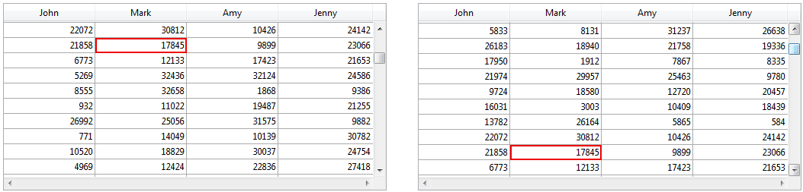

<!--REF #_command_.Form event code.Syntax-->**Form event code**  : Integer<!-- END REF-->
<!--REF #_command_.Form event code.Params-->
| Paramètre | Type |  | Description |
| --- | --- | --- | --- |
| Résultat | Integer | &#8592; | Numéro d'événement formulaire |

<!-- END REF-->

#### Compatibilité 

<!--REF #_command_.Form event code.Summary-->La commande **Form event code** était nommée **Evenement formulaire** dans les versions précédentes de 4D.<!-- END REF--> Elle a été renommée pour plus de clarté, depuis l'ajout de la commande [FORM Event](form-event.md) qui retourne un objet.

#### Description 

**Form event code** retourne une valeur numérique qui identifie le type d'événement formulaire qui vient de se produire. Généralement, **Form event code** s'utilise dans une méthode formulaire ou une méthode objet.

4D fournit des constantes prédéfinies (placées dans le thème *Evénements formulaire*) permettant de comparer les valeurs retournées par la commande **Form event code**. Certains événements sont génériques (générés pour tout type d'objet), d'autres sont spécifiques à un type d'objet particulier. 

| Constante                | Type        | Valeur | Comment                                                                                                                                                                                                                                                                                                                                                                                                                                                                                                                                                  |
| ------------------------ | ----------- | ------ | -------------------------------------------------------------------------------------------------------------------------------------------------------------------------------------------------------------------------------------------------------------------------------------------------------------------------------------------------------------------------------------------------------------------------------------------------------------------------------------------------------------------------------------------------------- |
| On Load                  | Entier long | 1      | Le formulaire s'affiche ou s'imprime                                                                                                                                                                                                                                                                                                                                                                                                                                                                                                                     |
| On Mouse Up              | Entier long | 2      | (*Images uniquement*) L'utilisateur vient de relâcher le bouton de la souris dans un objet Image                                                                                                                                                                                                                                                                                                                                                                                                                                                         |
| On Validate              | Entier long | 3      | La saisie des données dans l'enregistrement est validée                                                                                                                                                                                                                                                                                                                                                                                                                                                                                                  |
| On Clicked               | Entier long | 4      | Un clic est survenu sur un objet                                                                                                                                                                                                                                                                                                                                                                                                                                                                                                                         |
| On Header                | Entier long | 5      | L'en-tête du formulaire va être imprimé ou affiché                                                                                                                                                                                                                                                                                                                                                                                                                                                                                                       |
| On Printing Break        | Entier long | 6      | Une rupture du formulaire va être imprimée                                                                                                                                                                                                                                                                                                                                                                                                                                                                                                               |
| On Printing Footer       | Entier long | 7      | Le pied de page du formulaire va être imprimé                                                                                                                                                                                                                                                                                                                                                                                                                                                                                                            |
| On Display Detail        | Entier long | 8      | Un enregistrement va être affiché dans la liste ou une ligne va être affichée dans la list box                                                                                                                                                                                                                                                                                                                                                                                                                                                           |
| On VP Ready              | Entier long | 9      | (*Zones 4D View Pro uniquement*) Le chargement de la zone 4D View Pro est terminé                                                                                                                                                                                                                                                                                                                                                                                                                                                                        |
| On Outside Call          | Entier long | 10     | Le formulaire a reçu un appel de la commande [POST OUTSIDE CALL](post-outside-call.md)                                                                                                                                                                                                                                                                                                                                                                                                                                                                   |
| On Activate              | Entier long | 11     | La fenêtre du formulaire passe au premier plan                                                                                                                                                                                                                                                                                                                                                                                                                                                                                                           |
| On Deactivate            | Entier long | 12     | La fenêtre du formulaire passe en arrière-plan                                                                                                                                                                                                                                                                                                                                                                                                                                                                                                           |
| On Double Clicked        | Entier long | 13     | Un double-clic est survenu sur un objet                                                                                                                                                                                                                                                                                                                                                                                                                                                                                                                  |
| On Losing Focus          | Entier long | 14     | Un objet de formulaire perd le focus                                                                                                                                                                                                                                                                                                                                                                                                                                                                                                                     |
| On Getting Focus         | Entier long | 15     | Un objet de formulaire prend le focus                                                                                                                                                                                                                                                                                                                                                                                                                                                                                                                    |
| On Drop                  | Entier long | 16     | Des données sont déposées sur un objet                                                                                                                                                                                                                                                                                                                                                                                                                                                                                                                   |
| On Before Keystroke      | Entier long | 17     | Un caractère vient d'être saisi dans l'objet qui a le focus. [Get edited text](get-edited-text.md) retourne le contenu sans ce caractère                                                                                                                                                                                                                                                                                                                                                                                                                 |
| On Menu Selected         | Entier long | 18     | Une commande de menu a été sélectionnée                                                                                                                                                                                                                                                                                                                                                                                                                                                                                                                  |
| On Plug in Area          | Entier long | 19     | Un plug-in demande que sa méthode objet soit exécutée                                                                                                                                                                                                                                                                                                                                                                                                                                                                                                    |
| On Data Change           | Entier long | 20     | Les données d'un objet ont été modifiées                                                                                                                                                                                                                                                                                                                                                                                                                                                                                                                 |
| On Drag Over             | Entier long | 21     | Des données sont glissées sur un objet                                                                                                                                                                                                                                                                                                                                                                                                                                                                                                                   |
| On Close Box             | Entier long | 22     | On a cliqué sur la case de fermeture de la fenêtre                                                                                                                                                                                                                                                                                                                                                                                                                                                                                                       |
| On Printing Detail       | Entier long | 23     | Le corps du formulaire va être imprimé                                                                                                                                                                                                                                                                                                                                                                                                                                                                                                                   |
| On Unload                | Entier long | 24     | Le formulaire se referme et est déchargé                                                                                                                                                                                                                                                                                                                                                                                                                                                                                                                 |
| On Open Detail           | Entier long | 25     | Le formulaire détaillé associé au formulaire sortie ou à la listbox est sur le point d'être ouvert                                                                                                                                                                                                                                                                                                                                                                                                                                                       |
| On Close Detail          | Entier long | 26     | Le formulaire détaillé se referme et on retourne au formulaire sortie                                                                                                                                                                                                                                                                                                                                                                                                                                                                                    |
| On Timer                 | Entier long | 27     | Le nombre de ticks défini par [SET TIMER](set-timer.md) est atteint                                                                                                                                                                                                                                                                                                                                                                                                                                                                                      |
| On After Keystroke       | Entier long | 28     | Un caractère vient d'être saisi dans l'objet qui a le focus. [Get edited text](get-edited-text.md) retourne le contenu avec ce caractère.                                                                                                                                                                                                                                                                                                                                                                                                                |
| On Resize                | Entier long | 29     | La fenêtre du formulaire est redimensionnée                                                                                                                                                                                                                                                                                                                                                                                                                                                                                                              |
| On After Sort            | Entier long | 30     | (*List box uniquement*) Un tri standard vient d'être effectué dans une colonne de list box                                                                                                                                                                                                                                                                                                                                                                                                                                                               |
| On Selection Change      | Entier long | 31     | *List box* *et 4D View Pro* : la sélection courante de lignes ou de colonnes est modifiée *Enregistrements en liste* : l’enregistrement courant ou la sélection courante de lignes est modifié(e) dans un formulaire en liste ou un sous-formulaire *Liste hiérarchique* : la sélection dans la liste est modifiée à la suite d’un clic ou de la frappe d’une touche au clavier *Variable ou champ saisissable* : la sélection de texte ou la position du curseur dans la zone est modifiée à la suite d’un clic ou de la frappe d’une touche au clavier |
| On Column Moved          | Entier long | 32     | (*List box uniquement*) Une colonne de list box est déplacée par l’utilisateur via le glisser-déposer                                                                                                                                                                                                                                                                                                                                                                                                                                                    |
| On Column Resize         | Entier long | 33     | (*List box* *et 4D View Pro*) La largeur d’une colonne de list box est modifiée par l’utilisateur via la souris                                                                                                                                                                                                                                                                                                                                                                                                                                          |
| On Row Moved             | Entier long | 34     | (*List box uniquement*) Une ligne de list box est déplacée par l’utilisateur via le glisser-déposer                                                                                                                                                                                                                                                                                                                                                                                                                                                      |
| On Mouse Enter           | Entier long | 35     | Le curseur de la souris entre dans la zone graphique d’un objet                                                                                                                                                                                                                                                                                                                                                                                                                                                                                          |
| On Mouse Leave           | Entier long | 36     | Le curseur de la souris sort de la zone graphique d’un objet                                                                                                                                                                                                                                                                                                                                                                                                                                                                                             |
| On Mouse Move            | Entier long | 37     | Le curseur de la souris a bougé d’au moins un pixel OU une touche de modification (Ctrl, Alt, Verr Maj.) a été enfoncée. Si l'événement est coché pour un objet uniquement, il n'est généré que lorsque le curseur se trouve dans la zone graphique de l'objet                                                                                                                                                                                                                                                                                           |
| On Alternative Click     | Entier long | 38     | *Boutons 3D* : La zone “flèche” d'un bouton 3D reçoit un clic*List box* : Dans une colonne tableau d'objets, un bouton d'ellipse (attribut "alternateButton") reçoit un clic<br/>**Note**: Les boutons d'ellipses sont disponibles à partir de la v15 uniquement.                                                                                                                                                                                                                                                                                |
| On Long Click            | Entier long | 39     | (*Boutons 3D uniquement*) Un bouton 3D reçoit un clic et le bouton de la souris reste enfoncé pendant un certain laps de temps                                                                                                                                                                                                                                                                                                                                                                                                                           |
| On Load Record           | Entier long | 40     | En mode saisie en liste, un enregistrement est chargé en modification (l’utilisateur a cliqué sur la ligne de l’enregistrement et un champ passe en édition)                                                                                                                                                                                                                                                                                                                                                                                             |
| On Before Data Entry     | Entier long | 41     | (*List box uniquement*) Une cellule de list box est sur le point de passer en mode édition                                                                                                                                                                                                                                                                                                                                                                                                                                                               |
| On Header Click          | Entier long | 42     | (*List box* *et 4D View Pro*) Un clic est survenu dans l’en-tête d’une colonne de list box                                                                                                                                                                                                                                                                                                                                                                                                                                                               |
| On Expand                | Entier long | 43     | (*Listes hiérarchiques et List box hiérarchiques*) Un élément de liste hiérarchique ou de list box hiérarchique a été déployé via un clic ou une touche du clavier                                                                                                                                                                                                                                                                                                                                                                                       |
| On Collapse              | Entier long | 44     | (*Listes hiérarchiques et list box hiérarchiques*) Un élément de liste hiérarchique ou de list box hiérarchique a été contracté via un clic ou une touche du clavier                                                                                                                                                                                                                                                                                                                                                                                     |
| On After Edit            | Entier long | 45     | Le contenu de l'objet saisissable qui a le focus vient d'être modifié                                                                                                                                                                                                                                                                                                                                                                                                                                                                                    |
| On Begin Drag Over       | Entier long | 46     | Un objet est en cours de glisser                                                                                                                                                                                                                                                                                                                                                                                                                                                                                                                         |
| On Begin URL Loading     | Entier long | 47     | (*Zones Web uniquement*) Un nouvel URL est chargé dans la zone Web                                                                                                                                                                                                                                                                                                                                                                                                                                                                                       |
| On URL Resource Loading  | Entier long | 48     | (*Zones Web uniquement*) Une nouvelle ressource est chargée dans la zone Web                                                                                                                                                                                                                                                                                                                                                                                                                                                                             |
| On End URL Loading       | Entier long | 49     | (*Zones Web uniquement*) Toutes les ressources de l'URL ont été chargées                                                                                                                                                                                                                                                                                                                                                                                                                                                                                 |
| On URL Loading Error     | Entier long | 50     | (*Zones Web uniquement*) Une erreur s'est produite durant le chargement de l'URL                                                                                                                                                                                                                                                                                                                                                                                                                                                                         |
| On URL Filtering         | Entier long | 51     | (*Zones Web uniquement*) Un URL a été bloqué par la zone Web                                                                                                                                                                                                                                                                                                                                                                                                                                                                                             |
| On Open External Link    | Entier long | 52     | (*Zones Web uniquement*) Un URL externe a été ouvert dans le navigateur                                                                                                                                                                                                                                                                                                                                                                                                                                                                                  |
| On Window Opening Denied | Entier long | 53     | (*Zones Web uniquement*) Une fenêtre pop up a été bloquée                                                                                                                                                                                                                                                                                                                                                                                                                                                                                                |
| On bound variable change | Entier long | 54     | La variable liée à un sous-formulaire est modifiée.                                                                                                                                                                                                                                                                                                                                                                                                                                                                                                      |
| On Page Change           | Entier long | 56     | On a changé de page courante dans le formulaire                                                                                                                                                                                                                                                                                                                                                                                                                                                                                                          |
| On Footer Click          | Entier long | 57     | (*List box uniquement*) Un clic est survenu dans le pied d’une list box ou d’une colonne de list box                                                                                                                                                                                                                                                                                                                                                                                                                                                     |
| On Delete Action         | Entier long | 58     | (*Listes hiérarchiques et List box*) L’utilisateur a demandé à supprimer un élément                                                                                                                                                                                                                                                                                                                                                                                                                                                                      |
| On Scroll                | Entier long | 59     | *Variables ou champs image et List Box* : L'utilisateur fait défiler le contenu du champ image, de la variable image ou de la list box à l'aide de la souris ou d'une touche du clavier.                                                                                                                                                                                                                                                                                                                                                                 |
| On Row Resize            | Entier long | 60     | *(4D View Pro uniquement)* La hauteur d'une ligne est modifiée par l'utilisateur avec la souris                                                                                                                                                                                                                                                                                                                                                                                                                                                          |
| On VP Range Changed      | Entier long | 61     | La plage de cellules 4D View Pro a été modifiée (ex: calcul de formule, valeur supprimée d'une cellule, etc.)                                                                                                                                                                                                                                                                                                                                                                                                                                            |

**Note :** Les événements spécifiques des formulaires de sortie ne peuvent pas être utilisés avec les **formulaires projet**. Il s'agit de : Sur affichage corps, Sur ouverture corps, Sur fermeture corps, Sur chargement ligne, Sur entête, Sur impression corps, Sur impression sous total, Sur impression pied de page.

#### Evénements et méthodes 

Lorsqu'un événement formulaire se produit, 4D effectue les actions suivantes :

* En premier lieu, il examine chaque objet du formulaire et appelle la méthode de ceux dont la propriété d'événement correspondante a été sélectionnée et qui sont impliqués dans l'événement.
* Ensuite, il appelle la méthode formulaire si la propriété d'événement correspondante a été sélectionnée pour le formulaire.

Les différentes méthodes objet ne sont pas appelées dans un ordre particulier. La règle est que les méthodes objet sont toujours appelées avant la méthode formulaire. Dans le cas des sous-formulaires, les méthodes objet du formulaire sortie du sous-formulaire sont d'abord appelées, puis la méthode formulaire du formulaire sortie, puis enfin 4D appelle les méthodes objet du formulaire parent. Autrement dit, lorsqu'un objet est un sous-formulaire, 4D utilise la même règle pour les méthodes formulaire et objet dans le sous-formulaire.

Lorsque, pour un événement particulier, la propriété d'événement du formulaire n'est pas sélectionnée, cela n'empêche pas les appels aux méthodes des objets pour lesquels l'événement est sélectionné. Autrement dit, la sélection ou la désélection d'un événement au niveau du formulaire n'a pas d'effet sur les propriétés d'événements des objets. 

**ATTENTION :** Ce principe ne s'applique pas aux événements On Load et On Unload. Ces événements ne seront générés pour un objet que si les propriétés d'événement correspondantes ont été sélectionnées à la fois pour l'objet et pour le formulaire auquel il appartient. Si les propriétés sont sélectionnées pour l'objet uniquement, les événements ne seront pas générés ; ces deux événements doivent être sélectionnés au niveau du formulaire.

Le nombre d'objets impliqués par un événement dépend de la nature de l'événement. En particulier :

* Pour l'événement On Load, les méthodes objet de tous les objets du formulaire (sur toutes les pages) pour lequels la propriété d'événement On Load est sélectionnée seront appelées. Si l'événement On Load est sélectionné pour le formulaire, la méthode formulaire sera appelée.
* Pour les événements On Activate ou On Resize, aucune méthode objet ne sera appelée car ces événements s'appliquent au formulaire, pas à un objet en particulier. Par conséquent, si ces événements sont sélectionnés pour le formulaire, seule la méthode formulaire sera appelée.
* L'événement On Timer n'est généré que si la méthode formulaire contient un appel préalable à la commande [SET TIMER](set-timer.md). Seule la méthode formulaire reçoit cet événement, aucune méthode objet ne sera appelée.
* Pour l'événement On Drag Over, seule la méthode de l'objet déposable impliqué par l'événement sera appelée (si la propriété d'événement "Déposable" est sélectionnée pour l'objet). La méthode formulaire ne sera pas appelée.
* A l'inverse, pour l'événement On Begin Drag Over, la méthode objet ou la méthode formulaire de l'objet glissé sera appelée (si la propriété d'événement "Glissable" est sélectionnée pour l'objet).

**ATTENTION :** Contrairement aux autres événements, pendant un événement On Begin Drag Over, la méthode appelée est exécutée dans le contexte du process de l'objet source du glisser-déposer, et non dans celui du process de l'objet de destination. Pour plus d'informations, reportez-vous à la section *Présentation du Glisser-Déposer*.

* Si les événements On Mouse Enter, On Mouse Move et On Mouse Leave sont cochés pour le formulaire, ils sont générés pour chaque objet du formulaire. S’ils sont cochés pour un objet, ils sont générés pour cet objet uniquement. En cas de superposition d’objets, l’événement est généré par le premier objet capable de le gérer dans l’ordre des plans du haut vers le bas. Les objets rendus invisibles par la commande [OBJECT SET VISIBLE](object-set-visible.md) ne génèrent pas ces événements. Pendant la saisie d’un objet, les autres objets peuvent recevoir les événements de survol en fonction de la position de la souris.  
A noter que l'événement On Mouse Move est généré lorsque le curseur de la souris est déplacé mais également lorsque l'utilisateur appuie sur une touche de modification telle que **Maj**, **Verr. Maj**, **Ctrl** ou **Option** (ce principe permet notamment de gérer les glisser-déposer de type copie ou déplacement).
* Enregistrements en liste : l’enchaînement d’appels des méthodes et des événements formulaires dans les formulaires liste affichés via [MODIFY SELECTION](modify-selection.md) / [DISPLAY SELECTION](display-selection.md) et les sous-formulaires est le suivant :  

| Pour chaque objet de la zone d’en-tête :                                                                                                                                                                                                                    |  
| ----------------------------------------------------------------------------------------------------------------------------------------------------------------------------------------------------------------------------------------------------------- |  
| Méthode objet avec événement Sur entêteMéthode formulaire avec événement Sur entêtePour chaque enregistrement :Pour chaque objet de la zone de corps :Méthode objet avec événement Sur affichage corpsMéthode formulaire avec événement Sur affichage corps |
* L’appel depuis les événements On Display Detail et On Header d’une commande 4D provoquant l’affichage d’une boîte de dialogue est interdit et provoque une erreur de syntaxe. Les commandes concernées sont notamment : [ALERT](alert.md), [DIALOG](dialog.md), [CONFIRM](confirm.md), [Request](request.md), [ADD RECORD](add-record.md), [MODIFY RECORD](modify-record.md), [DISPLAY SELECTION](display-selection.md) et [MODIFY SELECTION](modify-selection.md).
* On Page Change : cet événement est disponible au niveau des formulaires uniquement (il est appelé dans la méthode formulaire). Il est généré à chaque changement de page courante du formulaire (à la suite d’un appel à la commande [FORM GOTO PAGE](form-goto-page.md) ou d’une action standard de navigation). A noter que l’événement est généré après le chargement complet de la page, c’est-à-dire une fois que tous les objets qu’elle contient sont initialisés (y compris les zones Web). Cet événement est utile pour exécuter du code qui nécessite que tous les objets soient initialisés au préalable. Il permet également d’optimiser l’application en n’exécutant du code (par exemple une recherche) qu’après l’affichage d’une page spécifique du formulaire et non dès le chargement de la page 1\. Si l’utilisateur n’accède pas à la page, le code n’est pas exécuté.

Le tableau suivant résume, pour chaque type d'événement, l'appel des méthodes formulaire et objet :

| **Evénement**            | **Méthode(s) objet**                   | **Méthode formulaire** | **Quel(s) objet(s)**  |
| ------------------------ | -------------------------------------- | ---------------------- | --------------------- |
| On Load                  | Oui                                    | Oui                    | Tous                  |
| On Unload                | Oui                                    | Oui                    | Tous                  |
| On Validate              | Oui                                    | Oui                    | Tous                  |
| On Clicked               | Oui (si cliquable ou saisissable) (\*) | Oui                    | Seul l'objet impliqué |
| On Double Clicked        | Oui (si cliquable ou saisissable) (\*) | Oui                    | Seul l'objet impliqué |
| On Before Keystroke      | Oui (si saisissable) (\*)              | Oui                    | Seul l'objet impliqué |
| On After Keystroke       | Oui (si saisissable) (\*)              | Oui                    | Seul l'objet impliqué |
| On After Edit            | Oui (si saisissable) (\*)              | Oui                    | Seul l'objet impliqué |
| On Getting Focus         | Oui (si tabulable) (\*)                | Oui                    | Seul l'objet impliqué |
| On Losing Focus          | Oui (si tabulable) (\*)                | Oui                    | Seul l'objet impliqué |
| On Activate              | Jamais                                 | Oui                    | Aucun                 |
| On Deactivate            | Jamais                                 | Oui                    | Aucun                 |
| On Outside Call          | Jamais                                 | Oui                    | Aucun                 |
| On Page Change           | Jamais                                 | Oui                    | Aucun                 |
| On Begin Drag Over       | Oui (si glissable) (\*\*)              | Oui                    | Seul l'objet impliqué |
| On Drop                  | Oui (si déposable) (\*\*)              | Oui                    | Seul l'objet impliqué |
| On Drag Over             | Oui (si déposable) (\*\*)              | Jamais                 | Seul l'objet impliqué |
| On Mouse Enter           | Oui                                    | Oui                    | Tous                  |
| On Mouse Move            | Oui                                    | Oui                    | Tous                  |
| On Mouse Leave           | Oui                                    | Oui                    | Tous                  |
| On Mouse Up              | Oui                                    | Jamais                 | Seul l'objet impliqué |
| On Menu Selected         | Jamais                                 | Oui                    | Aucun                 |
| On Bound variable change | Jamais                                 | Oui                    | Aucun                 |
| On Data Change           | Oui (si modifiable) (\*)               | Oui                    | Seul l'objet impliqué |
| On Plug in Area          | Oui                                    | Oui                    | Seul l'objet impliqué |
| On Header                | Oui                                    | Oui                    | Tous                  |
| On Printing Detail       | Oui                                    | Oui                    | Tous                  |
| On Printing Break        | Oui                                    | Oui                    | Tous                  |
| On Printing Footer       | Oui                                    | Oui                    | Tous                  |
| On Close Box             | Jamais                                 | Oui                    | Aucun                 |
| On Display Detail        | Oui                                    | Oui                    | Tous                  |
| On Open Detail           | Non sauf List box                      | Oui                    | Aucun sauf List box   |
| On Close Detail          | Non sauf List box                      | Oui                    | Aucun sauf List box   |
| On Resize                | Jamais                                 | Oui                    | Aucun                 |
| On Selection Change      | Oui (\*\*\*)                           | Oui                    | Seul l'objet impliqué |
| On Load Record           | Jamais                                 | Oui                    | Aucun                 |
| On Timer                 | Jamais                                 | Oui                    | Aucun                 |
| On Scroll                | Oui                                    | Jamais                 | Seul l'objet impliqué |
| On Before Data Entry     | Oui (List box)                         | Jamais                 | Seul l'objet impliqué |
| On Column Moved          | Oui (List box)                         | Jamais                 | Seul l'objet impliqué |
| On Row Moved             | Oui (List box)                         | Jamais                 | Seul l'objet impliqué |
| On Column Resize         | Oui (List box)                         | Jamais                 | Seul l'objet impliqué |
| On Header Click          | Oui (List box)                         | Jamais                 | Seul l'objet impliqué |
| On Footer Click          | Oui (List box)                         | Jamais                 | Seul l'objet impliqué |
| On After Sort            | Oui (List box)                         | Jamais                 | Seul l'objet impliqué |
| On Long Click            | Oui (Bouton 3D)                        | Oui                    | Seul l'objet impliqué |
| On Alternative Click     | Oui (Bouton 3D et List box)            | Jamais                 | Seul l'objet impliqué |
| On Expand                | Oui (Liste hiér. et List box)          | Jamais                 | Seul l'objet impliqué |
| On Collapse              | Oui (Liste hiér. et List box)          | Jamais                 | Seul l'objet impliqué |
| On Delete Action         | Oui (Liste hiér. et List box)          | Jamais                 | Seul l'objet impliqué |
| On URL Resource Loading  | Oui (Zone Web)                         | Jamais                 | Seul l'objet impliqué |
| On Begin URL Loading     | Oui (Zone Web)                         | Jamais                 | Seul l'objet impliqué |
| On URL Loading Error     | Oui (Zone Web)                         | Jamais                 | Seul l'objet impliqué |
| On URL Filtering         | Oui (Zone Web)                         | Jamais                 | Seul l'objet impliqué |
| On End URL Loading       | Oui (Zone Web)                         | Jamais                 | Seul l'objet impliqué |
| On Open External Link    | Oui (Zone Web)                         | Jamais                 | Seul l'objet impliqué |
| On Window Opening Denied | Oui (Zone Web)                         | Jamais                 | Seul l'objet impliqué |

(\*) Référez-vous ci-dessous au paragraphe "Evénements, objets et propriétés" pour plus d'informations.  
(\*\*) Référez-vous à la section *Présentation du Glisser-Déposer* pour plus d'informations.  
(\*\*\*) Seuls les objets de type List box, Liste hiérarchique et Sous-formulaire prennent en charge cet événement. 

**IMPORTANT :** Gardez constamment à l'esprit que, pour chaque événement, la méthode d'un formulaire ou d'un objet est appelée si l'événement correspondant a été sélectionné pour le formulaire ou l'objet. L'avantage de désactiver des événements en mode Développement (en utilisant la Liste des propriétés de l'éditeur de formulaires) est que vous pouvez réduire de manière très importante le nombre d'appels aux méthodes et donc optimiser la vitesse d'exécution des formulaires.

#### Evénements, objets et propriétés 

Une méthode objet est appelée si l'événement peut réellement se produire pour l'objet en fonction de sa nature et de ses propriétés. Ce paragraphe détaille les événements à utiliser pour gérer les différents types d'objets.  
A noter que la Liste des propriétés de l'éditeur de formulaires n'affiche que les événements compatibles avec l'objet sélectionné ou le formulaire. 

##### Objets cliquables 

Les objets cliquables sont gérés principalement avec la souris. Ces objets sont les suivants :

* Variables ou champs saisissables de type Booléen
* Boutons, boutons par défaut, boutons radio, cases à cocher, grilles de boutons
* Boutons 3D, boutons radio 3D, cases à cocher 3D
* Pop up menus, pop up menus hiérarchiques, menus Images
* Listes déroulantes, menus,
* Zones de défilement, listes hiérarchiques, list box et colonnes de list box
* Boutons invisibles, boutons inversés, boutons radio image
* Thermomètres, règles, cadrans
* Onglets,
* Séparateurs.

Lorsque l’événement On Clicked ou On Double Clicked est sélectionné pour un de ces objets, vous pouvez détecter et gérer les clics sur l'objet à l'aide de la commande **Form event code** qui retourne On Clicked ou On Double Clicked selon le cas.  
Si les deux événements sont sélectionnés pour un même objet, les événements On Clicked puis On Double Clicked seront générés en cas de double-clic sur l’objet. 

**Note :** A compter de 4D v14, les champs et variables saisissables contenant du texte (type texte, date, heure, numérique) génèrent également les événements On Clicked et On Double Clicked . 

Pour tous les objets cliquables, l'événement On Clicked se produit une fois que le bouton de la souris est relâché. Il y a cependant des exceptions : 

* Avec les boutons invisibles et les onglets, l'événement On Clicked se produit dès qu'un clic a été détecté — sans attendre le relâchement du bouton de la souris.
* Avec les thermomètres, règles et cadrans, si le format d'affichage indique que la méthode objet doit être appelée pendant que vous faites glisser les curseurs de contrôle, l'événement On Clicked survient dès que le clic est détecté.

Dans le contexte de l'événement On Clicked, vous pouvez tester le nombre de clics effectués par l'utilisateur à l'aide de la commande [Clickcount](clickcount.md).

**Note :** Quelques objets peuvent être activés par le clavier. Une case à cocher, par exemple, une fois qu'elle a le focus, peut être sélectionnée à l'aide de la barre d'espace. Dans ce cas, l'événement On Clicked est quand même généré. 

**ATTENTION :** Les combo-boxes ne sont pas considérées comme des objets cliquables. Une combo-box doit être perçue comme une zone de texte saisissable dont la liste déroulante fournit les valeurs par défaut. Par conséquent, vous gérez la saisie des données dans une combo-box à l'aide des événements On Before Keystroke, On After Keystroke et On Data Change.

**Note :** A compter de 4D v13, les objets de type pop up/liste déroulante et menu déroulant hiérarchique peuvent générer l'événement On Data Change. Ce principe vous permet de détecter l'activation de l'objet avec sélection d'une valeur différente de la valeur courante. 

##### Objets saisissables par clavier 

Les objets saississables par clavier sont des objets dans lesquels vous saisissez des données par le clavier et pour lesquels vous pouvez filtrer les données au plus bas niveau en détectant les événements On After Edit, On Before Keystroke, On After Keystroke et On Selection Change.  
Les objets et types de données saisissables sont les suivants :

* Tous les champs saisissables de type alpha, texte, date, heure, numérique ou (On After Edit uniquement) image
* Toutes les variables saisissables de type alpha, texte, date, heure, numérique ou (On After Edit uniquement) image
* Combo-boxes (sauf On Selection Change)
* List boxes

**Note :** A compter de 4D v14, les champs et variables saisissables contenant du texte (type texte, date, heure, numérique) génèrent également les événements On Clicked et On Double Clicked. 

**Note :** Bien qu'objets “saisissables”, les listes hiérarchiques ne gèrent pas les événements formulaire On After Edit, On Before Keystroke et On After Keystroke (voir aussi le paragraphe “Listes hiérarchiques” ci-dessous). 

* On Before Keystroke et On After Keystroke

**Note :** L'événement On After Keystroke peut généralement être avantageusement remplacé par l'événement On After Edit (cf. ci-dessous).   
Une fois que les événements On Before Keystroke et On After Keystroke ont été sélectionnés pour un objet, vous pouvez détecter et gérer la saisie par le clavier dans l'objet à l'aide de la commande **Form event code** qui va retourner On Before Keystroke puis On After Keystroke (pour plus d'informations, reportez-vous à la description de la commande [Get edited text](get-edited-text.md)). Ces événements sont également activés par les commandes du langage simulant une action utilisateur, telles que [POST KEY](post-key.md).  
A noter que les modifications des utilisateurs non effectuées via le clavier (coller, glisser-déposer, etc.) ne sont pas prises en compte. Pour traiter ces événements, vous devez utiliser On After Edit. 

**Note :** Les événements On Before Keystroke et On After Keystroke ne sont pas générés lors de l'utilisation d'une méthode d'entrée. Une méthode d'entrée (ou IME, Input Method Editor) est un programme ou un composant système permettant la saisie de caractères complexes ou de symboles (par exemple japonais ou chinois) à l'aide d'un clavier occidental.

* On After Edit  
Lorsqu’il est utilisé, cet événement est généré après chaque modification du contenu d’un objet saisissable, quelle que soit l’action à l’origine de cette modification, c'est-à-dire :  
\- les actions d’édition standard entraînant une modification du contenu telles que coller, couper, effacer ou annuler ;  
\- le déposer d’une valeur (action similaire au coller) ;  
\- toute saisie au clavier effectuée par l’utilisateur ; dans ce cas, l’événement On After Edit est généré après les événements On Before Keystroke et On After Keystroke s’ils sont utilisés.  
\- une modification effectuée via une commande du langage simulant une action utilisateur (i.e. [POST KEY](post-key.md)).  
Attention, les actions suivantes ne déclenchent PAS cet événement :  
\- les actions d’édition ne modifiant pas le contenu de la zone, comme copier ou tout sélectionner, ou le glisser d’une valeur (action similaire au copier) ; en revanche, ces actions modifient l'emplacement du curseur et déclenchent l'événement On Selection Change.  
\- les modifications de contenu effectuées par programmation, à l’exception des commandes simulant une action utilisateur.  
Cet événement permet de contrôler les actions utilisateur afin, par exemple, d’interdire de coller un texte trop volumineux, de filtrer certains caractères ou d’empêcher le couper d’un champ de mot de passe.
* On Selection Change : lorsqu'il est appliqué à un champ ou une variable de texte (saisissable ou non), cet événement est déclenché à chaque changement de position du curseur. C'est le cas par exemple dès que l'utilisateur sélectionne du texte à l'aide de la souris ou des touches fléchées du clavier, ou saisit du texte. Ce principe permet d'appeler par exemple des commandes telles que [GET HIGHLIGHT](get-highlight.md).

##### Objets modifiables 

Les objets modifiables sont des objets ayant une source de données, dont la valeur peut être modifiée à l'aide de la souris ou du clavier, mais qui ne sont pas gérés par l'événement On Clicked. Ces objets sont les suivants :

* Tous les champs saisissables (sauf BLOB)
* Toutes les variables saisissables (sauf BLOB, pointeurs et tableaux)
* Combo-boxes
* Objets externes (pour lesquels la saisie de données est validée par le plug-in)
* Listes hiérarchiques
* List box et colonnes de list box

Ces objets reçoivent les événements On Data Change. Lorsque la propriété d'événement On Data Change est sélectionnée pour un de ces objets, vous pouvez détecter et gérer la modification de la valeur de la source de données à l'aide de la commande **Form event code** qui retourne On Data Change. L'événement est généré dès que la variable associée à l'objet est mise à jour en interne par 4D (c'est-à-dire, en général, lorsque la zone de saisie de l'objet perd le focus). 

##### Objets tabulables 

Les objets tabulables sont ceux qui peuvent recevoir le focus lorsque vous utilisez la touche **Tab** et/ou si vous cliquez dessus. L'objet qui a le focus est celui qui reçoit les caractères saisis via le clavier et qui ne sont pas les modificateurs d'une commande de menu ou d'un objet tel qu'un bouton. 

TOUS les objets sont tabulables SAUF ceux listés ci-dessous :

* Variables ou champs non saisissables
* Grilles de boutons
* Boutons 3D, boutons radio 3D, cases à cocher 3D
* Pop-up/listes déroulantes
* Menus déroulants hiérarchiques
* Pop-up menus Image
* Zones de défilement
* Boutons invisibles, boutons inversés, boutons radio Images
* Graphes
* Objets externes (pour lesquels la saisie de données est validée par le plug-in 4D)
* Onglets
* Séparateurs

Lorsque les événements On Getting Focus et/ou On Losing Focus sont sélectionnés pour un objet tabulable, vous pouvez détecter et gérer la modification du focus à l'aide de la commande **Form event code** qui retournera On Getting Focus or On Losing Focus en fonction de l'événement. 

##### Boutons 3D 

Les boutons 3D autorisent la mise en place d’interfaces graphiques avancées (pour une description des boutons 3D, reportez-vous au manuel Mode Développement). Outre les événements génériques, deux événements spécifiques permettent de gérer de ces boutons : 

* On Long Click : cet événement est généré lorsqu’un bouton 3D reçoit un clic et que le bouton de la souris reste enfoncé pendant un certain laps de temps. En pratique, le délai à l’issue duquel l’événement est généré est égal au délai maximal séparant un double-clic, tel qu’il a été défini dans les préférences du système.  
Cet événement peut être généré pour tous les styles de boutons 3D, boutons radio 3D et cases à cocher 3D, à l’exception des boutons 3D “ancienne génération” (style Décalage du fond) et des zones de flèche des boutons 3D avec pop up menu (cf. ci-dessous).  
Cet événement est généralement utilisé pour afficher des pop up menus en cas de clics longs sur des boutons. L’événement On Clicked, s’il est coché, est généré si l’utilisateur relâche le bouton de la souris avant le délai du “clic long”.
* On Alternative Click : certains styles de boutons 3D peuvent être associés à un pop up menu et afficher une flèche. Un clic sur cette flèche fait généralement apparaître un menu de sélection proposant des actions alternatives supplémentaires en rapport avec l’action principale du bouton.  
4D vous permet de gérer ce type de bouton à l’aide de l'événement On Alternative Click. Cet événement est généré lorsque l’utilisateur clique sur la “flèche” (l'événement est généré dès que le bouton de la souris est enfoncé) :  
\- si le pop up menu est de type “Séparé”, l’événement est généré uniquement en cas de clic sur la zone fléchée du bouton.  
\- si le pop up menu est de type “Lié”, l’événement est généré en cas de clic sur n’importe quelle partie du bouton. A noter qu’avec ce type de bouton, l’événement On Long Click ne peut pas être généré.  


Les styles de boutons 3D, boutons radio 3D et cases à cocher 3D acceptant la propriété “Avec pop up menu” sont : Aucun, Bouton barre outils, Bevel, Bevel arrondi et Office XP.

##### List box 

Plusieurs événements formulaire permettent de prendre en charge les spécificités des list box : 

* On Before Data Entry : cet événement est généré juste avant qu’une cellule de list box passe en mode édition (c’est-à-dire, avant que le curseur de saisie soit affiché). Cet événement permet au développeur, par exemple, d’afficher un texte différent selon que l’utilisateur est en mode affichage ou édition.
* On Selection Change : cet événement est généré à chaque fois que la sélection courante de lignes ou de colonnes de la list box est modifiée. Cet événement est également généré pour les listes d’enregistrements et les listes hiérarchiques.
* On Column Moved : cet événement est généré lorsqu’une colonne de list box est déplacée par l’utilisateur via le glisser-déposer. Il n’est pas généré si la colonne est glissée et déposée à son emplacement initial. La commande [LISTBOX MOVED COLUMN NUMBER](listbox-moved-column-number.md) permet de connaître le nouvel emplacement de la colonne.
* On Row Moved : cet événement est généré lorsqu’une ligne de list box est déplacée par l’utilisateur via le glisser-déposer. Il n’est pas généré si la ligne est glissée et déposée à son emplacement initial.
* On Column Resize : cet événement est généré lorsque la largeur d’une colonne de list box est modifiée par l'utilisateur.
* On Expand et On Collapse : ces événements sont générés lorsqu'une ligne de list box hiérarchique est déployée ou contractée.
* On Header Click : cet événement est généré lorsqu’un clic se produit sur l’en-tête d’une colonne de list box. Dans ce cas, la commande [Self](self.md) permet de connaître l’en-tête de colonne sur laquelle le clic s’est produit. L’événement On Clicked est généré lorsqu’un clic droit (Windows) ou un Ctrl+clic (Mac OS) se produit sur une colonne ou un en-tête de colonne. Vous pouvez tester le nombre de clics effectués par l'utilisateur à l'aide de la commande [Clickcount](clickcount.md).  
Si la propriété **Triable** a été cochée pour la list box, il est possible d’autoriser ou non le tri standard sur la colonne en passant la valeur 0 ou -1 dans la variable $0 :  
\- Si $0 vaut 0, le tri standard est effectué.  
\- Si $0 vaut -1, le tri standard n’est pas effectué et l’en-tête n’affiche pas la flèche de tri. Le développeur peut toutefois générer un tri des colonnes sur des critères personnalisés à l’aide des commandes de gestion des tableaux de 4D.  
Si la propriété **Triable** n’a pas été cochée pour la list box, la variable $0 n’est pas utilisée.
* On Footer Click : cet événement est disponible pour l'objet list box ou colonne de list box. Il est généré lorsqu’un clic se produit dans la zone de pied de la list box ou de la colonne de list box. Dans ce cas, la commande [OBJECT Get pointer](object-get-pointer.md) retourne un pointeur vers la variable de pied ayant reçu le clic. L’événement est généré pour les clics gauche et droit. Vous pouvez tester le nombre de clics effectués par l'utilisateur à l'aide de la commande [Clickcount](clickcount.md).
* On After Sort : cet événement est généré juste après qu’un tri standard ait été effectué (i.e. il n’est pas généré si $0 retourne -1 dans l’événement On Header Click). Ce mécanisme est utile pour conserver le sens du dernier tri effectué par l’utilisateur. Dans cet événement, la commande [Self](self.md) retourne un pointeur sur la variable d'en-tête de la colonne ayant été triée.
* On Delete Action : cet événement est généré à chaque fois que l’utilisateur tente de supprimer la ou les ligne(s) sélectionnée(s) en appuyant sur une touche de suppression (**Suppr** ou **Ret. Arr.**) ou en sélectionnant la commande **Supprimer** dans le menu **Edition**. L’événement est disponible uniquement au niveau de l’objet list box. A noter que la génération de l’événement est la seule action effectuée par 4D : le programme ne supprime aucune ligne. Il appartient au développeur de prendre en charge la suppression et éventuellement l’affichage préalable d’un message d’alerte.
* On Scroll (nouveauté v15) : cet événement est généré dès que l'utilisateur fait défiler les lignes ou les colonnes de la list box. L'événement est uniquement généré lorsque le défilement est le résultat d'une action utilisateur : activation des barres et/ou des curseurs de défilement, utilisation de la roulette de la souris ou du clavier. Il n'est donc pas généré lorsque le défilement est provoqué par l'exécution de la commande [OBJECT SET SCROLL POSITION](object-set-scroll-position.md).  
Cet événement est généré après tous les autres événements liés à l'action de défilement (On Clicked, On After Keystroke, etc.). L'événement est généré uniquement dans la méthode objet (et non dans la méthode formulaire). Reportez-vous à l'exemple 15.
* On Alternative Click (nouveauté v15) : cet événement est généré dans les colonnes de list box de type tableau d'objets, lorsque l'utilisateur clique sur un bouton d'ellipse de widget (attribut "alternateButton"). Pour plus d'informations, reportez-vous à la section *Utiliser des tableaux objets dans les colonnes*.

Deux événements génériques sont également utilisables dans le contexte d'une list box de type "sélection" :

* On Open Detail : cet événement est généré lorsqu’un enregistrement est sur le point d’être affiché dans le formulaire détaillé associé à la list box (et avant que ce formulaire soit ouvert).
* On Close Detail : généré lorsqu’un enregistrement affiché dans le formulaire détaillé associé à la list box est sur le point d’être refermé (que l’enregistrement ait été modifié ou non).

##### Listes hiérarchiques 

Outre les événements génériques, plusieurs événements formulaires spécifiques permettent de prendre en charge les actions utilisateurs effectuées sur les listes hiérarchiques : 

* On Selection Change : cet événement est généré à chaque fois que la sélection dans la liste hiérarchique est modifiée à la suite d’un clic ou de la frappe d’une touche au clavier.  
Cet événement est également généré dans les objets list box et les listes d’enregistrements.
* On Expand : cet événement est généré à chaque fois qu’un élément de la liste hiérarchique a été déployé via un clic ou une touche du clavier.
* On Collapse : cet événement est généré à chaque fois qu’un élément de la liste hiérarchique a été contracté via un clic ou une touche du clavier.
* On Delete Action : cet événement est généré à chaque fois que l’utilisateur tente de supprimer le ou les élément(s) sélectionné(s) en appuyant sur une touche de suppression (**Suppr** ou **Ret. Arr.**) ou en sélectionnant la commande **Supprimer** dans le menu **Edition**. A noter que la génération de l’événement est la seule action effectuée par 4D : le programme ne supprime aucun élément. Il appartient au développeur de prendre en charge la suppression et éventuellement l’affichage préalable d’un message d’alerte (cf. exemple).

Ces événements ne sont pas mutuellement exclusifs. Ils peuvent être générés les uns après les autres pour une liste hiérarchique :  
\- Suite à la frappe d’une touche clavier (dans l’ordre) :  

| **Evénement**           | **Contexte**                                                             |
| ----------------------- | ------------------------------------------------------------------------ |
| On Data Change          | Un élément était en édition                                              |
| On Expand / On Collapse | Ouverture/fermeture de sous-liste à l’aide des touches fléchées -> ou <- |
| On Selection Change     | Sélection d’un nouvel élément                                            |
| On Clicked              | Activation de la liste par le clavier                                    |

  
\- Suite à un clic souris (dans l’ordre) :  

| **Evénement**                               | **Contexte**                                                                         |
| ------------------------------------------- | ------------------------------------------------------------------------------------ |
| On Data Change                              | Un élément était en édition                                                          |
| On Expand / On Collapse                     | Ouverture/fermeture de sous-liste via un clic sur l’icône de déploiement/contraction |
| ou bien                                     |                                                                                      |
| Double-clic sur une sous-liste non éditable |                                                                                      |
| On Selection Change                         | Sélection d’un nouvel élément                                                        |
| On Clicked / On Double Clicked              | Activation de la liste par un clic ou un double-clic                                 |

##### Variables et champs image 

* L'événement formulaire On Scroll est généré dès que l'utilisateur fait défiler une image à l'intérieur de la zone (variable ou champ) qui la contient. Il est possible de faire défiler le contenu d'une zone image lorsque la taille de la zone est inférieure à son contenu et que le format d'affichage est "**tronqué (non centré)**". Pour plus d'informations sur ce point, reportez-vous au paragraphe *Formats image*.  
L'événement est généré lorsque le défilement a pour origine une action utilisateur, quelle que soit cette action : utilisation des curseurs ou des barres de défilement, de la molette de la souris ou des touches de défilement du clavier (pour plus d'informations sur les commandes de défilement accessibles au clavier, reportez-vous à la section *Barres de défilement*). Il n'est donc pas généré lorsque l'image défile à la suite de l'exécution de la commande [OBJECT SET SCROLL POSITION](object-set-scroll-position.md). Cet événement est généré après tous les autres événements liés à l'action de défilement (On Clicked, On After Keystroke, etc.). Il est généré uniquement dans la méthode objet (et non dans la méthode formulaire). Reportez-vous à l'exemple 14\.
* (Nouveauté v16) L'événement On Mouse Up est généré lorsque l'utilisateur vient de relâcher le bouton de la souris alors qu'il était en train d'effectuer un glisser dans une zone image (champ ou variable). Cet événement est utile, par exemple, lorsque vous voulez permettre à l'utilisateur de déplacer, redimensionner ou dessiner des objets dans une zone SVG.  
Lorsque l'événement On Mouse Up est généré, vous pouvez récupérer les coordonnées locales de l'emplacement où le bouton de la souris a été relâché. Ces coordonnées sont retournées dans les *Variables système* **MouseX** et **MouseY**. Les coordonnées relatives sont exprimées en pixels par rapport au coin supérieur gauche de l'image (0,0).  
Lorsque vous utilisez cet événement, il est également nécessaire d'appeler la commande [Is waiting mouse up](is-waiting-mouse-up.md) pour traiter les cas où le "gestionnaire d'état" du formulaire est désynchronisé, c'est-à-dire lorsque l'événement On Mouse Up n'est jamais reçu après un clic. C'est le cas par exemple lorsqu'une boîte de dialogue d'alerte s'affiche au-dessus du formulaire alors que le bouton de la souris n'a pas encore été relâché. Pour plus d'informations et un exemple d'utilisation de l'événement On Mouse Up, veuillez vous référer à la description de la commande [Is waiting mouse up](is-waiting-mouse-up.md).  
    
**Note :** Si la propriété "Glissable" est cochée pour l'objet image, l'événement On Mouse Up n'est jamais généré.

##### Sous-formulaires 

Un objet conteneur de sous-formulaire (objet inclus dans le formulaire parent, contenant une instance de sous-formulaire) prend en charge les événements suivants :

* On Load et On Unload : respectivement ouverture et fermeture du sous-formulaire (ces événements doivent également avoir été activés au niveau du formulaire parent pour être pris en compte). A noter que ces événements sont générés avant ceux du formulaire parent. A noter également que, conformément aux principes de fonctionnement des événements formulaire, si le sous-formulaire est placé sur une page autre que la page 0 ou 1, ces événements ne sont générés qu’au moment de l’affichage/la fermeture de la page (et non du formulaire).
* On Validate : validation de la saisie dans le sous-formulaire.
* On Data Change : la variable associée à l’objet conteneur du sous-formulaire a été modifiée.
* On Getting Focus et On Losing Focus : le conteneur de sous-formulaire vient de recevoir ou de perdre le focus. Ces événements sont générés dans la méthode de l’objet sous-formulaire lorsqu’ils sont cochés. Ils sont envoyés à la méthode formulaire du sous-formulaire, ce qui permet par exemple de gérer l’affichage de boutons de navigation dans le sous-formulaire en fonction du focus. A noter que les objets du sous-formulaire peuvent eux-mêmes recevoir le focus.
* On Bound Variable Change : cet événement spécifique est généré dans le contexte de la méthode formulaire du sous-formulaire dès qu’une valeur est affectée à la variable associée au sous-formulaire dans le formulaire parent (même si la même valeur est réaffectée), et si le sous-formulaire appartient à la page formulaire courante ou à la page 0\. Ce principe permet de mettre à jour le contenu du sous-formulaire à la suite de la modification de la variable associée au conteneur du sous-formulaire dans le formulaire parent. Pour plus d'informations sur la gestion des sous-formulaires, reportez-vous au manuel *Mode Développement*.

**Note :** Il est possible de définir tout type d’événement personnalisé pouvant être généré dans un sous-formulaire via la commande [CALL SUBFORM CONTAINER](call-subform-container.md). Cette commande permet d’appeler la méthode de l’objet conteneur et de lui passer un code d’événement.

**Note :** Les événements On Clicked et On Double Clicked générés dans le sous-formulaire sont reçus en premier lieu par la méthode formulaire du sous-formulaire puis par la méthode formulaire du formulaire hôte. 

##### Zones Web 

Sept événements formulaires spécifiques sont disponibles pour les zones Web : 

* On Begin URL Loading : cet événement est généré au début du chargement d’un nouvel URL dans la zone Web. La variable "URL" associée à la zone Web vous permet de connaître l’URL en cours de chargement.  
**Note :** L’URL en cours de chargement est différent de l’URL courant (reportez-vous à la description de la commande [WA Get current URL](wa-get-current-url.md)).
* On URL Resource Loading : cet événement est généré à chaque chargement d’une nouvelle ressource (image, frame, etc.) dans la page Web courante. La variable "Progression du chargement" associée à la zone vous permet de connaître l’état courant du chargement.
* On End URL Loading : cet événement est généré lorsque toutes les ressources de l’URL courant ont été chargées. Vous pouvez appeler la commande [WA Get current URL](wa-get-current-url.md) afin de connaître l’URL chargé.
* On URL Loading Error : cet événement est généré lorsqu’une erreur a été détectée au cours du chargement d’un URL. Vous pouvez appeler la commande [WA GET LAST URL ERROR](wa-get-last-url-error.md) afin d’obtenir des informations sur l’erreur.
* On URL Filtering : cet événement est généré lorsque le chargement d’un URL a été bloqué par la zone Web du fait d’un filtre mis en place via la commande [WA SET URL FILTERS](wa-set-url-filters.md). Vous pouvez alors connaître l’URL bloqué à l’aide de la commande [WA Get last filtered URL](wa-get-last-filtered-url.md).
* On Open External Link : cet événement est généré lorsque le chargement d’un URL a été bloqué par la zone Web et que l’URL a été ouvert avec le navigateur courant du système, du fait d’un filtre mis en place via la commande [WA SET EXTERNAL LINKS FILTERS](wa-set-external-links-filters.md). Vous pouvez alors connaître l’URL bloqué à l’aide de la commande [WA Get last filtered URL](wa-get-last-filtered-url.md).
* On Window Opening Denied : cet événement est généré lorsque l’ouverture d’une fenêtre pop up a été bloquée par la zone Web. En effet, les zones Web 4D ne permettent pas l’ouverture de fenêtres pop up. Vous pouvez alors connaître l’URL bloqué à l’aide de la commande [WA Get last filtered URL](wa-get-last-filtered-url.md).

##### Zones 4D View Pro 

Les événements suivants sont disponibles pour les zones 4D View Pro :

* On After Edit: Cet événement est généré à la suite d'une modification apportée dans la zone 4D View Pro.
* On Clicked: Cet événement est généré lorsque à la suite d'un clic dans l'affichage de la zone 4D View Pro (hors des en-têtes, barres de défilement ou de la boîte à outils)
* On Column Resize: Cet événement est généré lorsque la largeur d'une colonne est modifiée par un utilisateur
* On Double Clicked: Cet événement est généré à la suite d'un double-clic dans la zone 4D View Pro
* On Header Click: Cet événement est généré à la suite d'un clic dans l'en-tête d'une colonne ou d'une ligne
* On Row Resize: Cet événement est généré lorsque la hauteur d'une ligne est modifiée par un utilisateur
* On Selection Change: Cet événement est généré lorsqu'une sélection courante de lignes ou de colonnes est modifiée.
* On VP Ready Cet événement est généré lorsque le chargement de la zone 4D View Pro est terminé. Il est nécessaire d'utiliser cet événement lorsque vous écrivez du code d'initialisation pour la zone.

Pour plus d'informations, veuillez vous reporter à la section *Evénement formulaire Sur VP prêt*.

#### Exemple 1 

L'exemple suivant montre l'utilisation de l'événement On Validate pour affecter automatiquement la date lorsque l'enregistrement est modifié :

```4d
  // Méthode d'un formulaire
 Case of
  // ...
    :(FORM Event=On Validate)
       [LaTable]Date de modification:=Current date
 End case
```

#### Exemple 2 

Dans l'exemple suivant, la gestion complète d'un menu déroulant (initialisation, clics et relâchement de l'objet) est placée dans la méthode de l'objet :

```4d
  // Méthode objet du menu déroulant taTaille
 Case of
    :(Form event code=On Load)
       ARRAY TEXT(taTaille;3)
       taTaille{1}:="Petit"
       taTaille{2}:="Moyen"
       taTaille{3}:="Grand"
    :(Form event code=On Clicked)
       If(taTaille#0)
          ALERT("Vous avez choisi la taille "+taTaille{taTaille}+".")
       End if
    :(Form event code=Sur libération)
       CLEAR VARIABLE(taTaille)
 End case
```

#### Exemple 3 

L'exemple suivant montre comment, dans une méthode objet, gérer et valider l'opération de glisser-déposer à partir d'un champ qui n'accepte que des images.

```4d
  // Méthode objet du champ Image [LaTable]uneImage
 Case of
    :(FORM Event=On Drag Over)
  // On est en train de glisser-déposer un objet et la souris est au-dessus d'un champ
  // Obtenir les informations sur l'objet source
       DRAG AND DROP PROPERTIES($vpObjetSource;$vlElémentSource;$lProcessSource)
  // Notez que nous n'avons pas besoin de tester le numéro de process source
  // pour la méthode objet exécutée parce qu'elle est dans le même process
       $vlTypeDonnées:=Type($vpSrcObject->)
  // Les données source sont-elles une image (champ, variable ou tableau) ?
       If(($vlTypeDonnées=Is picture)|($vlTypeDonnées=Picture array))
  // Accepter l'opération
          $0:=0
       Else
  // Else, refuser l'opération
          $0:=-1
       End if
    :(FORM Event=On Drop)
  // Les données source ont été déposées sur l'objet, donc nous avons besoin de les copier dans l'objet.
  // Obtenir les informations sur l'objet source
       DRAG AND DROP PROPERTIES($vpObjetSource;$vlElémentSource;$lProcessSource)
       $vlTypeDonnées:=Type($vpSrcObject->)
       Case of
  // L'objet source est un champ ou une variable de type Image
          :($vlTypeDonnées=Is picture)
  // Est-ce que l'objet source est dans le même process (dans la même fenêtre et le même
             formulaire)?
             If($lProcessSource=Current process)
  // Copier la valeur source
                [LaTable]uneImage:=$vpObjetSource->
             Else
  // Else, est-ce que l'objet source est une variable ?
                If(Is a variable($vpObjetSource))
  // Obtenir la valeur du process source
                   GET PROCESS VARIABLE($lProcessSource;$vpObjetSource->;$vgImageGlissée)
                   [LaTable]uneImage:=$vgImageGlissée
                Else
  // Else, utiliser APPELER PROCESS pour obtenir la valeur du champ du process source
                End if
             End if
  // L'objet source est un tableau de type Image
          :($vlTypeDonnées=Picture array)
  // Est-ce que l'objet source est dans le même process (dans la même fenêtre et le même
             formulaire)?
             If($lProcessSource=Current process)
  // Copier la valeur source
                [LaTable]uneImage:=$vpSrcObject->{$vlElémentSource}
             Else
  // Else, obtenir la valeur du process source
                GET PROCESS VARIABLE($lProcessSource;$vpObjetSource
                ->{$vlElémentSource};$vgImageGlissée)
                [LaTable]uneImage:=$vgImageGlissée
             End if
       End case
 End case
```

**Note :** Pour d'autres exemples sur la gestion des événements On Drag Over et On Drop, référez-vous aux exemples de la commande *\_o\_DRAG AND DROP PROPERTIES*. 

#### Exemple 4 

L'exemple suivant est une méthode formulaire générique. Elle fait apparaître chacun des événements qui peuvent survenir lorsqu'un formulaire est utilisé comme formulaire sortie : 

```4d
  // Méthode formulaire d'un formulaire sortie
 $vpFormTable:=Current form table
 Case of
  // ...
    :(Form event code=Sur entête)
  // La zone en-tête va être imprimée ou affichée
       Case of
          :(Before selection($vpFormTable->))
  // Le code pour la première rupture d'en-tête doit être placé ici
          :(Level=1)
  // Le code pour la rupture d'en-tête niveau 1 doit être placé ici
          :(Level=2)
  // Le code pour la rupture d'en-tête niveau 2 doit être placé ici
  // ...
       End case
    :(Form event code=On Printing Detail)
  // Un enregistrement va être imprimé
  // Le code pour chaque enregistrement doit être placé ici
    :(Form event code=On Printing Break)
  // Une rupture va être imprimée
       Case of
          :(Level=0)
  // Le code pour la rupture 0 doit être placé ici
          :(Level=1)
  // Le code pour la rupture 1 doit être placé ici
  // ...
       End case
    :(Form event code=On Printing Footer)
       If(End selection($vpFormTable->))
  // Le code pour le dernier pied de page doit être placé ici
       Else
  // Le code pour le pied de page doit être placé ici
       End if
 End case
```

#### Exemple 5 

L'exemple suivant montre une méthode formulaire générique qui gère les événements pouvant survenir dans un formulaire sortie quand il s'affiche à l'aide de [DISPLAY SELECTION](display-selection.md) ou [MODIFY SELECTION](modify-selection.md). Dans un but informatif, elle affiche l'événement dans la barre de titre de la fenêtre.

```4d
  // Une méthode formulaire exemple
 Case of
    :(Form event code=On Load)
       $vaEvénement:="Le formulaire va être affiché"
    :(Form event code=Sur libération)
       $vaEvénement:="Le formulaire sortie vient de se fermer et va disparaître de l'écran"
    :(Form event code=On Display Detail)
       $vaEvénement:="Affichage de l'enregistrement n°"+String(Numero dans selection([LaTable]))
    :(Form event code=Sur menu sélectionné)
       $vaEvénement:="Une commande de menu a été sélectionnée"
    :(Form event code=Sur entête)
       $vaEvénement:="L'en-tête va être imprimé ou affiché"
    :(Form event code=On Clicked)
       $vaEvénement:="On a cliqué sur un enregistrement"
    :(Form event code=On Double Clicked)
       $vaEvénement:="On a double-cliqué sur un enregistrement"
    :(Form event code=On Open Detail)
       $vaEvénement:="On a double-cliqué sur l'enregistrement n°"+String(Numero dans selection([LaTable]))
    :(Form event code=On Close Detail)
       $vaEvénement:="Retour au formulaire sortie"
    :(Form event code=On Activate)
       $vaEvénement:="La fenêtre du formulaire passe au premier plan"
    :(Form event code=Sur désactivation)
       $vaEvénement:="La fenêtre du formulaire n'est plus au premier plan"
    :(Form event code=Sur menu sélectionné)
       $vaEvénement:="Une ligne de menu a été sélectionnée"
    :(Form event code=Sur appel extérieur)
       $vaEvénement:="Un appel extérieur a été reçu"
    Else
       $vaEvénement:="Que se passe-t-il ? L'événement n°"+String(Evenement formulaire)
 End case
 SET WINDOW TITLE($vaEvénement)
```

#### Exemple 6 

Pour des exemples de gestion des événements On Before Keystroke et On After Keystroke, référez-vous aux exemples des commandes [Get edited text](get-edited-text.md), [Keystroke](keystroke.md) et [FILTER KEYSTROKE](filter-keystroke.md).

#### Exemple 7 

L'exemple suivant montre comment traiter de la même manière les clics et double-clics dans une zone de défilement :

```4d
  // Méthode objet pour la zone de défilement taChoix
 Case of
    :(Form event code=On Load)
       ARRAY TEXT(taChoix;...)
  // ...
       taChoix:=0
    :((Form event code=On Clicked)|(Form event code=On Double Clicked))
       If(taChoix#0)
  // On a cliqué sur un élément, faire quelque chose
  // ...
       End if
  // ...
 End case
```

#### Exemple 8 

L'exemple suivant montre comment traiter les clics et double-clics de manière différente (notez l'utilisation de l'élément zéro pour conserver la valeur de l'élément sélectionné) :

```4d
  // Méthode objet pour la zone de défilement taChoix
 Case of
    :(FORM Event=On Load)
       ARRAY TEXT(taChoix;...)
  // ...
       taChoix:=0
       taChoix{0}:="0"
    :(FORM Event=On Clicked)
       If(taChoix#0)
          If(taChoix#Num(taChoix))
  // On a cliqué sur un élément, faire quelque chose
  // ...
  // Sauvegarder l'élément nouvellement sélectionné pour la prochaine fois
             taChoix{0}:=String(taChoix)
          End if
       Else
          taChoix:=Num(taChoix{0})
       End if
    :(FORM Event=On Double Clicked)
       If(taChoix#0)
  // On a double-cliqué sur un élément, faire quelque chose
       End if
  // ...
 End case
```

#### Exemple 9 

L'exemple suivant montre comment maintenir une zone contenant du texte à partir d'une méthode formulaire à l'aide des événements On Getting Focus et On Losing Focus :

```4d
  // Méthode formulaire [Contacts];"Entrée"
 Case of
    :(FORM Event=On Load)
       var vtZoneEtat : Text
       vtZoneEtat:=""
    :(FORM Event=On Getting Focus)
       RESOLVE POINTER(Focus object;$vsNomVar;$vlNumTable;$vlNumChamp)
       If(($vlNumTable#0) & ($vlNumChamp#0))
          Case of
             :($vlNumChamp=1) // Champ nom
                vtZoneEtat:="Saisissez le nom du contact, il sera automatiquement mis en majuscules."
  // ...
             :($vlNumChamp=10) // Champ code postal
                vtZoneEtat:="Saisissez un code postal, il sera automatiquement vérifié et validé."
  // ...
          End case
       End if
    :(FORM Event=On Losing Focus)
       vtZoneEtat:=""
  // ...
 End case
```

#### Exemple 10 

L'exemple suivant montre comment traiter l'événement de fermeture de fenêtre avec un formulaire utilisé pour l'entrée des données : 

```4d
  // Méthode pour un formulaire entrée
 $vpFormulaireTable:=Current form table
 Case of
  // ...
    :(Form event code=On Close Box)
       If(Modified record($vpFormulaireTable->))
          CONFIRM("Cet enregistrement a été modifié. Voulez-vous sauvegarder les modifications ?")
          If(OK=1)
             ACCEPT
          Else
             CANCEL
          End if
       Else
          CANCEL
       End if
  // ...
 End case
```

#### Exemple 11 

L'exemple suivant montre comment mettre en majuscules un champ Texte ou Alphanumérique chaque fois que la valeur est modifiée : 

```4d
  // Méthode objet pour [Contacts]Prénom
 Case of
  // ...
    :(Form event code=Sur données modifiées)
       [Contacts]Prénom:=Uppercase(Substring([Contacts]Prénom;1;1))+Lowercase(Substring([Contacts]Prénom;2))
  // ...
 End case
```

#### Exemple 12 

L'exemple suivant montre comment mettre en majuscules un champ Texte ou Alphanumérique chaque fois que la valeur est modifiée : 

```4d
  // Méthode objet pour [Contacts]Prénom
 Case of
  // ...
    :(Form event code=Sur données modifiées)
       [Contacts]Prénom:=Uppercase(Substring([Contacts]Prénom;1;1))+Lowercase(Substring([Contacts]Prénom;2))
  // ...
 End case
```

#### Exemple 13 

L'exemple suivant propose une manière de gérer une action de suppression dans une liste hiérarchique :

```4d
 ... //méthode de la liste hiérarchique
:(Form event code=On Delete Action)
 ARRAY LONGINT($itemsArray;0)
 $Ref:=Selected list items(<>HL;$itemsArray;*)
 $n:=Size of array($itemsArray)
 
 Case of
    :($n=0)
       ALERT("Pas d’élément sélectionné")
       OK:=0
    :($n=1)
        CONFIRM("Voulez-vous supprimer cet élément ?")
    :($n>1)
       CONFIRM("Voulez-vous supprimer ces éléments ?")
 End case
 
 If(OK=1)
    For($i;1;$n)
       DELETE FROM LIST(<>HL;$itemsArray{$i};*)
    End for
 End if
```

#### Exemple 14 

Dans cet exemple, l'événement formulaire On Scroll permet de synchroniser l'affichage de deux images dans un formulaire. Le code suivant est ajouté dans la méthode de l'objet "satellite" (champ image ou variable image) :

```4d
 Case of
    :(FORM Event=On Scroll)
           // on relève la position de l'image de gauche
       OBJECT GET SCROLL POSITION(*;"satellite";vPos;hPos)
           // on l'applique à l'image de droite
       OBJECT SET SCROLL POSITION(*;"plan";vPos;hPos;*)
 End case
```

Résultat :

#### Exemple 15 

Vous souhaitez dessiner un rectangle rouge autour de la cellule sélectionnée d'une list box, et vous voulez que le rectangle se déplace si l'utilisateur fait défiler verticalement la list box. Dans la méthode objet de la list box, vous pouvez écrire :

```4d
 Case of
 
    :(Form event code=On Clicked)
       LISTBOX GET CELL POSITION(*;"LB1";$col;$raw)
       LISTBOX GET CELL COORDINATES(*;"LB1";$col;$raw;$x1;$y1;$x2;$y2)
       OBJECT SET VISIBLE(*;"RedRect";True)  //initialiser rectangle rouge
       OBJECT SET COORDINATES(*;"RedRect";$x1;$y1;$x2;$y2)
 
    :(Form event code=Sur défilement)
       LISTBOX GET CELL POSITION(*;"LB1";$col;$raw)
       LISTBOX GET CELL COORDINATES(*;"LB1";$col;$raw;$x1;$y1;$x2;$y2)
       OBJECT GET COORDINATES(*;"LB1";$xlb1;$ylb1;$xlb2;$ylb2)
  //tenir compte de la hauteur de l'entête pour ne pas que le rectangle empiète dessus
       $toAdd:=LISTBOX Lire hauteur entêtes(*;"LB1")
       If($ylb1+$toAdd<$y1)&($ylb2>$y2) //si nous sommes dans la list box
  //pour simplifier, on ne tient compte que des en-têtes
  //mais il faudrait également gérer le clipping horizontal
  //ainsi que les barres de défilement
          OBJECT SET VISIBLE(*;"RedRect";True)
          OBJECT SET COORDINATES(*;"RedRect";$x1;$y1;$x2;$y2)
       Else
          OBJECT SET VISIBLE(*;"RedRect";False)
       End if
 
 End case
```

En résultat, le rectangle rouge suit bien le défilement de la list box :



#### Voir aussi 

[CALL SUBFORM CONTAINER](call-subform-container.md)  
[Current form table](current-form-table.md)  
[FILTER KEYSTROKE](filter-keystroke.md)  
[FORM Event](form-event.md)  
[Get edited text](get-edited-text.md)  
[Keystroke](keystroke.md)  
[POST OUTSIDE CALL](post-outside-call.md)  
[SET TIMER](set-timer.md)  

#### Propriétés
|  |  |
| --- | --- |
| Numéro de commande | 388 |
| Thread safe | &check; |
| Interdite sur le serveur ||


