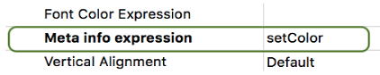

<!--REF #_command_.FORM Event.Syntax-->**FORM Event** : Object<!-- END REF-->
<!--REF #_command_.FORM Event.Params-->
| Paramètre | Type |  | Description |
| --- | --- | --- | --- |
| Résultat | Object | &#8592; | Objet événement |

<!-- END REF-->

#### Description 

<!--REF #_command_.FORM Event.Summary-->**FORM Event** retourne un objet contenant des informations sur l'événement formulaire qui vient de se produire.<!-- END REF--> Généralement, vous utiliserez **FORM Event** à partir d'un formulaire ou d'une méthode objet **FORM Event**.

**Objet retourné**

Chaque objet retourné inclut les propriétés principales suivantes :

| **Propriété** | **Type**    | **Description**                                                                                    |
| ------------- | ----------- | -------------------------------------------------------------------------------------------------- |
| objectName    | texte       | Nom de l'objet déclenchant l'événement - Non inclus si l'événement est déclenché par le formulaire |
| code          | entier long | Valeur numérique de l'événement formulaire. Voir [Form event code](form-event-code.md)             |
| description   | texte       | Nom de l'événement formulaire (*ex :* "Sur après modification").                                   |

Par exemple, si un bouton est cliqué, l'objet contient les propriétés suivantes :

```json
{"code":4,"description":"Sur clic","objectName":"Button2"}
```

L'objet événement peut contenir des propriétés supplémentaires, en fonction de l'objet lié à l'événement courant. Pour les objets *eventObj* générés dans :

* les objets List box ou colonnes de list box, voir *la documentation des list box sur developer.4d.com*
* les zones 4D View Pro, voir *Evénement formulaire Sur VP prêt*.

**Note :** S'il n'existe pas d'événement courant, **FORM Event** retourne un objet null.

#### Exemple 1 

Vous souhaitez gérer l'événement Sur clic dans un bouton : 

```4d
 If(FORM Event.code=On Clicked)
    ...
 End if
```

#### Exemple 2 

Si vous définissez le nom de l'objet colonne avec un nom d'attribut d'une dataclass comme suit:


Vous pouvez trier la colonne à l'aide de l'événement Sur clic entête :

```4d
 Form.event:=FORM Event
 Case of
    :(Form event code=On Header Click)
       si(Form.event.columnName="lastname")
       Form.employees:=Form.employees.orderBy(Form.event.columnName+", firstname")
    End if
End case
```

#### Exemple 3 

Vous souhaitez gérer l'événement Sur affichage corps sur un objet List box à l'aide d'une méthode définie dans la propriété *Meta info expression* :



La méthode *setColor* :

```4d
 var $event;$0;$meta : Object
 $event:=FORM Event
 $meta:=New object
 
 Case of
    :($event.code=On Display Detail)
       If($event.isRowSelected)
          $meta.fill:="lightblue"
       End if
 End case
 $0:=$meta
```

La list box résultante s'affichera comme suit lorsque les lignes sont sélectionées :


#### Voir aussi 

[Form event code](form-event-code.md)  

#### Propriétés

|  |  |
| --- | --- |
| Numéro de commande | 1606 |
| Thread safe | &check; |


