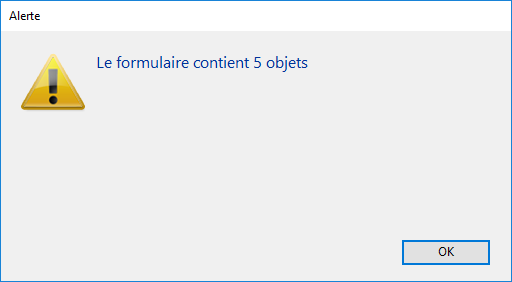

<!--REF #_command_.FORM LOAD.Syntax-->**FORM LOAD** ( {*laTable* ;} *formulaire* {; *formData*}{; *} )<!-- END REF-->
<!--REF #_command_.FORM LOAD.Params-->
| Paramètre | Type |  | Description |
| --- | --- | --- | --- |
| laTable | Table | &#8594;  | Table du formulaire à charger (si omis, charger un formulaire projet) |
| formulaire | Text, Object | &#8594;  | Nom du formulaire table ou projet à utiliser, ouChemin POSIX (chaîne) d'un fichier .json décrivant le formulaire, ouObjet décrivant le formulaire |
| formData | Object | &#8594;  | Data to associate to the form |
| * | Opérateur | &#8594;  | Si passé = la commande s’applique à la base hôte lorsqu’elle est exécutée depuis un composant (paramètre ignoré hors de ce contexte) |

<!-- END REF-->

*Cette commande n'est pas thread-safe, elle ne peut pas être utilisée dans du code préemptif.*


#### Description 

<!--REF #_command_.FORM LOAD.Summary-->La commande **FORM LOAD** vous permet de charger le *formulaire* en mémoire dans le process courant avec formData (facultatif) afin d'imprimer des données ou d'analyser son contenu.<!-- END REF--> Il ne peut y avoir qu'un seul formulaire courant par process.

Dans le paramètre *formulaire*, vous pouvez passer soit :

* le nom du formulaire (formulaire projet ou formulaire table) à utiliser,
* le chemin (en syntaxe POSIX) d'un fichier .json valide contenant la description du formulaire à utiliser (voir *Chemin d'accès du formulaire*),
* un objet contenant la description du formulaire à utiliser.

Lorsque la commande est exécutée à partir d'un composant, elle charge par défaut les formulaires du composant. Si vous passez le paramètre \*, la méthode charge les formulaires de la base de données de l'hôte.

##### formData 

En option, vous pouvez transmettre des paramètres au formuliare à l'aide de l'objet formData. Toutes les propriétés de l'objet formData seront alors disponibles dans le contexte du formulaire par l'intermédiaire de la commande [Form](form.md). Par exemple, si vous passez un objet contenant {"version", "12"} dans formData, vous pourrez obtenir ou définir la valeur de la propriété "version" dans le formulaire en appelant :

```4d
 $v:=Form.version //"12"
 Form.version:=13
```

L'objet *formData* est disponible dans l'événement Sur chargement formulaire.

formData vous permet de passer en toute sécurité des paramètres à vos formulaires, quel que soit le contexte d'appel. En particulier, si le même formulaire est appelé à différents endroits dans le même processus, vous pourrez toujours accéder à ses valeurs spécifiques en appelant simplement [Form](form.md).myProperty.

**Note :** Si vous ne passez pas le paramètre formData ou si vous passez un objet non défini, **\[#current\_titl**e\] crée automatiquement un nouvel objet vide lié au formulaire, disponible via la commande [Form](form.md).

##### Impression de données 

Pour que cette commande puisse être exécutée, une tâche d'impression doit avoir été ouverte au préalable à l'aide de la commande [OPEN PRINTING JOB](open-printing-job.md). La commande [OPEN PRINTING JOB](open-printing-job.md) effectue un appel implicite à la commande [FORM UNLOAD](form-unload.md), il est donc nécessaire d’exécuter [FORM LOAD](form-load.md) dans ce contexte. Une fois chargé, le *formulaire* devient le formulaire d’impression courant. Toutes les commandes de gestion des objets, et en particulier la commande [Print object](print-object.md), travaillent avec ce formulaire.

Si un formulaire d’impression avait déjà été chargé au préalable (via un appel précédent à la commande **FORM LOAD**), il est refermé et remplacé par *formulaire*. Vous pouvez ouvrir et refermer plusieurs formulaires dans la même session d’impression. Changer de formulaire d’impression via la commande **FORM LOAD** ne génère pas de saut de page, il revient au développeur de les gérer. 

Seul l’événement formulaire On Load est exécuté durant l’ouverture du formulaire, ainsi que les méthodes des objets du formulaire. Les autres événements formulaire sont ignorés. L’événement formulaire On Unload est exécuté à l’issue de l’impression. 

Pour préserver la cohérence graphique des formulaires, il est conseillé d’appliquer la propriété d’apparence "Impression" sur toutes les plates-formes. 

Le formulaire d’impression courant est automatiquement refermé lorsque la commande [CLOSE PRINTING JOB](close-printing-job.md) est appelée. 

**Note de compatibilité :** Dans les versions de 4D antérieures à la v14, la commande **FORM LOAD** (nommée OUVRIR FORMULAIRE IMPRESSION) acceptait une chaîne vide dans le paramètre *formulaire* afin de refermer le formulaire projet courant. Cette syntaxe n’est désormais plus prise en charge et retourne une erreur. Vous devez désormais utiliser la commande [FORM UNLOAD](form-unload.md) ou la commande [CLOSE PRINTING JOB](close-printing-job.md) pour refermer le formulaire. 

##### Analyse du contenu du formulaire 

Cette possibilité consiste à charger un formulaire hors-écran à des fins d’analyse. Pour effectuer cette action, il suffit d’appeler **FORM LOAD** en-dehors d’un contexte de tâche d’impression. Dans ce cas, les événements formulaire ne sont pas exécutés.

**FORM LOAD** peut être utilisé avec les commandes [FORM GET OBJECTS](form-get-objects.md) et [OBJECT Get type](object-get-type.md) afin d’effectuer tout type de traitement sur le contenu du formulaire. Il est ensuite impératif d'appeler la commande [FORM UNLOAD](form-unload.md) afin de décharger le formulaire de la mémoire.

A noter que dans tous les cas, le formulaire à l’écran reste chargé (il n’est pas touché par la commande **FORM LOAD**), il n’est pas nécessaire de le recharger après un [FORM UNLOAD](form-unload.md). 

**Rappel :** Dans le contexte du hors-écran, n'oubliez pas d'appeler [FORM UNLOAD](form-unload.md) afin d'éviter tout risque de saturation de la mémoire. 

#### Exemple 1 

Appel d’un formulaire projet en tâche d’impression :

```4d
 OPEN PRINTING JOB
 FORM LOAD("print_form")
     // exécution des événements et des méthodes objet
```

#### Exemple 2 

Appel d’un formulaire table en tâche d’impression :

```4d
 OPEN PRINTING JOB
 FORM LOAD([People];"print_form")
     // exécution des événements et des méthodes objet
```

#### Exemple 3 

Analyse du contenu d’un formulaire pour effectuer un traitement sur les zones de saisie de texte :

```4d
 FORM LOAD([People];"my_form") 
     // sélection du formulaire sans exécution des événements ni des méthodes
 FORM GET OBJECTS(tabNomsObj;tabPtrObj;tabPages;*)
 For($i;1;Size of array(tabNomsObj))
       If(OBJECT Get type(*;tabNomsObj{$i})=Object type text input)
           //… traitement
       End if
 End for
 FORM UNLOAD //ne pas oublier
```

#### Exemple 4 

L'exemple suivant retourne le nombre d'objets contenu dans un formulaire dynamique (JSON) :

```4d
 ARRAY TEXT(objectsArray;0)
 ARRAY POINTER(variablesArray;0)
 ARRAY INTEGER(pagesArray;0)
 
 FORM LOAD("/RESOURCES/OutputForm.json") //on charge le formulaire
 FORM GET OBJECTS(objectsArray;variablesArray;pagesArray;Form all pages+Form inherited)
 
 ALERT("Le formulaire contient "+String(Taille tableau(objectsArray))+" objets") //afficher le nombre d'objets
```

Résultat :



#### Exemple 5 

Vous souhaitez imprimer un formulaire contenant une list box. Lors de l'événement Sur chargement, vous souhaitez que le contenu de la list box soit modifié.

1\. Dans la méthode d'impression, vous écrivez :

```4d
 var $formData : Object
 var $over : Boolean
 var $full : Boolean
 
 OPEN PRINTING JOB
 $formData:=New object
 $formData.LBcollection:=New collection()
 ... //remplir la collection avec des données
 
 FORM LOAD("GlobalForm";$formData) //enregistrer la collection dans $formData
 $over:=False
 Repeat
    $full:=Print object(*;"LB") // la source de données de cette "LB" list box est Form.LBcollection
    LISTBOX GET PRINT INFORMATION(*;"LB";lk printing is over;$over)
    If(Not($over))
       PAGE BREAK
    End if
 Until($over)
 FORM UNLOAD
 CLOSE PRINTING JOB
```

2\. Dans la méthode des formulaires, vous pouvez écrire :

```4d
 var $o : Object
 Case of
    :(Form event code=On Load)
       For each($o;Form.LBcollection) //LBcollection est disponible
          $o.reference:=Uppercase($o.reference)
       End for each
 End case
```

#### Voir aussi 

[Current form name](current-form-name.md)  
[FORM UNLOAD](form-unload.md)  
[LISTBOX GET OBJECTS](listbox-get-objects.md)  
[OBJECT Get type](object-get-type.md)  
[Print object](print-object.md)  