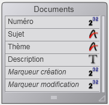

<!--REF #_command_.GET DOCUMENT PROPERTIES.Syntax-->**GET DOCUMENT PROPERTIES** ( *nomFichier* ; *verrouillé* ; *invisible* ; créé le ; créé à  ; modifié le ; modifié à )<!-- END REF-->
<!--REF #_command_.GET DOCUMENT PROPERTIES.Params-->
| Paramètre | Type |  | Description |
| --- | --- | --- | --- |
| nomFichier | Text | &#8594;  | Nom du document |
| verrouillé | Boolean | &#8592; | Verrouillé (Vrai) ou non verrouillé (Faux) |
| invisible | Boolean | &#8592; | Invisible (Vrai) ou visible (Faux) |
| créé le | Date | &#8592; | Date de création |
| créé à | Heure | &#8592; | Heure de création |
| modifié le | Date | &#8592; | Date de la dernière modification |
| modifié à | Heure | &#8592; | Heure de la dernière modification |

<!-- END REF-->

#### Description 

<!--REF #_command_.GET DOCUMENT PROPERTIES.Summary-->La commande **GET DOCUMENT PROPERTIES** retourne des informations sur le document dont le nom ou le chemin d'accès est passé dans le paramètre *document*.<!-- END REF-->

Après l'appel :

* *verrouillé* retourne Vrai si le document est verrouillé. Un document verrouillé ne peut pas être modifié.
* *invisible* retourne Vrai si le document est caché.
* *créé le* et *créé à* retournent la date et l'heure de création du document.
* *modifié le* et *modifié à* retournent la date et l'heure de la dernière modification du document.

#### Exemple 

Vous avez créé une base de documentation et vous voulez exporter tous les enregistrements créés dans le base vers un document sur disque. Comme la base est régulièrement mise à jour, vous voulez écrire un algorithme d'export qui crée ou recrée chaque document sur disque si le document n'existe pas ou si l'enregistrement correspondant a été modifié depuis la dernière sauvegarde du document. Par conséquent, vous devez comparer la date et l'heure de modification du document (s'il existe) avec celles de l'enregistrement correspondant. Pour illustrer cet exemple, nous allons utiliser la table suivante :



Plutôt que de sauvegarder une date et une heure dans chaque enregistrement, vous pouvez stocker un "marqueur" dont la valeur exprime le nombre de secondes écoulées depuis une date antérieure arbitraire (dans cet exemple, le 1er janvier 1995 à 00:00:00) ainsi que la date et l'heure de la sauvegarde de l'enregistrement. 

Dans notre exemple, le champ *\[Documents\]Marqueur création* contient le marqueur de création de l'enregistrement et le champ *\[Documents\]Marqueur modification* contient le marqueur de la dernière modification de l'enregistrement. 

La méthode projet marqueurTemps suivante calcule le marqueur de temps par rapport à une date et une heure spécifiques ou par rapport à la date et l'heure courantes si aucun paramètre n'est passé :

```4d
  // Méthode projet marqueurTemps
  // marqueurTemps { ( Date ; Heure ) } -> Entier long
  // marqueurTemps { ( Date ; Heure ) } -> Nombre de secondes depuis le 1er janvier 1995
 
 var $1;$vdDate : Date
 var $2;$vhTime : Time
 var $0 : Integer
 
 If(Count parameters=0)
    $vdDate:=Current date
    $vhTime:=Current time
 Else
    $vdDate:=$1
    $vhTime:=$2
 End if
 $0:=(($vdDate-!01/01/95!)*86400)+$vhTime
```

**Note :** Avec cette méthode, vous pouvez encoder toutes les dates et les heures situées entre le *01/01/95* à *00:00:00* et le *19/01/2063* à *03:14:07*, ce qui représente l'intervalle de données exploitables par un entier long (de *0* à *2^31* moins 1).

A l'inverse, les méthodes projet Marqueur vers date et Marqueur vers heure vous permettent d'extraire la date et l'heure stockées dans un marqueur :

```4d
  // Méthode projet Marqueur vers date
  // Marqueur vers date ( Entier long ) -> Date
  // Marqueur vers date ( Marqueur ) -> Date extraite
 
 var $0 : Date
 var $1 : Integer
 
 $0:=!01/01/95!+($1\86400)
 
  // Méthode projet Marqueur vers heure
  // Marqueur vers heure ( Entier long ) -> Heure
  // Marqueur vers heure ( Marqueur ) -> Heure extraite
 
 var $0 : Time
 var $1 : Integer
 
 $0:=Time(Time string(†00:00:00†+($1%86400)))
```

Pour vous assurer que les marqueurs des enregistrements sont correctement mis à jour, quelle que soit la manière dont ils sont créés ou modifiés, il suffit de faire appliquer cette règle par le trigger de la table *\[Documents\]*:

```4d
  // Trigger de la table [Documents]
 
 Case of
    :(Trigger event=On Saving New Record Event)
       [Documents]Marqueur création:=marqueurTemps
       [Documents]Marqueur modification:=marqueurTemps
    :(Trigger event=On Saving Existing Record Event)
       [Documents]Marqueur modification:=marqueurTemps
 End case
```

Une fois que cela est implémenté dans votre base, il suffit d'écrire la méthode projet CREER DOCUMENTATION listée ci-dessous. Nous utilisons **GET DOCUMENT PROPERTIES** et [SET DOCUMENT PROPERTIES](set-document-properties.md) pour gérer la date et l'heure de création et de modification des documents.

```4d
  //Méthode projet CREER DOCUMENTATION
 
 C_STRING(255;$vsPath;$vsDocPathName;$vsDocName)
 var $vlDoc : Integer
 var $vbOnWindows;$vbDoIt;$vbLocked;$vbInvisible : Boolean
 var $vhDocRef;$vhCreatedAt;$vhModifiedAt : Time
 var $vdCreatedOn;$vdModifiedOn : Date
 
 If(Application type=4D Client)
  // Si 4D Client est utilisé, sauvegarder les documents localement
  // c'est-à-dire sur le poste client où se trouve 4D Client
    $vsPath:=Nom long vers chemin d'accès(Application type)
 Else
  // Else, sauvegarder les documents là où se trouve le fichier de données
    $vsPath:=Nom long vers chemin d'accès(Data file)
 End if
  // Stocker les documents dans un répertoire nommé arbitrairement "Documentation"
 $vsPath:=$vsPath+"Documentation"+Char(Symbole séparateur)
  // Si ce répertoire n'existe pas, le créer
 If(Test path name($vsPath) #Is a folder)
    CREATE FOLDER($vsPath)
 End if
  // Etablir la liste des documents existants
  // car nous allons devoir supprimer ceux qui sont obsolètes, autrement dit
  // ceux dont les enregistrements correspondants ont été supprimés.
 ARRAY STRING(255;$asDocument;0)
 DOCUMENT LIST($vsPath;$asDocument)
  // Sélection de tous les enregistrements de la table [Documents]
 ALL RECORDS([Documents])
  // For each enregistremnt
 $vlNbRecords:=Records in selection([Documents])
 $vlNbDocs:=0
 $vbOnWindows:=Sous Windows
 For($vlDoc;1;$vlNbRecords)
  // Supposons que nous aurons à (re)créer le document sur disque
    $vbDoIt:=True
  // Calcul du nom et du chemin d'accès au document
    $vsDocName:="DOC"+String([Documents]Numéro;"00000")
    $vsDocPathName:=$vsPath+$vsDocName
  // Est-ce que ce document existe déjà ?
    If(Test path name($vsDocPathName+".HTM")=Is a document)
  // Si oui, retirer le document de la liste des documents
  // qui peuvent être supprimés
       $vlElem:=Find in array($asDocument;$vsDocName+".HTM")
       If($vlElem>0)
          DELETE FROM ARRAY($asDocument;$vlElem)
       End if
  // Est-ce que le document a été stocké après la dernière modification de l'enregistrement?
       GET DOCUMENT PROPERTIES($vsDocPathName+".HTM";$vbLocked;$vbInvisible;$vdCreatedOn;
       $vhCreatedAt;$vdModifiedOn;$vhModifiedAt)
       If(marqueurTemps($vdModifiedOn;$vhModifiedAt)>=[Documents]Marqueur modification)
  //Si oui, nous n'avons pas besoin de recréer le document
          $vbDoIt:=False
       End if
    Else
  //Le document n'existe pas, mettre ces deux variables à zéro, pour que
  // nous sachions que nous devrons les traiter avant de fixer les propriétés finales
  // du document
       $vdModifiedOn:=!00/00/00!
       $vhModifiedAt:=†00:00:00†
    End if
  // Avons-nous besoin de (re)créer le document?
    If($vbDoIt)
  // Si oui, incrémenter le nombre de documents mis à jour
       $vlNbDocs:=$vlNbDocs+1
  // Supprimer le document s'il existe déjà
       DELETE DOCUMENT($vsDocPathName+".HTM")
  // Et le recréer
       If($vbOnWindows)
          $vhDocRef:=Create document($vsDocPathName;"HTM")
       Else
          $vhDocRef:=Create document($vsDocPathName+".HTM")
       End if
       If(OK=1)
  //...
  // Ecrivons ici le contenu du document
  // ...
          CLOSE DOCUMENT($vhDocRef)
          If($vdModifiedOn=!00/00/00!)
  // Le document n'existait pas, fixer les valeurs correctes pour
  // la date et l'heure de modification
             $vdModifiedOn:=Current date
             $vhModifiedAt:=Current time
          End if
  // Changer les propriétés du document de telle manière que sa date et son heure de création
  // soit égales à celles de l'enregistrement correspondant
          SET DOCUMENT PROPERTIES($vsDocPathName+".HTM";$vbLocked;$vbInvisible;Marqueur vers date([Documents]Marqueur création);Marqueur vers heure([Documents]Marqueur création);$vdModifiedOn;$vhModifiedAt)
       End if
    End if
  // Juste pour savoir ce qui se passe
    SET WINDOW TITLE("Traitement du document "+String($vlDoc)+" sur "+Chaine($vlNbRecords))
    NEXT RECORD([Documents])
 End for
  //Suppression des documents obsolètes, c'est-à-dire ceux
  // qui sont toujours dans le tableau $asDocument
 For($vlDoc;1;Size of array($asDocument))
    DELETE DOCUMENT($vsPath+$asDocument{$vlDoc})
    SET WINDOW TITLE("Suppression du document obsolète: "+Char(34)+$asDocument{$vlDoc}+Char(34))
 End for
  //C'est la fin
 ALERT("Nombre de documents traités : "+String($vlNbRecords)+Caractere(13)+"Nombre de documents mis à jour : "+Chaine($vlNbDocs)+Caractere(13)+"Nombre de documents supprimés : "+Chaine(Taille tableau($asDocument)))
```

#### Voir aussi 

[SET DOCUMENT PROPERTIES](set-document-properties.md)  

#### Propriétés
|  |  |
| --- | --- |
| Numéro de commande | 477 |
| Thread safe | &check; |
| Modifie les variables | error |
| Interdite sur le serveur ||


