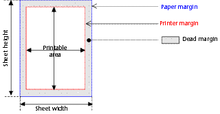

<!--REF #_command_.GET PRINTABLE MARGIN.Syntax-->**GET PRINTABLE MARGIN** ( *gauche* ; *haut* ; *droite* ; *bas* )<!-- END REF-->
<!--REF #_command_.GET PRINTABLE MARGIN.Params-->
| Paramètre | Type |  | Description |
| --- | --- | --- | --- |
| gauche | Integer | &#8592; | Marge gauche |
| haut | Integer | &#8592; | Marge supérieure |
| droite | Integer | &#8592; | Marge droite |
| bas | Integer | &#8592; | Marge inférieure |

<!-- END REF-->

#### Description 

<!--REF #_command_.GET PRINTABLE MARGIN.Summary-->La commande **GET PRINTABLE MARGIN** retourne les valeurs courantes des différentes marges définies lors de l’utilisation des commandes [Print form](print-form.md), [PRINT SELECTION](print-selection.md) et [PRINT RECORD](print-record.md).<!-- END REF-->

Les valeurs sont retournées en pixels par rapport au bord du papier. 

Il est possible d’obtenir la taille du papier à l’aide de la fonction [GET PRINTABLE AREA](get-printable-area.md), et ainsi de calculer la zone imprimable.

##### Gestion des marges d’impression 

Par défaut, dans 4D le calcul des impressions est effectué sur la base des “marges imprimante”. L’avantage de ce système est que les formulaires s’adaptent automatiquement aux nouvelles imprimantes (puisque positionnés dans la partie imprimable). En revanche, dans le cas des formulaires pré-imprimés, il n’est pas possible de positionner précisément les éléments à imprimer car un changement d’imprimante peut modifier les marges imprimante.

Il est possible de baser l’impression des formulaires effectuée à l’aide des commandes [Print form](print-form.md), [PRINT SELECTION](print-selection.md) et [PRINT RECORD](print-record.md) sur une marge fixe et identique sur chaque imprimante : la marge papier, c’est-à-dire les limites physiques de la feuille. Pour cela, il suffit d’utiliser les commandes [GET PRINTABLE MARGIN](get-printable-margin.md), [SET PRINTABLE MARGIN](set-printable-margin.md) et [GET PRINTABLE AREA](get-printable-area.md).

#### Terminologie des impressions 

* **Marge papier** : la marge papier correspond aux limites physiques de la feuille.
* **Marge imprimante** : la marge imprimante est la marge au-dela de laquelle l’imprimante est incapable d’imprimer (pour des raisons physiques : galets d’impression, fin de course de la tête d’impression...). Elle varie d’une imprimante à l’autre et d’un format à l’autre.
* **Marge morte** : c’est la zone située entre la marge papier et la marge imprimante.  

#### Voir aussi 

[GET PRINTABLE AREA](get-printable-area.md)  
[Print form](print-form.md)  
[SET PRINTABLE MARGIN](set-printable-margin.md)  

#### Propriétés

|  |  |
| --- | --- |
| Numéro de commande | 711 |
| Thread safe | &cross; |

