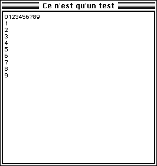

<!--REF #_command_.GOTO XY.Syntax-->**GOTO XY** ( *x* ; *y* )<!-- END REF-->
<!--REF #_command_.GOTO XY.Params-->
| Paramètre | Type |  | Description |
| --- | --- | --- | --- |
| x | Integer | &#8594;  | Coordonnée x (horizontale) du curseur |
| y | Integer | &#8594;  | Coordonnée y (verticale) du curseur |

<!-- END REF-->

*Cette commande n'est pas thread-safe, elle ne peut pas être utilisée dans du code préemptif.*


#### Description 

<!--REF #_command_.GOTO XY.Summary-->La commande **GOTO XY** est destinée à être utilisée conjointement avec la commande [MESSAGE](message.md) lorsque vous affichez des messages dans une fenêtre ouverte par la commande [Open window](open-window.md).<!-- END REF--> 

La commande **GOTO XY** détermine l'emplacement du curseur d'insertion des caractères (ce curseur est invivible) : elle définit les coordonnées auxquelles le prochain message s'affichera à l'intérieur de la fenêtre. 

L'angle supérieur gauche de la fenêtre représente les coordonnées 0,0\. Le curseur est automatiquement positionné à 0,0 lorsqu'une fenêtre est créée ou après l'exécution de la commande [ERASE WINDOW](erase-window.md).

Après que **GOTO XY** ait défini l'emplacement du curseur, la commande [MESSAGE](message.md) peut être appelée pour afficher des caractères dans la fenêtre.

#### Exemple 1 

Reportez-vous à l'exemple de la commande [MESSAGE](message.md).

#### Exemple 2 

Reportez-vous à l'exemple de la fonction [Milliseconds](milliseconds.md).

#### Exemple 3 

L'exemple ci-dessous : 

```4d
 Open window(50;50;300;300;5;"Ce n'est qu'un test")
 For($vlColonne;0;9)
    GOTO XY($vlColonne;0)
    MESSAGE(String($vlColonne))
 End for
 For($vlLigne;0;9)
    GOTO XY(0;$vlLigne)
    MESSAGE(String($vlLigne))
 End for
 $vhHeureDébut:=Current time
 Repeat
 Until((Current time-$vhHeureDébut)>?00:00:30?)
```

... affiche la fenêtre suivante (sous Mac OS) pendant 30 secondes :



#### Voir aussi 

[MESSAGE](message.md)  