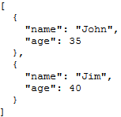

<!--REF #_command_.JSON Stringify array.Syntax-->**JSON Stringify array** ( *tab* {; *} ) : Text<!-- END REF-->
<!--REF #_command_.JSON Stringify array.Params-->
| Paramètre | Type |  | Description |
| --- | --- | --- | --- |
| tab | Text array, Real array, Boolean array, Pointer array, Object array | &#8594;  | Tableau dont le contenu doit être sérialisé |
| * | Opérateur | &#8594;  | Améliorer le formatage |
| Résultat | Text | &#8592; | Chaîne contenant le tableau JSON sérialisé |

<!-- END REF-->

#### Description 

<!--REF #_command_.JSON Stringify array.Summary-->La commande **JSON Stringify array** convertit le tableau 4D *tab* en un tableau JSON sérialisé.<!-- END REF--> Cette commande effectue l’action inverse de la commande [JSON PARSE ARRAY](json-parse-array.md).

Passez dans *tab* un tableau 4D contenant les données à sérialiser. Le tableau peut être de type texte, réel, booléen, pointeur ou objet.

**Note :** Si vous passez une variable scalaire ou un champ dans *tab*, la commande retournera simplement la valeur du paramètre entre "\[ \]".

Vous pouvez passer le paramètre optionnel *\** afin d’inclure des caractères de formatage dans la chaîne résultante. Cette option permet d’améliorer la présentation des données JSON lorsqu’elles sont affichées dans une page Web (*pretty formatting*).

#### Exemple 1 

Conversion d’un tableau texte :

```4d
 var $jsonString : Text
 ARRAY TEXT($ArrayFirstname;2)
 $ArrayFirstname{1}:="John"
 $ArrayFirstname{2}:="Jim"
 $jsonString :=JSON Stringify array($ArrayFirstname)
 
     // $jsonString = "["John","Jim"]"
```

#### Exemple 2 

Conversion d’un tableau texte contenant des nombres :

```4d
 ARRAY TEXT($phoneNumbers;0)
 APPEND TO ARRAY($phoneNumbers ;"555-0100")
 APPEND TO ARRAY($phoneNumbers ;"555-0120")
 $string :=JSON Stringify array($phoneNumbers)
     // $string = "["555-0100","555-0120"]"
```

#### Exemple 3 

Conversion d’un tableau objet :

```4d
 var $ref_john : Object
 var $ref_jim : Object
 ARRAY OBJECT($myArray;0)
 OB SET($ref_john;"name";"John";"age";35)
 OB SET($ref_jim;"name";"Jim";"age";40)
 APPEND TO ARRAY($myArray ;$ref_john)
 APPEND TO ARRAY($myArray ;$ref_jim)
 $JsonString :=JSON Stringify array($myArray)
     // $JsonString = "[{"name":"John","age":35},{"name":"Jim","age":40}]"
 
     // Si vous souhaitez visualiser le résultat dans une page Web, passez
     // le paramètre optionnel * :
 $JsonStringPretty :=JSON Stringify array($myArray;*)
```



#### Exemple 4 

Conversion d’une sélection 4D dans un tableau objet :

```4d
 var $jsonObject : Object
 var $jsonString : Text
 
 QUERY([Company];[Company]Company Name="a@")
 OB SET($jsonObject;"company name";->[Company]Company Name)
 OB SET($jsonObject;"city";->[Company]City)
 OB SET($jsonObject;"date";[Company]Date_input)
 OB SET($jsonObject;"time";[Company]Time_input)
 ARRAY OBJECT($arraySel;0)
 
 While(Not(End selection([Company])))
       $ref_value:=OB Copy($jsonObject;True)
           // Si vous ne les copiez pas, les valeurs seront des chaînes vides
       APPEND TO ARRAY($arraySel;$ref_value)
           // Chaque élément contient les valeurs sélectionnées, par exemple :
           // $arraySel{1} = // {"company name":"APPLE","time":43200000,"city":
           // "Paris","date":"2012-08-02T00:00:00Z"}
       NEXT RECORD([Company])
 End while
 
 $jsonString:=JSON Stringify array($arraySel)
     // $jsonString = "[{"company name":"APPLE","time":43200000,"city":
     //"Paris","date":"2012-08-02T00:00:00Z"},{"company name":
     //"ALMANZA",...}]"
```

#### Voir aussi 

[JSON PARSE ARRAY](json-parse-array.md)  
[JSON Stringify](json-stringify.md)  