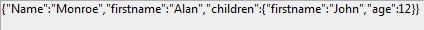

<!--REF #_command_.JSON Stringify.Syntax-->**JSON Stringify** ( *valeur* {; *} ) : Text<!-- END REF-->
<!--REF #_command_.JSON Stringify.Params-->
| Paramètre | Type |  | Description |
| --- | --- | --- | --- |
| valeur | Object, any | &#8594;  | Données à convertir en chaîne JSON |
| * | Opérateur | &#8594;  | Améliorer la présentation |
| Résultat | Text | &#8592; | Chaîne contenant le texte JSON sérialisé |

<!-- END REF-->

#### Description 

<!--REF #_command_.JSON Stringify.Summary-->La commande **JSON Stringify** convertit le paramètre *valeur* en une chaîne JSON.<!-- END REF--> Cette commande effectue l’action inverse de la commande [JSON Parse](json-parse.md).

Passez dans *valeur* les données à sérialiser. Elles peuvent être exprimées sous forme scalaire (chaîne, numérique, date ou heure) ou via un objet 4D ou une collection. 

**Note :** Les dates 4D seront converties au format "yyyy-mm-dd" ou "YYYY-MM-DDThh:mm:sssZ" en fonction du paramétrage courant de la base (voir l'option "Utiliser le type date au lieu du format date ISO dans les objets" dans la *Page Compatibilité*).

Dans le cas d’un objet ou d'une collection, vous pouvez inclure tout type de valeurs (cf. paragraphe *Types de données JSON*), en respectant les règles suivantes du JSON :

* les valeurs de type chaîne doivent être encadrées de guillemets. Tous les caractères Unicode peuvent être utilisés à l’exception des caractères spéciaux, devant être précédés par une barre oblique inversée.
* numérique : intervalle ±10.421e±10
* booléen : chaîne "true" ou "false"
* date : type texte au format "aaaa-mm-jj" ou "\\"AAAA-MM-JJTHH:mm:ssZ"\\", en fonction des paramètres courants de la base (voir ci-dessus)
* heure : type réel (nombre de secondes par défaut)
* pointeur vers un champ, une variable ou un tableau (le pointeur est évalué au moment du stringify)  
**Notes :**  
   * Les attributs image sont convertis en chaîne "\[object Picture\]"  
   * les pointeurs vers des champs, variables ou tableaux sont évalués au moment du stringify.

Vous pouvez passer le paramètre optionnel *\** afin d’inclure des caractères de formatage dans la chaîne résultante. Cette option permet d’améliorer la présentation des données JSON (*pretty formatting*). 

#### Exemple 1 

Conversions de valeurs scalaires :

```4d
 $vc:=JSON Stringify("Saperlipopette") // "Saperlipopette"
 $vel:=JSON Stringify(120) // "120"
 
 $vh:=JSON Stringify(?20:00:00?) // "72000" secondes depuis minuit
 SET DATABASE PARAMETER(Heures dans objets;Heures en milliseconds)
 $vhms:=JSON Stringify(?20:00:00?) // "72000000" millisecondes depuis minuit
 
 $vd:=JSON Stringify(!28/08/2013!) //  "2013-08-27T22:00:000Z" (fuseau horaire Paris)
 SET DATABASE PARAMETER(Dates dans objets;String type without time zone)
 $vdd:=JSON Stringify(!28/08/2013!) // "2013-08-28T00:00:00.000Z"
```

#### Exemple 2 

Conversion d’une chaîne contenant des caractères spéciaux :

```4d
 $s:=JSON Stringify("{\"name\":\"john\"}")
     // $s="{\\"name\\":\\"john\\"}"
 $p:=JSON Parse($s)
     // $p={"name":"john"}
```

#### Exemple 3 

Exemples de sérialisation d’un objet 4D avec et sans le paramètre *\** :

```4d
 var $MyContact : Text
 var $MyPContact : Text
 var $Contact;$Children : Object
 OB SET($Contact;"lastname";"Monroe";"firstname";"Alan")
 OB SET($Children;"firstname";"Jim";"age";"12")
 OB SET($Contact;"children";$Children)
 $MyContact:=JSON Stringify($Contact)
 $MyPContact:=JSON Stringify($Contact;*)
     //$MyContact= {"lastname":"Monroe","firstname":"Alan","children":{"firstname":"John","age":"12"}}
     //$MyPContact= {\n\t"lastname": "Monroe",\n\t"firstname": "Alan",\n\t"children": {\n\t\t"firstname": "John",\n\t\t"age": "12"\n\t}\n}
```

L’intérêt de ce formatage apparaît clairement lorsque le JSON est représenté dans une zone Web :

* Formatage standard :  

* Formatage amélioré :  


#### Exemple 4 

Exemple utilisant un pointeur vers une variable :

```4d
 var $MaVarTest : Object
 var $name ;$jsonstring  : Text
 OB SET($MaVarTest;"name";->$name) // définition de l’objet
     // $MaVarTest = {"name":"->$name"}
 
 $jsonstring :=JSON Stringify($MaVarTest)
     // $jsonstring ="{"name":""}"
     //...
 
 $name:="Smith"
 $jsonstring :=JSON Stringify($MaVarTest) 
     //$jsonstring = "{"name" : "Smith"}"
```

#### Exemple 5 

Sérialisation d’un objet 4D :

```4d
 var $varjsonTextserialized : Text
 var $Contact : Object
 OB SET($Contact;"firstname";"Alan")
 OB SET($Contact;"lastname";"Monroe")
 OB SET($Contact;"age";40)
 OB SET($Contact;"phone";"[555-0100,555-0120]")
 
 $varjsonTextserialized:=JSON Stringify($Contact)
 
     // $varjsonTextserialized = "{"lastname":"Monroe","phone":"[555-0100,
     // 555-0120]","age":40,"firstname":"Alan"}"
```

#### Exemple 6 

Sérialisation d'un objet 4D contenant une valeur de date (Fuseau horaire de Paris). La chaîne résultante dépend du paramétrage courant de la base.

```4d
 var $varjsonTextserialized : Text
 var $Contact : Object
 OB SET($Contact;"name";"Smith";"birthday";!22/10/1975!)
 $varjsonTextserialized:=JSON Stringify($Contact)
```

* Si l'option "Utiliser le type date au lieu du format date ISO dans les objets" n'est pas cochée :  
```json  
"name":"Smith","birthday":"1975-10-21T22:00:00.000Z"  
```
* Si l'option "Utiliser le type date au lieu du format date ISO dans les objets" est cochée :  
```json  
"name":"Smith","birthday":"1975-10-22"  
```

**Note :** Pour plus d'informations sur cette option, reportez-vous à la *Page Compatibilité*.

#### Exemple 7 

Conversion d'une collection (fuseau horaire Paris). La chaîne résultante dépend du paramétrage courant de la base.

```4d
 var $myCol : Collection
 var $myTxtCol : Text
 $myCol:=New collection(33;"mike";!28/08/2017!;False)
 $myTxtCol:=JSON Stringify($myCol)
```

* Si l'option "Utiliser le type date au lieu du format date ISO dans les objets" n'est pas cochée :  
```json  
$myTxtCol="[33,"mike","2017-08-27T22:00:00.000Z",false]"  
```
* Si l'option "Utiliser le type date au lieu du format date ISO dans les objets" est cochée :  
```json  
$myTxtCol="[33,"mike","2017-08-28",false]"  
```

**Note :** Pour plus d'informations sur cette option, reportez-vous à la *Page Compatibilité*.

#### Voir aussi 

[JSON Parse](json-parse.md)  
[JSON Stringify array](json-stringify-array.md)  

#### Propriétés
|  |  |
| --- | --- |
| Numéro de commande | 1217 |
| Thread safe | &check; |
| Interdite sur le serveur ||


