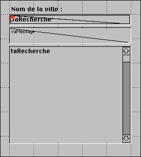
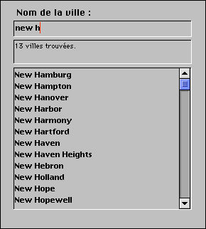

<!--REF #_command_.Keystroke.Syntax-->**Keystroke**  : Text<!-- END REF-->
<!--REF #_command_.Keystroke.Params-->
| Paramètre | Type |  | Description |
| --- | --- | --- | --- |
| Résultat | Text | &#8592; | Caractère saisi par l'utilisateur |

<!-- END REF-->

#### Description 

<!--REF #_command_.Keystroke.Summary-->**Keystroke** retourne le caractère tapé par l'utilisateur dans un champ ou une zone saisissable.<!-- END REF--> 

En général, vous appelez **Keystroke** dans une méthode formulaire ou objet, lors de la gestion des événements formulaire On Before Keystroke et On After Keystroke. Pour détecter les événements de frappe clavier, utilisez la commande [Form event code](../commands/form-event-code.md)". 

Si vous voulez remplacer un caractère saisi par l'utilisateur par un autre, utilisez la commande [FILTER KEYSTROKE](filter-keystroke.md).

**IMPORTANT :** Si vous voulez effectuer des opérations “à la volée” en fonction de la valeur courante de la zone saisissable en cours de modification ainsi que du caractère à saisir, rappelez-vous que le texte affiché à l'écran n'est pas encore la valeur du champ ou de la variable. La valeur saisie dans une variable ou un champ ne lui est affectée que lorsque la zone est validée (si l'utilisateur appuie sur la touche Tabulation, clique sur un bouton, etc.). En conséquence, pensez à placer les valeurs saisies dans une variable temporaire et à travailler avec celle-ci, ou utilisez la commande [Get edited text](get-edited-text.md). Vous devez procéder ainsi si vous souhaitez connaître la valeur courante du texte pour effectuer des actions spéciales.

Vous pouvez utiliser la commande **Keystroke** pour :

* effectuer un filtrage personnalisé des caractères
* créer un filtre de saisie non disponible en standard, par exemple dans les filtres de saisie
* implémenter des zones de recherche ou de pré-saisie dynamiques.

**Note :** Vous ne pouvez pas utiliser la fonction **Keystroke** dans les sous-formulaires.

#### Exemple 1 

Référez-vous aux exemples de la commande [FILTER KEYSTROKE](filter-keystroke.md).

#### Exemple 2 

Lorsque vous traitez un événement On Before Keystroke, vous gérez la modification de la zone de texte courante (celle qui contient le curseur), et non la “valeur future” de la source de données (champ ou variable) de cette zone. La méthode Gérer frappe clavier décrite ci-dessous vous permet de placer dans une seconde variable les caractères saisis dans une zone de texte. Vous pouvez alors utiliser cette variable pour effectuer différentes actions pendant la saisie des caractères dans la zone. Vous passez comme premier paramètre un pointeur vers la source des données de la zone, et comme second paramètre un pointeur vers cette seconde variable. La méthode renvoie la nouvelle valeur de la zone de texte dans la seconde variable et retourne Vrai si cette valeur est différente de ce qu'elle était avant la saisie du dernier caractère. 

```4d
  // Méthode projet Gérer frappe clavier
  // Gérer frappe clavier ( Pointeur ; Pointeur ) -> Booléen
  // Gérer frappe clavier ( -> zoneSource ; -> valeurCourante ) -> Est-ce une nouvelle valeur
 
 var $1;$2 : Pointer
 var $vtNouvValeur : Text
 
  // Récupérer le texte sélectionné dans la zone saisissable
 GET HIGHLIGHT($1->;$vlDébut;$vlFin)
  // Commencer à travailler avec la valeur courante
 $vtNouvValeur:=$2->
  // Selon la touche appuyée ou le caractère saisi, effectuer les actions appropriées
 Case of
 
  // La touche Retour arrière a été enfoncée
    :(Character code(Keystroke)=Backspace key)
  // Supprimer les caractères sélectionnés ou le caractère à gauche du curseur
       $vtNouvValeur:=Substring($vtNouvValeur;1;$vlDébut-1-Num($vlDébut=$vlFin))
       +Substring($vtNouvValeur;$vlFin)
 
  // Un caractère acceptable a été saisi
    :(Position(Keystroke;"abcdefghjiklmnopqrstuvwxyz -0123456789")>0)
       If($vlDébut#$vlFin)
  // Un ou plusieurs caractères sont sélectionnés, la frappe clavier va les effacer
          $vtNouvValeur:=Substring($vtNouvValeur;1;$vlDébut-1)+Keystroke+Substring($vtNouvValeur;$vlFin)
       Else
  // La sélection de texte est le curseur
          Case of
  // Le curseur est actuellement au début du texte
             :($vlDébut<=1)
  // Insertion du caractère au début du texte
                $vtNouvValeur:=Keystroke+$vtNouvValeur
  // Le curseur est actuellement à la fin du texte
             :($vlDébut>=Length($vtNouvValeur))
  // Ajouter le caractère à la fin du texte
                $vtNouvValeur:=$vtNouvValeur+Keystroke
             Else
  // Le curseur se trouve dans le texte, insérer le nouveau caractère
                $vtNouvValeur:=Substring($vtNouvValeur;1;$vlDébut-1)+Keystroke
                +Substring($vtNouvValeur;$vlDébut)
          End case
       End if
 
  // Une touche flèche a été enfoncée
  // Ne rien faire, mais valider la frappe clavier
    :(Character code(Keystroke)=Left arrow key)
    :(Character code(Keystroke)=Right arrow key)
    :(Character code(Keystroke)=Up arrow key)
    :(Character code(Keystroke)=Down arrow key)
  `
    Else
  // Il ne faut pas accepter des caractères autres que des lettres, chiffres, espaces et tirets
       FILTER KEYSTROKE("")
 End case
  // Est-ce que la valeur est maintenant différente ?
 $0:=($vtNouvValeur#$2->)
  // Retourner la valeur pour la gestion de la prochaine frappe clavier
 $2->:=$vtNouvValeur
```

Une fois que vous avez ajouté cette méthode projet à votre application, vous pouvez l'utiliser ainsi :

```4d
  // Méthode objet de la zone saisissable MonObjet
 Case of
    :(FORM Event=On Load)
       MonObjet:=""
       MonObjetCaché:=""
    :(FORM Event=On Before Keystroke)
       If(Gérer frappe clavier(->MonObjet;->MonObjetCaché))
  // Effectuer des actions appropriées par rapport à la valeur stockée dans MonObjetCaché
       End if
 End case
```

Examinons par exemple le formulaire suivant :



Il est composé des objets suivants : une zone saisissable *vaRecherche*, une zone non-saisissable *vaMessage* et une zone de défilement *taRecherche*. Lorsque l'utilisateur saisit des caractères dans *vaRecherche*, la méthode objet effectue une recherche sur la table \[Codes postaux\] permettant d'afficher des villes américaines en saisissant seulement les premiers caractères de leur nom. Voici la méthode objet de *vaRecherche* :

```4d
  // Méthode objet de la zone saisissable vaRecherche
 Case of
    :(FORM Event=On Load)
       vaRecherche:=""
       vaRésultat:=""
       vaMessage:="Saisissez les premiers caractères de la ville que vous cherchez."
       CLEAR VARIABLE(taRecherche)
    :(FORM Event=On Before Keystroke)
       If(Gérer frappe clavier(->vaRecherche;->vaRésultat))
          If(vaRésultat#"")
             QUERY([Codes postaux];[Codes postaux]Ville=vaRésultat+"@")
             MESSAGES OFF
             DISTINCT VALUES([Codes postaux]Ville;taRecherche)
             MESSAGES ON
             $vlRésultat:=Size of array(taRecherche)
             Case of
                :($vlRésultat=0)
                   vaMessage:="Aucune ville trouvée."
                :($vlRésultat=1)
                   vaMessage:="Une ville trouvée."
                Else
                   vaMessage:=String($vlRésultat)+" villes trouvées."
             End case
          Else
             DELETE FROM ARRAY(taRecherche;1;Size of array(taRecherche))
             vaMessage:="Saisissez les premières lettres de la ville que vous cherchez."
          End if
       End if
 End case
```

Voici le formulaire en exécution :



A l'aide des possibilités de communication interprocess de 4D, vous pouvez construire une interface dans laquelle les recherches se construisent dans des palettes flottantes communiquant avec les process dans lesquels les enregistrements sont affichés ou modifiés.

#### Voir aussi 

[FILTER KEYSTROKE](filter-keystroke.md)  
[Form event code](../commands/form-event-code.md)"  
[Get edited text](get-edited-text.md)  

#### Propriétés

|  |  |
| --- | --- |
| Numéro de commande | 390 |
| Thread safe | &cross; |


