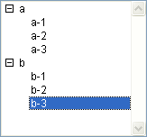

<!--REF #_command_.List item parent.Syntax-->**List item parent** ( {* ;} *liste* ; refElément | * ) : Integer<!-- END REF-->
<!--REF #_command_.List item parent.Params-->
| Paramètre | Type |  | Description |
| --- | --- | --- | --- |
| * | Opérateur | &#8594;  | Si spécifié, liste est un nom d'objet (chaîne) Si omis, liste est une référence de liste |
| liste | Integer, Text | &#8594;  | Numéro de référence de liste (si * omis) ou Nom d'objet de type liste (si * passé) |
| refElément &#124; * | Opérateur, Entier long | &#8594;  | Numéro de référence d'élément ou 0 pour le dernier élément ajouté à la liste ou * pour l'élément courant de la liste |
| Résultat | Integer | &#8592; | Numéro de référence de l'élément parent ou 0 s'il n'y en a pas |

<!-- END REF-->

#### Description 

<!--REF #_command_.List item parent.Summary-->La commande **List item parent** retourne le numéro de référence de l'élément parent.<!-- END REF-->

Passez dans *liste* le numéro de référence ou le nom d'objet de la liste. 

Si vous passez le premier paramètre optionnel *\**, vous indiquez que le paramètre *liste* est un nom d’objet (chaîne) correspondant à une représentation de liste dans le formulaire. Si vous ne passez pas ce paramètre, vous indiquez que le paramètre *liste* est une référence de liste hiérarchique ([RéfListe](# "Expression de type Entier long identifiant de façon unique une liste hiérarchique")). Si vous utilisez une seule représentation de liste ou travaillez avec les éléments structurels (le second *\** est omis), vous pouvez utiliser indifféremment l’une ou l’autre syntaxe. En revanche, si vous utilisez plusieurs représentations d’une même liste et travaillez avec l’élément courant (le second *\** est passé), la syntaxe basée sur le nom d’objet est requise car chaque représentation peut disposer de son propre élément courant.

**Note :** Si vous utilisez le caractère @ dans le nom d'objet de la liste et que le formulaire contient plusieurs listes répondant à ce nom, la commande **List item parent** s'appliquera au premier objet dont le nom correspond. 

Passez dans *réfElément* le numéro de référence d'un élément de la liste ou 0, ou encore \*. Si vous passez 0, la commande s’applique au dernier élément ajouté à la liste. Si vous passez \*, la commande s’applique à l’élément courant de la liste. Si plusieurs éléments sont sélectionnés, l’élément courant est celui qui a été sélectionné en dernier.

En retour, si un élément correspondant existe bien dans la liste et si cet élément se trouve bien dans une sous-liste (et a donc un élément parent), vous récupérez le numéro de référence de l'élément parent. 

S'il n'existe pas d'élément numéro *réfElément*, ou si vous avez passé \* et qu’aucun élément n’est sélectionné, ou si cet élément n'a pas d'élément parent, **List item parent** retourne *0* (zéro).

Si vous travaillez avec les numéros de référence des éléments, assurez-vous d'utiliser des numéros uniques, sinon vous ne pourrez pas différencier les éléments. Pour plus d'informations sur ce point, reportez-vous à la description de la commande [APPEND TO LIST](append-to-list.md).

#### Exemple 

Voici une liste *hList* affichée en mode Application :



Voici les numéros de référence des éléments de cette liste :

| **Elément** | **Numéro** |
| ----------- | ---------- |
| a           | 100        |
| a-1         | 101        |
| a-2         | 102        |
| b           | 200        |
| b-1         | 201        |
| b-2         | 202        |
| b-3         | 203        |

* Avec le code ci-dessous, si l'élément “b-3” est sélectionné, la variable *$vlParentElémRef* prend la valeur 200, c'est-à-dire le numéro de référence de l'élément “b” :

```4d
 $vlElémPos:=Selected list items(hList)
 GET LIST ITEM(hList;$vlElémPos;$vlElémRef;$vsItemText)
 $vlParentElémRef:=List item parent(hList;$vlElémRef) // $vlParentElémRef vaut 200
```

* Si l'élément “a-1” était sélectionné, la variable *$vlParentElémRef* prendrait la valeur 100, c'est-à-dire le numéro de référence de l'élément “a”.
* Si l'élément “a” ou “b” était sélectionné, la variable *$vlParentElémRef* prendrait la valeur 0 car ces éléments n'ont pas d'élément parent.

#### Voir aussi 

[GET LIST ITEM](get-list-item.md)  
[List item position](list-item-position.md)  
[SELECT LIST ITEMS BY REFERENCE](select-list-items-by-reference.md)  
[SET LIST ITEM](set-list-item.md)  

#### Propriétés
|  |  |
| --- | --- |
| Numéro de commande | 633 |
| Thread safe | &check; |
| Interdite sur le serveur ||


