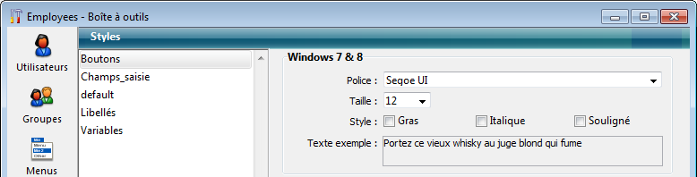

<!--REF #_command_.LIST OF STYLE SHEETS.Syntax-->**LIST OF STYLE SHEETS** ( *tabFeuillesStyle* )<!-- END REF-->
<!--REF #_command_.LIST OF STYLE SHEETS.Params-->
| Paramètre | Type |  | Description |
| --- | --- | --- | --- |
| tabFeuillesStyle | Text array | &#8592; | Noms des feuilles de style définies dans l’application |

<!-- END REF-->

#### Description 

<!--REF #_command_.LIST OF STYLE SHEETS.Summary-->La commande **LIST OF STYLE SHEETS** retourne la liste des feuilles de style de l’application dans le tableau *tabFeuillesStyle*.<!-- END REF--> 

S’il n’a pas été défini auparavant, le tableau texte *tabFeuillesStyle* est créé par la commande. Il est automatiquement dimensionné en fonction du nombre de feuilles de style définies. 

A l’issue de l’exécution de la commande, chaque élément du tableau contient un nom de feuille de style. Les noms sont triés par ordre alphabétique, comme dans l’éditeur de feuilles de style. Le premier élément du tableau contient systématiquement "\_\_automatic\_\_", qui représente la feuille de style "Automatique". 

**Note :** Pour des raisons de compatibilité, les feuilles de style automatiques "\_\_automatic\_main\_text\_\_" et "\_\_automatic\_additional\_text\_\_" ne sont pas retournées par cette commande. Cependant, elles sont toujours disponibles dans les formulaires. 

##### Note de compatibilité 

Cette commande ne peut être utilisée que dans les **bases de données binaires**. Dans **l'architecture projet**, le tableau n'est pas rempli.

#### Exemple 

Dans votre application, les feuilles de style suivantes sont définies :



Si vous exécutez le code suivant :

```4d
 LIST OF STYLE SHEETS($tTtabstyles)
     //$tTtabstyles{1} contient "__automatic__"
     //$tTtabstyles{2} contient "Boutons"
     //$tTtabstyles{3} contient "Champs_saisie"
     //$tTtabstyles{4} contient "default"
     //$tTtabstyles{5} contient "Libellés"
     //$tTtabstyles{6} contient "Variables"
```

#### Voir aussi 

[GET STYLE SHEET INFO](get-style-sheet-info.md)  
[OBJECT SET STYLE SHEET](object-set-style-sheet.md)  

#### Propriétés

|  |  |
| --- | --- |
| Numéro de commande | 1255 |
| Thread safe | &cross; |


