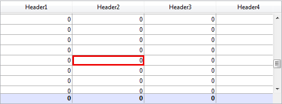

<!--REF #_command_.LISTBOX GET CELL COORDINATES.Syntax-->**LISTBOX GET CELL COORDINATES** ( {* ;} *objet* ; *colonne* ; *ligne* ; *gauche* ; *haut* ; *droite* ; *bas* )<!-- END REF-->
<!--REF #_command_.LISTBOX GET CELL COORDINATES.Params-->
| Paramètre | Type |  | Description |
| --- | --- | --- | --- |
| * | Opérateur | &#8594;  | Si spécifié, objet est un nom d'objet (chaîne)Si omis, objet est une variable |
| objet | any | &#8594;  | Nom d'objet (si * est spécifié) ou Variable (si * est omis) |
| colonne | Integer | &#8594;  | Numéro de colonne |
| ligne | Integer | &#8594;  | Numéro de ligne |
| gauche | Integer | &#8592; | Coordonnée gauche de l'objet |
| haut | Integer | &#8592; | Coordonnée supérieure de l’objet |
| droite | Integer | &#8592; | Coordonnée droite de l’objet |
| bas | Integer | &#8592; | Coordonnée inférieure de l’objet |

<!-- END REF-->

*Cette commande n'est pas thread-safe, elle ne peut pas être utilisée dans du code préemptif.*


#### Description 

<!--REF #_command_.LISTBOX GET CELL COORDINATES.Summary-->La commande **LISTBOX GET CELL COORDINATES** retourne dans les variables ou champs *gauche*, *haut*, *droite* et *bas* les coordonnées (en points) de la cellule désignée par les paramètres *colonne* et *ligne* dans la list box définie par *\** et *objet*.<!-- END REF-->

Si vous passez le paramètre optionnel *\**, vous indiquez que le paramètre *objet* est un nom d’objet (une chaîne de caractères). Si vous ne passez pas le paramètre *\**, vous indiquez que l'objet est un champ ou une variable. Dans ce cas, vous ne passez pas une chaîne mais une référence de champ ou de variable (champ ou variable de type objet uniquement).

Par cohérence avec la commande [OBJECT GET COORDINATES](object-get-coordinates.md), le point d'origine est le coin supérieur gauche du formulaire qui contient la cellule. Aussi, les coordonnées retournées sont théoriques ; elles tiennent compte du défilement éventuel de la list box avant son affichage à l'intérieur de son cadre. En résultat, la cellule peut ne pas être visible (ou être visible seulement en partie) à ses coordonnées, et ces coordonnées peuvent se situer au-delà des limites du formulaire (voire être négatives). Pour savoir si la cellule est visible (et quelle partie) vous devez comparer les coordonnées retournées avec celles de la list box elle-même, en tenant compte des règles suivantes :

* Les limites des cellules dépendent des coordonnées de leur list box parente (telles que retournées par la commande [OBJECT GET COORDINATES](object-get-coordinates.md) pour la list box).
* Les sous-objets en-tête et pied sont affichés au-dessus du contenu des colonnes : lorsque les coordonnées d'une cellule coupent celles d'une ligne d'en-tête ou de pied, la cellule n'est pas affichée à l'emplacement de l'intersection.
* Les éléments des colonnes verrouillées sont affichés au-dessus des éléments des colonnes défilables : lorsque les coordonnées d'un élément d'une colonne défilable croisent celles d'un élément d'une colonne verrouillée, l'élément défilable n'est pas affiché à l'emplacement de l'intersection.

Pour plus d'informations, veuillez vous reporter à la description de la commande [OBJECT GET COORDINATES](object-get-coordinates.md).

#### Exemple 

Vous souhaitez afficher un rectangle rouge autour de la cellule sélectionnée dans une list box :

```4d
 OBJECT SET VISIBLE(*;"RedRect";False) //initialiser un rectangle rouge
  //le rectangle est déjà défini quelque part dans le formulaire
 LISTBOX GET CELL POSITION(*;"LB1";$col;$row)
 LISTBOX GET CELL COORDINATES(*;"LB1";$col;$row;$x1;$y1;$x2;$y2)
 OBJECT SET VISIBLE(*;"RedRect";True)
 OBJECT SET COORDINATES(*;"RedRect";$x1;$y1;$x2;$y2)
```



#### Voir aussi 

[LISTBOX GET CELL POSITION](listbox-get-cell-position.md)  
[OBJECT GET COORDINATES](object-get-coordinates.md)  