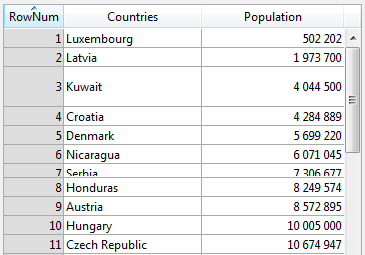

<!--REF #_command_.LISTBOX SET ROW HEIGHT.Syntax-->**LISTBOX SET ROW HEIGHT** ( {* ;} *objet* ; *ligne* ; *hauteur* )<!-- END REF-->
<!--REF #_command_.LISTBOX SET ROW HEIGHT.Params-->
| Paramètre | Type |  | Description |
| --- | --- | --- | --- |
| * | Opérateur | &#8594;  | Si spécifié, objet est un nom d'objet (chaîne) Si omis, objet est une variable |
| objet | any | &#8594;  | Nom d’objet (si * est spécifié) ou Variable (si * est omis) |
| ligne | Integer | &#8594;  | Ligne de la List box dont la hauteur doit être fixée. |
| hauteur | Integer | &#8594;  | Hauteur de la ligne de la List box |

<!-- END REF-->

#### Description 

<!--REF #_command_.LISTBOX SET ROW HEIGHT.Summary-->La commande **LISTBOX SET ROW HEIGHT** permet de modifier la hauteur de la ligne spécifiée dans le paramètre *ligne* dans la List box désignée par les paramètres *objet* et éventuellement *\**.<!-- END REF-->

Si vous passez le paramètre optionnel *\**, vous précisez que le paramètre *objet* est un nom d'objet (chaîne). Si vous ne passez pas ce paramètre, vous indiquez que le paramètre *objet* est une variable. Dans ce cas, vous passez une référence de variable à la place d'une chaîne. Pour plus d'information sur les noms d'objet, reportez-vous à la section *Objets de formulaires*. 

Si la *ligne* spécifiée n'existe pas dans la List box, la commande ne fait rien.

L'unité utilisée par *hauteur* correspond à celle définie globalement pour les lignes de la List box, soit dans la Liste des propriétés, soit par un appel antérieur à la commande [LISTBOX SET ROWS HEIGHT](listbox-set-rows-height.md).

La commande **LISTBOX SET ROW HEIGHT** modifie le tableau de hauteur de lignes spécifié dans la Liste des propriétés, le cas échéant (cf. section *Tableau hauteurs de lignes* dans le manuel *Mode Développement*. Sinon, la commande crée dynamiquement un tableau de hauteurs de lignes. Utiliser cette commande pour définir individuellement les hauteurs de lignes produit le même résultat qu'utiliser un tableau de hauteurs de lignes ; toutefois, remplir un tableau de hauteurs de lignes est plus rapide qu'appeler cette commande dans une boucle pour fixer les hauteurs de lignes une par une. 

**Important :** Si la commande globale [LISTBOX SET ROWS HEIGHT](listbox-set-rows-height.md) est appelée par la suite avec une unité différente de celle définie précédemment, la valeur par défaut de cette commande remplacera et réinitialisera toute hauteur de ligne définie à l'aide de **LISTBOX SET ROW HEIGHT** (voir exemple 2).

#### Exemple 1 

Vous souhaitez modifier la hauteur de quelques lignes de la list box suivante :


Si vous exécutez ce code :

```4d
  //unité courante en pixels
 LISTBOX SET ROW HEIGHT(*;"listboxname";3;40) //Kuwait
 LISTBOX SET ROW HEIGHT(*;"listboxname";7;14) //Serbia
```

... vous obtenez le résultat suivant :



#### Exemple 2 

Vous devez fixer une hauteur de ligne par défaut puis mettre en place individuellement des hauteurs de lignes spécifiques pour certaines d'entre elles en utilisant la commande **LISTBOX SET ROW HEIGHT** :

```4d
 LISTBOX SET ROWS HEIGHT(*;"listboxname";25;lk pixels) // la hauteur est globalement fixée à 25 pixels
 
 LISTBOX SET ROW HEIGHT(*;"listboxname";1;30) // ligne 1: 30 pixels
 LISTBOX SET ROW HEIGHT(*;"listboxname";5;40) // ligne 5: 40 pixels
 LISTBOX SET ROW HEIGHT(*;"listboxname";11;50) // ligne 11: 50 pixels
```

Par la suite, si le code suivant est exécuté :

```4d
 LISTBOX SET ROWS HEIGHT(*;"listboxname";18;lk pixels)
```

… la hauteur des lignes est globalement fixée à 18 pixels ; toutefois, étant donné que l'unité n'a pas changé, les lignes 1, 5 et 11 garderont leur hauteur personnalisée, à savoir, 30, 40 et 50 pixels tel que défini ci-dessus par la commande **LISTBOX SET ROW HEIGHT**.  
  
En revanche, si le code suivant est exécuté :

```4d
 LISTBOX SET ROWS HEIGHT(*;"listboxname";2;lk lines)
```

… alors les lignes 1, 5 et 11 sont réinitialisées à la valeur globale par défaut mise en place par la commande [LISTBOX SET ROWS HEIGHT](listbox-set-rows-height.md) (c'est-à-dire 2 lignes) car l'unité est passée de "pixels" à "lignes". Comme il n'y a pas de conversion automatique, le changement d'unité aboutit toujours à la réinitialisation des hauteurs de lignes avec la nouvelle valeur par défaut.

#### Voir aussi 

  
[LISTBOX Get row height](listbox-get-row-height.md)  
[LISTBOX SET AUTO ROW HEIGHT](listbox-set-auto-row-height.md)  
[LISTBOX SET ROWS HEIGHT](listbox-set-rows-height.md)  

#### Propriétés
|  |  |
| --- | --- |
| Numéro de commande | 1409 |
| Thread safe | &check; |
| Interdite sur le serveur ||


