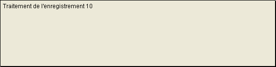
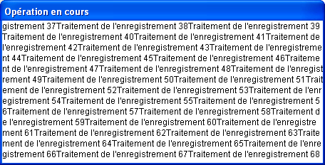
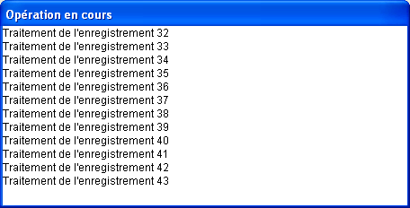
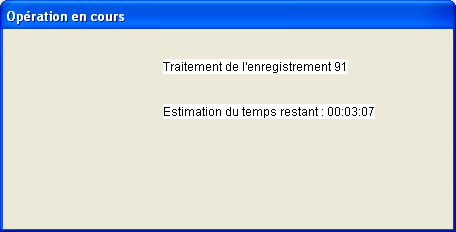

<!--REF #_command_.MESSAGE.Syntax-->**MESSAGE** ( *message* )<!-- END REF-->
<!--REF #_command_.MESSAGE.Params-->
| Paramètre | Type |  | Description |
| --- | --- | --- | --- |
| message | Text | &#8594;  | Message à afficher |

<!-- END REF-->

*Cette commande n'est pas thread-safe, elle ne peut pas être utilisée dans du code préemptif.*


#### Description 

<!--REF #_command_.MESSAGE.Summary-->La commande **MESSAGE** affiche *message* à l'écran dans une fenêtre spéciale de message qui est ouverte et refermée à chaque fois que vous l'appelez (à moins que vous ne travailliez dans une fenêtre préalablement ouverte par la commande [Open window](open-window.md), cf.<!-- END REF--> ci-dessous). Le message est temporaire et est effacé dès qu'un formulaire est affiché ou dès que l'exécution de la méthode est stoppée. Si une autre commande **MESSAGE** est exécutée, le précédent message est effacé. 

**MESSAGE** est généralement utilisée pour informer l'utilisateur du déroulement d'une action. 

Si une fenêtre a été ouverte par la commande [Open window](open-window.md), tous les appels ultérieurs à la commande **MESSAGE** affichent les messages dans cette fenêtre. Cette fenêtre se comporte en quelque sorte comme un terminal :

* Chaque message successif n'efface pas le précédent, les messages se placent les uns à la suite des autres.
* Si un message est plus large que la fenêtre, 4D insère automatiquement un retour à la ligne.
* Si le message contient plus de lignes que ne peut en afficher la fenêtre, 4D fait automatiquement défiler le message dans la fenêtre.
* Si vous souhaitez contrôler les retours à la ligne, insérez vos propres retours chariot dans votre texte, à l'aide de [Char](char.md)(13).
* Vous pouvez appeler la commande [GOTO XY](goto-xy.md) pour afficher le texte à un emplacement particulier dans la fenêtre.
* Vous pouvez appeler la commande [ERASE WINDOW](erase-window.md) pour effacer le contenu de la fenêtre.
* La fenêtre est une fenêtre d'affichage statique : son contenu n'est pas redessiné lorsque d'autres fenêtres s'affichent par-dessus.
* La police et la taille des caractères affichés dans la fenêtre peuvent être modifiées via la page "Interface" des Propriétés de la base.

**Note :** **MESSAGE** est compatible avec la commande [Open form window](open-form-window.md), toutefois dans ce contexte le second paramètre *\** de [Open form window](open-form-window.md), permettant de conserver la taille et position de la fenêtre, n'est pas pris en charge. 

#### Exemple 1 

L'exemple suivant traite une sélection d'enregistrements et appelle la commande **MESSAGE** pour informer l'utilisateur de la progression de l'opération :

```4d
 For($vlEnregistrement;1;Records in selection([touteTable]))
    MESSAGE("Traitement de l'enregistrement "+String($vlEnregistrement))
  // Faire quelque chose avec l'enregistrement
    NEXT RECORD([touteTable])
 End for
```

La fenêtre suivante s'affiche puis disparaît à chaque appel de **MESSAGE** :



#### Exemple 2 

Afin d'éliminer le "clignotement" de la fenêtre, il est préférable, comme dans ce deuxième exemple, d'afficher les messages dans une fenêtre ouverte par l'intermédiaire de la commande [Open window](open-window.md) :

```4d
 Open window(50;50;500;250;5;"Opération en cours")
 For($vlEnregistrement;1;Records in selection([touteTable]))
    MESSAGE("Traitement de l'enregistrement "+String($vlEnregistrement))
  // Faire quelque chose avec l'enregistrement
    NEXT RECORD([touteTable])
 End for
 CLOSE WINDOW
```

Le résultat est le suivant (sous Windows) : 



#### Exemple 3 

En ajoutant un retour chariot, vous améliorez la présentation :

```4d
 Open window(50;50;500;250;5;"Opération en cours")
 For($vlEnregistrement;1;Records in selection([touteTable]))
    MESSAGE("Traitement de l'enregistrement "+String($vlEnregistrement)+Caractere(Retour chariot))
  // Faire quelque chose avec l'enregistrement
    NEXT RECORD([touteTable])
 End for
 CLOSE WINDOW
```

Voici le résultat (Sous Windows) :



#### Exemple 4 

A l'aide de la commande [GOTO XY](goto-xy.md) et de l'écriture de quelques lignes supplémentaires, la présentation s'améliore nettement : 

```4d
 Open window(50;50;500;250;5;"Opération en cours")
 $vlNbEnregistrements:=Records in selection([touteTable])
 $vhHeureDébut:=Current time
 For($vlEnregistrement;1;$vlNbEnregistrements)
    GOTO XY(5;2)
    MESSAGE("Traitement de l'enregistrement "+String($vlEnregistrement)+Caractere(Retour chariot))
  // Faire quelque chose avec les enregistrements
    NEXT RECORD([touteTable])
    GOTO XY(5;5)
    $vlReste:=(($vlNbEnregistrements/$vlEnregistrement)-1)*(Current time-$vhHeureDébut)
    MESSAGE("Estimation du temps restant : "+Time string($vlReste))
 End for
 CLOSE WINDOW
```

Voici le résultat (sous Windows) :



#### Voir aussi 

[CLOSE WINDOW](close-window.md)  
[ERASE WINDOW](erase-window.md)  
[GOTO XY](goto-xy.md)  
[Open window](open-window.md)  