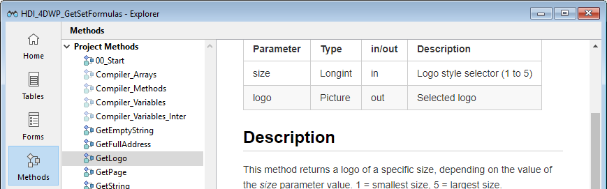

<!--REF #_command_.METHOD GET COMMENTS.Syntax-->**METHOD GET COMMENTS** ( *chemin* ; *commentaires* {; *} )<!-- END REF-->
<!--REF #_command_.METHOD GET COMMENTS.Params-->
| Paramètre | Type |  | Description |
| --- | --- | --- | --- |
| chemin | Text, Text array | &#8594;  | Texte ou Tableau texte contenant un ou plusieurs chemin(s) de méthode(s) |
| commentaires | Text, Text array | &#8592; | Documentation de la ou des méthode(s) désignée(s) |
| * | Opérateur | &#8594;  | Si passé = la commande s’applique à la base hôte lorsqu’elle est exécutée depuis un composant (paramètre ignoré hors de ce contexte) |

<!-- END REF-->

#### Description 

<!--REF #_command_.METHOD GET COMMENTS.Summary-->La commande **METHOD GET COMMENTS** retourne dans le paramètre *commentaires* la documentation de la ou des méthode(s) désignée(s) par le paramètre *chemin*.<!-- END REF-->

La documentation lue par cette commande est affichée dans l’Explorateur de 4D (à ne pas confondre avec les lignes de commentaires dans le code, qui peuvent être lues à l’aide de [METHOD GET CODE](method-get-code.md)). 

Elle contient :

* du texte markdown dans les bases projet
* du texte stylé dans les bases binaires



Cette documentation peut être générée pour des méthodes de type triggers, méthodes projet, méthodes formulaire, méthodes base ou les classes.

**Note :** Les formulaires et les méthodes formulaire partagent la même documentation.

Vous pouvez utiliser deux types de syntaxes, basées soit sur des tableaux texte, soit sur des variables texte :  

```4d
 var vTchemin : Text // variables texte
 var vTcommentaires : Text
 METHOD GET COMMENTS(vTchemin;vTcommentaires) // documentation d’une seule méthode
```

```4d
 ARRAY TEXT(tabChemins;0) // tableaux texte
 ARRAY TEXT(tabCommentaires;0)
 METHOD GET COMMENTS(tabChemins;tabCommentaires) // documentation de plusieurs méthodes
```

Il n’est pas possible de mixer les deux syntaxes.

Si la commande est exécutée depuis un composant, elle s’applique par défaut aux méthodes du composant. Si vous passez le paramètre *\**, elle accède aux méthodes de la base hôte.

#### Voir aussi 

[METHOD SET COMMENTS](method-set-comments.md)  

#### Propriétés
|  |  |
| --- | --- |
| Numéro de commande | 1189 |
| Thread safe | &check; |
| Interdite sur le serveur ||


