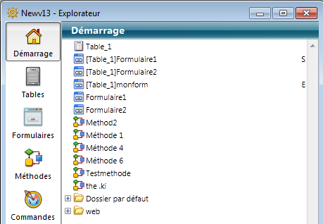

<!--REF #_command_.METHOD GET FOLDERS.Syntax-->**METHOD GET FOLDERS** ( *tabNoms* {; *filtre*}{; *} )<!-- END REF-->
<!--REF #_command_.METHOD GET FOLDERS.Params-->
| Paramètre | Type |  | Description |
| --- | --- | --- | --- |
| tabNoms | Text array | &#8592; | Tableau des noms de dossiers de la page Démarrage |
| filtre | Text | &#8594;  | Filtrage des noms |
| * | Opérateur | &#8594;  | Si passé = la commande s’applique à la base hôte lorsqu’elle est exécutée depuis un composant (paramètre ignoré hors de ce contexte) |

<!-- END REF-->

*Cette commande n'est pas thread-safe, elle ne peut pas être utilisée dans du code préemptif.*

#### Description 

<!--REF #_command_.METHOD GET FOLDERS.Summary-->La commande **METHOD GET FOLDERS** retourne dans le tableau *tabNoms* les noms des dossiers créés dans la page Démarrage de l’Explorateur de 4D :

Comme les noms des dossiers doivent être uniques, la hiérarchie n’est pas retournée dans le tableau.<!-- END REF--> 

Vous pouvez restreindre la liste des dossiers en passant une chaîne de comparaison dans le paramètre *filtre* : dans ce cas, seuls les dossiers dont le nom correspond au filtre seront retournés. Vous pouvez utiliser le caractère @ afin de définir des filtres de type "commence par", "se termine par" ou "contient". Si vous passez une chaîne vide, le paramètre *filtre* est ignoré. 

Si la commande est exécutée depuis un composant, elle retourne par défaut les chemins des méthodes du composant. Si vous passez le paramètre *\**, le tableau contiendra les chemins des méthodes de la base hôte.

#### Voir aussi 

[METHOD GET PATHS](method-get-paths.md)  