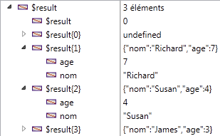

<!--REF #_command_.OB GET ARRAY.Syntax-->**OB GET ARRAY** ( *objet* ; *propriété* ; *tableau* )<!-- END REF-->
<!--REF #_command_.OB GET ARRAY.Params-->
| Paramètre | Type |  | Description |
| --- | --- | --- | --- |
| objet | Object, Object | &#8594;  | Objet structuré |
| propriété | Text | &#8594;  | Nom de la propriété à lire |
| tableau | Text array, Real array, Boolean array, Object array, Pointer array, Integer array | &#8592; | Tableau valeur de la propriété |

<!-- END REF-->

#### Description 

<!--REF #_command_.OB GET ARRAY.Summary-->La commande **OB GET ARRAY** récupère dans *tableau* le tableau de valeurs stocké dans la *propriété* de l’objet de langage désigné par le paramètre *objet*.<!-- END REF--> 

*objet* doit avoir été défini via la commande [C\_OBJECT](c-object.md) ou désigner un champ objet 4D.

Passez dans le paramètre *propriété* le libellé de la propriété à lire. Attention, le paramètre *propriété* tient compte des majuscules/minuscules. 

#### Exemple 1 

Soit le tableau objet défini dans l’exemple de la commande [OB SET ARRAY](ob-set-array.md) :


On souhaite récupérer ces valeurs :

```4d
 ARRAY OBJECT($result;0)
 OB GET ARRAY($Enfants;"Enfants";$result)
```



#### Exemple 2 

On souhaite changer une valeur dans le premier élément du tableau :

```4d
     //Changer la valeur de "age" :
 ARRAY OBJECT($refs)
 OB GET ARRAY($refEmployees;"__ENTITIES";$refs)
 OB SET($refs{1};"age";25)
```

#### Voir aussi 

*Conversions de type entre les collections et les tableaux 4D*  
[OB SET ARRAY](ob-set-array.md)  