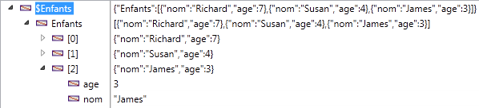
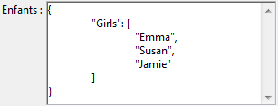

<!--REF #_command_.OB SET ARRAY.Syntax-->**OB SET ARRAY** ( *objet* ; *propriété* ; *tableau* )<!-- END REF-->
<!--REF #_command_.OB SET ARRAY.Params-->
| Paramètre | Type |  | Description |
| --- | --- | --- | --- |
| objet | Object, Object | &#8594;  | Objet structuré |
| propriété | Text | &#8594;  | Nom de la propriété à définir |
| tableau | Array, Variable | &#8594;  | Tableau à stocker dans la propriété |

<!-- END REF-->

#### Description 

<!--REF #_command_.OB SET ARRAY.Summary-->La commande **OB SET ARRAY** permet de définir le *tableau* à associer à la *propriété* dans l’objet de langage désigné par le paramètre *objet*.<!-- END REF-->doit avoir été défini via la commande [C\_OBJECT](c-object.md) ou désigner un champ objet 4D.

Passez dans le paramètre *propriété* le libellé de la propriété à créer ou à modifier. Si la propriété existe déjà dans *objet*, sa valeur sera mise à jour. Si elle n’existe pas, elle est créée. Attention, le paramètre *propriété* tient compte des majuscules/minuscules. 

Passez dans le paramètre *tableau* le tableau devant être passé comme valeur de la propriété. Plusieurs types de tableaux sont pris en charge : réel, entier long, texte, booléen, objet, pointeur ou image. 

**Notes :**

* Les variables simples sont prises en charge dans le paramètre *tableau*, auquel cas un tableau à valeur unique est créé et associé à la propriété.
* Il n’est pas possible d’utiliser de tableaux à deux dimensions.

#### Exemple 1 

Utilisation d’un tableau texte :

```4d
 var $Children : Object
 ARRAY TEXT($tabChildren;3)
 $tabChildren{1}:="Richard"
 $tabChildren{2}:="Susan"
 $tabChildren{3}:="James"
 
 OB SET ARRAY($Children;"Children";$tabChildren)
     // Valeur de $Children = {"Children":["Richard","Susan","James"]}
```

#### Exemple 2 

Ajout d’un élément dans un tableau :

```4d
 ARRAY TEXT($tabText;2)
 $tabText{1}:="Smith"
 $tabText{2}:="White"
 var $Employees : Object
 OB SET ARRAY($Employees;"Employés";$tabText)
 APPEND TO ARRAY($tabText;"Brown") //Ajout dans le tableau 4D
     // $Employees = {"Employés":["Smith","White"]}
 
 OB SET ARRAY($Employees;"Employés";$tabText)
     // $Employees = {"Employés":["Smith","White","Brown"]}
```

#### Exemple 3 

Utilisation d’un tableau texte avec sélection d’un élément :

```4d
     //$Employees = {"Employés":["Smith","White","Brown"]}
 OB SET ARRAY($Employees ;"Manager";$tabText{1})
     //$Employees = {"Employees":["Smith","White","Brown"],"Manager":["Smith"]}
```

#### Exemple 4 

Utilisation d’un tableau objet :

```4d
 var $Enfants;$ref_richard;$ref_susan;$ref_james : Object
 ARRAY OBJECT($tabEnfants;0)
 OB SET($ref_richard;"nom";"Richard";"age";7)
 APPEND TO ARRAY($tabEnfants;$ref_richard)
 OB SET($ref_susan;"nom";"Susan";"age";4)
 APPEND TO ARRAY($tabEnfants;$ref_susan)
 OB SET($ref_james;"nom";"James";"age";3)
 
 APPEND TO ARRAY($tabEnfants;$ref_james)
 
     //$tabEnfants {1} = {"nom":"Richard","age":7}
     //$tabEnfants {2} = {"nom":"Susan","age":4}
     //$tabEnfants {3} = {"nom":"James","age":3}
 
 OB SET ARRAY($Enfants;"Enfants";$tabEnfants)
 
     // $Enfants = {"Enfants":[{"nom":"Richard","age":7},{"nom":"Susan",
     // "age":4},{"nom":"James","age":3}]}
```

L’objet est représenté ainsi dans le débogueur :



#### Exemple 5 

Utilisation d'un champ objet :

```4d
 ARRAY TEXT($arrGirls;3)
 $arrGirls{1}:="Emma"
 $arrGirls{2}:="Susan"
 $arrGirls{3}:="Jamie"
 OB SET ARRAY([Personnes]Enfants;"Girls";$arrGirls)
```



#### Exemple 6 

#### Voir aussi 

*Conversions de type entre les collections et les tableaux 4D*  
[OB GET ARRAY](ob-get-array.md)  
[OB SET](ob-set.md)  

#### Propriétés

|  |  |
| --- | --- |
| Numéro de commande | 1227 |
| Thread safe | &check; |


