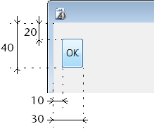

<!--REF #_command_.OBJECT SET COORDINATES.Syntax-->**OBJECT SET COORDINATES** ( {* ;} *objet* ; *gauche* ; *haut* {; *droite* ; *bas*} )<!-- END REF-->
<!--REF #_command_.OBJECT SET COORDINATES.Params-->
| Paramètre | Type |  | Description |
| --- | --- | --- | --- |
| * | Opérateur | &#8594;  | Si spécifié, objet est un nom d'objet (chaîne)<br/>Si omis, objet est un champ ou une variable |
| objet | Integer | &#8594;  | Nom d'objet (si * est spécifié) ou <br/>Champ ou variable (si * est omis) |
| gauche | Integer | &#8594;  | Coordonnée gauche de l’objet en pixels |
| haut | Integer | &#8594;  | Coordonnée supérieure de l’objet en pixels |
| droite | Integer | &#8594;  | Coordonnée droite de l’objet en pixels |
| bas | Integer | &#8594;  | Coordonnée inférieure de l’objet en pixels |

<!-- END REF-->

*Cette commande n'est pas thread-safe, elle ne peut pas être utilisée dans du code préemptif.*


#### Description 

<!--REF #_command_.OBJECT SET COORDINATES.Summary-->La commande **OBJECT SET COORDINATES** permet de modifier l’emplacement et, optionnellement, la taille de l’objet ou des objets désigné(s) par les paramètres *objet* et *\** pour le process courant.<!-- END REF-->

**Note :** Cette commande équivaut à utiliser la commande [OBJECT MOVE](object-move.md) en passant le 2e paramètre *\**. 

Si vous passez le paramètre optionnel *\**, vous indiquez que le paramètre *objet* est un nom d’objet (une chaîne). Si vous ne passez pas le paramètre, vous indiquez que le paramètre *objet* est un champ ou une variable. Dans ce cas, vous ne passez pas une chaîne mais une référence de champ ou de variable (champ ou variable objet uniquement).

Passez dans les paramètres *gauche* et *haut* les nouvelles coordonnées absolues de l’objet dans le formulaire. Ces coordonnées doivent être exprimées en pixels par rapport à l’angle supérieur gauche du formulaire. 

Vous pouvez également passer des valeurs de coordonnées absolues dans les paramètres *droite* et *bas*, indiquant l’angle inférieur droit de l’objet. Si cet angle ne correspond pas à celui de l’objet après application des paramètres *gauche* et *haut*, l’objet est redimensionné en conséquence. 

**Note :** Si vous souhaitez déplacer un objet relativement à sa position initiale, il est préférable d’utiliser la commande existante [OBJECT MOVE](object-move.md). 

Cette commande fonctionne uniquement dans les contextes suivants :

* Formulaires entrée en mode saisie,
* Formulaires affichés via la commande [DIALOG](dialog.md),
* En-têtes et pieds de page des formulaires sortie affichés par la commande [MODIFY SELECTION](modify-selection.md) ou [DISPLAY SELECTION](display-selection.md),
* Formulaires en cours d'impression.

#### Exemple 

L’instruction suivante place l’objet "bouton\_1" aux coordonnées (10,20) (30,40) :

```4d
 OBJECT SET COORDINATES(*;"bouton_1";10;20;30;40)
```



#### Voir aussi 

[CONVERT COORDINATES](convert-coordinates.md)  
[OBJECT GET COORDINATES](object-get-coordinates.md)  
[OBJECT MOVE](object-move.md)  