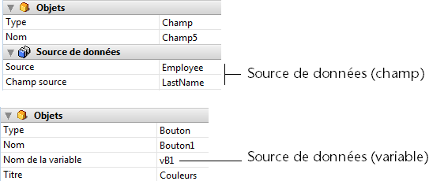

<!--REF #_command_.OBJECT SET DATA SOURCE.Syntax-->**OBJECT SET DATA SOURCE** ( {* ;} *objet* ; *sourceDonnées* )<!-- END REF-->
<!--REF #_command_.OBJECT SET DATA SOURCE.Params-->
| Paramètre | Type |  | Description |
| --- | --- | --- | --- |
| * | Opérateur | &#8594;  | Si spécifié, objet est un nom d'objet (chaîne)<br/>Si omis, objet est un champ ou une variable |
| objet | any | &#8594;  | Nom d'objet (si * est spécifié) ou <br/>Champ ou variable (si * est omis) |
| sourceDonnées | Pointer | &#8594;  | Pointeur vers la nouvelle source de données de l’objet |

<!-- END REF-->

#### Description 

<!--REF #_command_.OBJECT SET DATA SOURCE.Summary-->La commande **OBJECT SET DATA SOURCE** vous permet de modifier la source de données de l’objet ou des objets désigné(s) par les paramètres *objet* et *\**.<!-- END REF-->

Si vous passez le paramètre optionnel *\**, vous indiquez que le paramètre *objet* est un nom d’objet (une chaîne). Si vous ne passez pas le paramètre, vous indiquez que le paramètre *objet* est un champ ou une variable. Dans ce cas, vous ne passez pas une chaîne mais une référence de champ ou de variable (champ ou variable objet uniquement).

La source de données est le champ ou la variable dont la valeur est représentée par l’objet lors de l’exécution du formulaire. En mode Développement, la source de données est définie dans la Liste de propriétés, généralement via les lignes Source et Champ source (champs) ou Nom de la variable (variables) : 



Hormis pour les list box (cf. ci-dessous), toutes les sources de données du formulaire peuvent être modifiées par cette commande. Il appartient au développeur de s’assurer de la cohérence des modifications effectuées. 

Dans le cas des list box, les points suivants sont à considérer :

* les modifications de sources de données doivent tenir compte du type de list box : par exemple, il n’est pas possible d’utiliser un champ comme source de données de colonne d’une list box de type tableau.
* pour les list box de type sélection, il n’est pas possible de modifier ou de lire la source de données de l’objet list box lui-même : il s’agit dans ce cas d’une référence interne et non d’une source de données.
* cette commande est utile principalement dans le contexte des list box de type tableau. Pour les list box de type sélection, vous pouvez plutôt utiliser la commande [LISTBOX SET COLUMN FORMULA](listbox-set-column-formula.md).

Si la commande est appliquée à une source de données non modifiable, elle ne fait rien. 

#### Exemple 

Modification de la source de données d’une zone de saisie :

```4d
 var $ptrChp : Pointer
 $ptrChp:=Field(3;2)
 OBJECT SET DATA SOURCE(*;"Input";$ptrChp)
```

#### Voir aussi 

[LISTBOX SET COLUMN FORMULA](listbox-set-column-formula.md)  
[OBJECT Get data source](object-get-data-source.md)  

#### Propriétés

|  |  |
| --- | --- |
| Numéro de commande | 1264 |
| Thread safe | &cross; |


