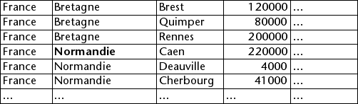
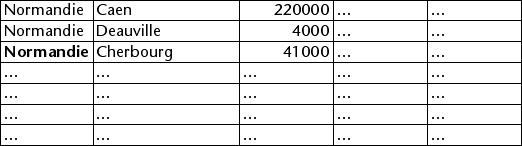
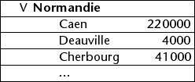

<!--REF #_command_.OBJECT SET SCROLL POSITION.Syntax-->**OBJECT SET SCROLL POSITION** ( * ; *objet* {; *positionLigne* {; *positionH*}}{; *} )<!-- END REF-->
<!--REF #_command_.OBJECT SET SCROLL POSITION.Params-->
| Paramètre | Type |  | Description |
| --- | --- | --- | --- |
| * | Opérateur | &#8594;  | Si spécifié, objet est un nom d’objet (chaîne)Si omis, objet est une table, un champ ou une variable |
| objet | any | &#8594;  | Nom d’objet (si * est spécifié) ou Table, champ ou variable (si * est omis) |
| positionLigne | Integer | &#8594;  | Numéro de ligne à afficher ou Défilement vertical en pixels (images) |
| positionH | Integer | &#8594;  | Numéro de colonne à afficher (list box) ou<br/>Défilement horizontal en pixels (images) |
| * | Opérateur | &#8594;  | Afficher la ligne (et la colonne si le paramètre positionH est passé) en première position après défilement (listes)Appliquer un défilement relatif (images) |

<!-- END REF-->

#### Description 

<!--REF #_command_.OBJECT SET SCROLL POSITION.Summary-->La commande **OBJECT SET SCROLL POSITION** permet de faire défiler le contenu de plusieurs types d'objets : lignes d’un sous-formulaire, d’un formulaire liste affiché via la commande [MODIFY SELECTION](modify-selection.md) ou [DISPLAY SELECTION](display-selection.md), ou d'une liste hiérarchique, lignes et colonnes d'une List box ou encore pixels d'une image.<!-- END REF--> 

**Note :** Le défilement par programmation d’un objet reste possible même si les barres de défilement ont été masquées dans le formulaire.

Si vous passez le premier paramètre optionnel *\**, vous indiquez que le paramètre *objet* est le nom d’un objet de type sous-formulaire, liste hiérarchique, List box ou champ/variable image (dans ce cas, passez une chaîne dans *objet*). Si vous ne passez pas ce paramètre, vous indiquez que le paramètre *objet* est une table (table du formulaire liste ou du sous-formulaire), une variable ([RefListe](# "Expression de type Entier long identifiant de façon unique une liste hiérarchique") de liste hiérarchique, list box ou image) ou un champ. 

Le paramètre *positionLigne* permet de spécifier le numéro de la ligne à afficher ou, dans le cas d'une image, la coordonnée verticale du pixel à afficher.   
Si vous ne passez pas ce paramètre, la commande provoque le défilement vertical des lignes de la liste de manière à ce que la première ligne sélectionnée (surlignée) dans la liste soit visible. Dans ce cas, si aucune ligne n’est sélectionnée ou si au moins une ligne sélectionnée est déjà visible, aucun défilement vertical n'est effectué.  
Si vous passez ce paramètre, la commande provoque le défilement vertical des lignes de la liste de manière à ce que la ligne désignée soit visible (qu’elle soit surlignée ou non). Si la ligne est déjà visible, la commande ne fait rien, sauf si le second paramètre \* est passé (cf. ci-dessous). 

* Pour les formulaires liste et les sous-formulaires, ce numéro correspond au numéro d’un enregistrement parmi la sélection courante, c’est-à-dire sa position.
* Dans le cas des listes hiérarchiques, la commande tient compte de l'état déployé/contracté des éléments.
* Pour les list box, ce numéro correspond au numéro de la ligne parmi toutes les lignes de l'objet (y compris les lignes éventuellement cachées). Si le numéro passé dans *positionLigne* correspond à une ligne masquée dans la list box, la commande affiche la première ligne visible suivante.  
**Note :** Gardez à l’esprit que cette commande se base toujours sur la représentation "standard" (non hiérarchique) d’une list box, même si elle est affichée en mode hiérarchique. Par conséquent, le résultat pourra être différent suivant que la list box est affichée en mode standard ou en mode hiérarchique (cf. exemple).
* Dans le cas d'une image affichée dans le formulaire, *positionLigne* indique le point de coordonnée verticale de l’image à afficher dans l'objet. Passez 0 dans *positionLigne* dans pour ne pas faire défiler l’image dans la dimension verticale. La valeur doit être exprimée en pixels relativement à l’origine de l’image. Si le point de coordonnée verticale est déjà visible dans l'objet, la commande ne fait rien (hormis si vous passez le second paramètre *\**, cf. ci-dessous). L’image doit être affichée dans le format "Image tronquée (non centrée)".

Le paramètre *positionH* peut être utilisé dans le contexte d’une list box ou d'une image. 

* Dans le cas d'une list box, vous pouvez passer dans *positionH* un numéro de colonne. L’exécution de la commande provoquera le défilement horizontal de la list box de manière à ce que la colonne soit visible. Si la colonne est déjà visible, la commande ne fait rien. Comme pour le défilement vertical, si vous passez le second paramètre optionnel *\**, la colonne rendue visible par la commande (si la list box a effectivement défilé) sera placée en première position (cf. ci-dessous).
* Dans le cas d'une image affichée dans le formulaire, *positionH* indique le point de coordonnée horizontale de l’image à afficher dans l'objet. La valeur doit être exprimée en pixels relativement à l’origine de l’image. Si le point de coordonnée horizontale est déjà visible dans l'objet, la commande ne fait rien (hormis si vous passez le second paramètre *\**, cf. ci-dessous).

Si vous passez le second paramètre optionnel *\** :

* la ligne rendue visible par la commande (si la liste a effectivement défilé) sera placée en première position de la liste. Si la ligne est située en fin de liste, cette option n'a pas d'effet.
* dans le contexte d'une image, les coordonnées demandées seront positionnées à l'origine de la variable image (0,0), même si ces coordonnées étaient déjà visibles dans l'objet.

**Note :** La commande [HIGHLIGHT RECORDS](highlight-records.md) comporte un paramètre *\** facultatif permettant de déléguer la gestion du défilement dans les formulaires à la commande **OBJECT SET SCROLL POSITION**.

#### Exemple 1 

Cet exemple illustre la différence de fonctionnement de la commande avec une list box affichée en mode standard et hiérarchique :

```4d
 OBJECT SET SCROLL POSITION(*;"malistbox";4;2;*) // afficher en tête la 4e ligne de la 2e colonne de la list box
```

Si cette instruction est appliquée à une list box affichée en mode standard :



... les lignes et les colonnes de la list box défilent effectivement :



En revanche, si la même instruction est appliquée à la list box affichée en mode hiérarchique, les lignes défilent mais pas les colonnes car la 2e colonne appartient à la hiérarchie :



#### Exemple 2 

Vous souhaitez faire défiler une image incluse dans une variable de formulaire. Ce montage fait apparaître la partie visible de l'image ainsi que le point à afficher (166 pixels verticalement et 200 pixels horizontalement) :


Pour faire défiler la partie visible et afficher le point rouge à l'origine de la variable image, il vous suffit d'écrire :

```4d
 OBJECT SET SCROLL POSITION(*;"maVar";166;200;*)
```

Vous obtenez le résultat suivant :


Attention dans ce cas, si vous omettez le second paramètre \*, l'image ne défilera pas car le point défini est déjà visible. 

#### Voir aussi 

[HIGHLIGHT RECORDS](highlight-records.md)  
[LISTBOX SELECT ROW](listbox-select-row.md)  
[OBJECT GET SCROLL POSITION](object-get-scroll-position.md)  

#### Propriétés
|  |  |
| --- | --- |
| Numéro de commande | 906 |
| Thread safe | &check; |
| Interdite sur le serveur ||


