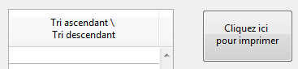

<!--REF #_command_.OBJECT SET TITLE.Syntax-->**OBJECT SET TITLE** ( {* ;} *objet* ; *libellé* )<!-- END REF-->
<!--REF #_command_.OBJECT SET TITLE.Params-->
| Paramètre | Type |  | Description |
| --- | --- | --- | --- |
| * | Opérateur | &#8594;  | Si spécifié, objet est un nom d'objet (chaîne) Si omis, objet est une variable |
| objet | any | &#8594;  | Nom d'objet (si * est spécifié) ou Variable (si * est omis) |
| libellé | Text | &#8594;  | Nouveau libellé de l'objet |

<!-- END REF-->

#### Description 

<!--REF #_command_.OBJECT SET TITLE.Summary-->La commande **OBJECT SET TITLE** change le libellé du ou des objets(s) spécifié(s) dans le paramètre *objet* et le remplace par la valeur définie dans le paramètre *libellé* *.<!-- END REF-->*

Si vous passez le paramètre optionnel \*, vous indiquez que le paramètre *objet* est un nom d'objet (une chaîne). Si vous ne passez pas ce paramètre, vous indiquez que le paramètre *objet* est une variable. Dans ce cas, vous ne passez pas une chaîne mais une référence de variable (variable objet uniquement). Pour plus d'informations sur les noms d'objets, reportez-vous à la section *Objets de formulaires*.

**OBJECT SET TITLE** peut s'appliquer à tous les types d'objets simples contenant un libellé : 

* boutons et boutons 3D,
* cases à cocher et cases à cocher 3D,
* boutons radio et boutons radio 3D,
* en-têtes de list box,
* textes statiques,
* zones de groupe.

Généralement, cette commande s'applique à un objet à la fois. La zone de libellé de l'objet doit être assez grande pour pouvoir accueillir le texte ; sinon, le texte est tronqué. 

N'utilisez pas de retours chariot dans *libellé*. 

Si vous souhaitez définir un libellé sur plusieurs lignes, utilisez le caractère "\\" ("\\\\" dans l'éditeur de code) comme retour à la ligne. Cette possibilité est permise pour les boutons 3D, cases à cocher 3D, boutons radio 3D et les en-têtes de list box.

**Note :** Passez "\\\\\\" si vous souhaitez utiliser le caractère "\\" dans le libellé.

#### Exemple 1 

L'exemple suivant est la méthode objet d'un bouton de recherche situé dans la zone de pied de page d'un formulaire sortie affiché par la commande [MODIFY SELECTION](modify-selection.md). La méthode effectue une recherche dans une table et active ou inactive le bouton intitulé *bSuppr* et change son titre, en fonction des résultats de la recherche :

```4d
 QUERY([Personnes];[Personnes]Nom=vNom)
 Case of
    :(Records in selection([Personnes])=0) // Personne n'a été trouvé
       OBJECT SET TITLE(bSuppr;" Supprimer")
       OBJECT SET ENABLED(bSuppr;False)
    :(Records in selection([Personnes])=1) // Une personne a été trouvée
       OBJECT SET TITLE(bSuppr;"Supprimer la personne")
       OBJECT SET ENABLED(bSuppr;True)
    :(Records in selection([Personnes])>1) // Plusieurs personnes ont été trouvées
       OBJECT SET TITLE(bSuppr;"Supprimer les personnes")
       OBJECT SET ENABLED(bSuppr;True)
 End case
```

#### Exemple 2 

Vous souhaitez insérer des libellés sur deux lignes :

```4d
 OBJECT SET TITLE(*;"entete1";"Tri ascendant \\\ \\Tri descendant")
 OBJECT SET TITLE(*;"bouton1";"Cliquez ici \\pour imprimer")
```



#### Voir aussi 

[OBJECT Get title](object-get-title.md)  

#### Propriétés

|  |  |
| --- | --- |
| Numéro de commande | 194 |
| Thread safe | &cross; |


