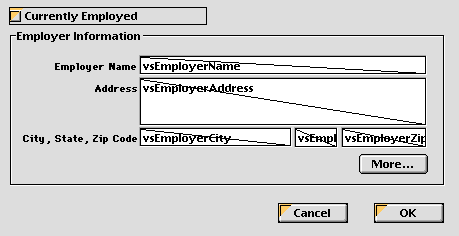
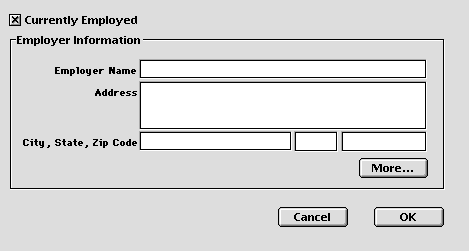
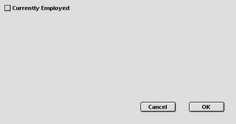

<!--REF #_command_.OBJECT SET VISIBLE.Syntax-->**OBJECT SET VISIBLE** ( {* ;} *objet* ; *visible* )<!-- END REF-->
<!--REF #_command_.OBJECT SET VISIBLE.Params-->
| Paramètre | Type |  | Description |
| --- | --- | --- | --- |
| * | Opérateur | &#8594;  | Si spécifié, objet est un nom d'objet (chaîne) Si omis, objet est un champ ou une variable |
| objet | any | &#8594;  | Nom d'objet (si * est passé) ou Champ ou Variable (si * est omis) |
| visible | Boolean | &#8594;  | Vrai = visible, Faux = invisible |

<!-- END REF-->

#### Description 

<!--REF #_command_.OBJECT SET VISIBLE.Summary-->La commande **OBJECT SET VISIBLE** affiche ou masque le ou les objet(s) défini(s) par les paramètres *objet* et *\**.<!-- END REF-->

Si vous passez le paramètre optionnel *\**, vous indiquez que le paramètre *objet* désigne le nom d'un objet (une chaîne). Si vous ne passez pas le paramètre \*, vous indiquez que le paramètre *objet* désigne un champ ou une variable. Dans ce cas, vous ne passez pas une chaîne de caractères mais la référence du champ ou de la variable (champs ou variables objets uniquement). Pour plus d'informations sur les noms d'objets, reportez-vous à la section *Objets de formulaires*.

Si vous passez la valeur **VRAI** dans le paramètre *visible*, le ou les objet(s) sont affichés. Si vous passez **FAUX** dans *visible*, les objets sont masqués.

#### Exemple 

Voici un formulaire tel qu'il apparaît en mode Développement :



Les objets dans la zone de groupe **Employer Information** ont tous un nom qui contient l'expression “employer” (y compris la zone de groupe). Lorsque l'option **Currently Employed** est cochée, les objets doivent être visibles, lorsqu'elle est désélectionnée les objets doivent être invisibles. Voici la méthode projet de la case à cocher :

```4d
    // Méthode objet Case à cocher cbCurrentlyEmployed
 Case of
    :(FORM Event=On Load)
       cbCurrentlyEmployed:=1
 
    :(FORM Event=On Clicked)
  // Cacher ou montrer tous les objets dont le nom contient "emp"
       OBJECT SET VISIBLE(*;"@emp@";cbCurrentlyEmployed # 0)
  // Mais toujours conserver la case à cocher visible
       OBJECT SET VISIBLE(cbCurrentlyEmployed;True)
 End case
```

En exécution, le formulaire apparaîtra ainsi :



ou ainsi :



#### Voir aussi 

[OBJECT Get visible](object-get-visible.md)  
[OBJECT SET ENTERABLE](object-set-enterable.md)  

#### Propriétés
|  |  |
| --- | --- |
| Numéro de commande | 603 |
| Thread safe | &check; |
| Interdite sur le serveur ||


