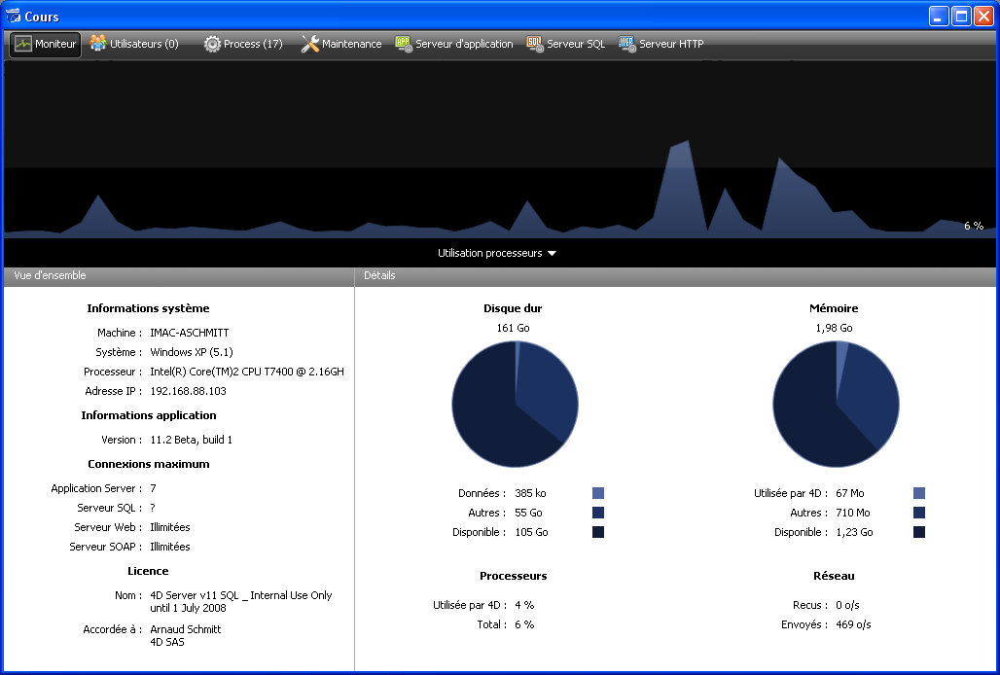

<!--REF #_command_.OPEN ADMINISTRATION WINDOW.Syntax-->**OPEN ADMINISTRATION WINDOW**<!-- END REF-->
<!--REF #_command_.OPEN ADMINISTRATION WINDOW.Params-->
| Ne requiert pas de paramètre |  |
| --- | --- |

<!-- END REF-->

#### Description 

<!--REF #_command_.OPEN ADMINISTRATION WINDOW.Summary-->La commande **OPEN ADMINISTRATION WINDOW** affiche la fenêtre d’administration du serveur sur le poste qui l’exécute.<!-- END REF--> La fenêtre d’administration de 4D Server permet de visualiser les paramètres courants et d’effectuer diverses opérations de maintenance (cf. Guide de référence de 4D Server). A compter de la version 11 de 4D Server, cette fenêtre peut être affichée depuis un poste client : 



Cette commande doit être appelée dans le contexte d’une application 4D connectée ou d'un 4D Server. Elle ne fait rien si :

* elle est appelée dans une application 4D en mode local,
* elle est exécutée par un utilisateur autre que le Super\_Utilisateur ou l’Administrateur (dans ce cas, l’erreur -9991 est générée, cf. section *Erreurs de la base de données (-10602 -> 4004)*).

#### Exemple 

Voici le code d'un bouton d’administration : 

```4d
 If(Application type=4D mode local)
    OPEN SECURITY CENTER
  // ...
 End if
 If(Application type=4D mode distant)
    OPEN ADMINISTRATION WINDOW
  // ...
 End if
 If(Application type=4D Server)
    OPEN SECURITY CENTER
  // ...
 End if
```

#### Variables et ensembles système 

Si la commande a été exécutée correctement, la variable système OK prend la valeur 1\. Dans le cas contraire, elle prend la valeur 0.

#### Voir aussi 

[OPEN SECURITY CENTER](open-security-center.md)  

#### Propriétés

|  |  |
| --- | --- |
| Numéro de commande | 1047 |
| Thread safe | &cross; |
| Modifie les variables | OK, error |


