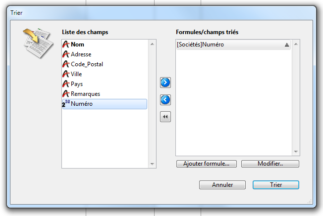
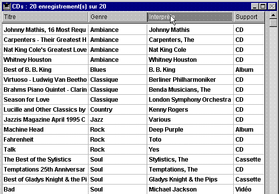

<!--REF #_command_.ORDER BY.Syntax-->**ORDER BY** ( {*laTable* ;}{ *leChamp* }{; > ou < }{; *leChamp2* ; > ou <2 ; ... ; *leChampN* ; > ou <N}{; *} )<!-- END REF-->
<!--REF #_command_.ORDER BY.Params-->
| Paramètre | Type |  | Description |
| --- | --- | --- | --- |
| laTable | Table | &#8594;  | Table de laquelle réordonner la sélection courante ou Table par défaut si ce paramètre est omis |
| leField | Field | &#8594;  | Champ sur lequel effectuer le tri pour chaque niveau |
| > ou < | Opérateur | &#8594;  | Sens du tri pour chaque niveau : > demander un tri croissant ou < demander un tri décroissant |
| * | Opérateur | &#8594;  | Attente d'exécution du tri |

<!-- END REF-->

#### Description 

<!--REF #_command_.ORDER BY.Summary-->**ORDER BY** trie (réordonne) les enregistrements de la sélection courante de *laTable* pour le process courant.<!-- END REF--> Une fois le tri effectué, le premier enregistrement de la sélection courante devient le nouvel enregistrement courant. 

Si vous omettez le paramètre *laTable*, la commande s'applique à la table par défaut, si elle a été définie. Sinon, 4D utilise la table du premier champ passé en paramètre. Si vous ne passez pas de paramètre et si aucune table par défaut n'a été définie, une erreur est retournée.

Si vous ne passez ni le paramètre *leChamp*, ni les paramètres *\>*, *<* ou *\**, **ORDER BY** affiche la boîte de dialogue de l'Editeur de tri de 4D pour *laTable*. Cet éditeur est présenté ci-dessous :



Pour plus d'informations sur l'utilisation de cet éditeur, reportez-vous au manuel *Mode Développement* de 4D.  
L'utilisateur construit le tri puis clique sur le bouton **Trier**. Si le tri est correctement effectué, la variable système OK prend la valeur *1*. Si l'utilisateur clique sur **Annuler**, aucun tri n'est effectué et la variable OK prend la valeur *0* (zéro).

Si vous spécifiez les paramètres *leChamp* et *\> ou <*, la boîte de dialogue standard de Tri ne s'affiche pas et le tri est entièrement défini par programmation. Vous pouvez trier la sélection courante sur un plusieurs niveaux. Pour chaque niveau de tri, vous passez un champ dans le paramètre *leChamp* et un ordre de tri dans *\> ou <*. Si vous passez le paramètre “supérieur à ” (>), l'ordre est croissant. Si vous passez le paramètre “inférieur à ” (<), l'ordre est décroissant. Si vous omettez le paramètre d'ordre *\> ou <*, le tri est croissant par défaut.

Si un seul champ est spécifié (tri sur un niveau) et s'il est indexé, le tri tire parti de l'index. Si le champ n'est pas indexé ou si plus d'un champ est utilisé, le tri est effectué de manière séquentielle (hors index composites). Le champ peut appartenir à la table de la sélection que vous triez ou à une table 1 liée à *laTable* par un lien automatique. Dans ce cas, le tri est toujours séquentiel.   
Si les champs triés sont inclus dans un index composite, **ORDER BY** tire parti de l'index. 

Pour indiquer que le tri ne doit pas être immédiatement effectué, passez en dernier paramètre le symbole *\**. 4D attendra de rencontrer une nouvelle ligne de tri ne se terminant pas par *\** pour exécuter le tri. Cette possibilité est utile pour gérer les tris multicritères dans le cadre d'interfaces personnalisées.  
**Attention :** lorsque vous utilisez cette syntaxe, vous ne pouvez passer qu'un seul niveau de tri (un seul champ) par ligne d'instruction.

Quelle que soit la manière dont le tri est défini, si l'opération risque de prendre un certain temps, 4D affiche automatiquement un message contenant un thermomètre de progression. Vous pouvez décider d'afficher ou de ne pas afficher ce message pour le process à l'aide des commandes [MESSAGES OFF](messages-off.md) et [MESSAGES ON](messages-on.md). Si le thermomètre de progression est affiché, l'utilisateur peut cliquer sur le bouton **Stop** pour interrompre l'opération. Si le tri s'est correctement déroulé, la variable système OK prend la valeur 1\. Sinon, si le tri est interrompu, OK prend la valeur 0 (zéro).

##### 

**Note :** Cette commande ne prend pas en charge les champs de type Objet.

#### Exemple 1 

L'exemple suivant affiche la boîte de dialogue de Tri pour la table \[Produits\] :

```4d
 ORDER BY([Produits])
```

#### Exemple 2 

L'exemple suivant affiche la boîte de dialogue de Tri pour la table par défaut (si elle a été définie) : 

```4d
 ORDER BY
```

#### Exemple 3 

L'exemple suivant trie la sélection courante de \[Produits\] par nom dans un ordre croissant :

```4d
 ORDER BY([Produits];[Produits]Nom;>)
```

#### Exemple 4 

L'exemple suivant trie la sélection courante de \[Produits\] par nom dans un ordre décroissant :

```4d
 ORDER BY([Produits];[Produits]Nom;<)
```

#### Exemple 5 

L'exemple suivant trie la sélection courante de \[Produits\] par type et par prix dans un ordre croissant à chaque niveau :

```4d
 ORDER BY([Produits];[Produits]Type;>;[Produits]Prix;>)
```

#### Exemple 6 

L'exemple suivant trie la sélection courante de \[Produits\] par type et par prix dans un ordre décroissant à chaque niveau :

```4d
 ORDER BY([Produits];[Produits]Type;<;[Produits]Prix;<)
```

#### Exemple 7 

L'exemple suivant trie la sélection courante de \[Produits\] par type dans un ordre croissant et par prix dans un ordre décroissant :

```4d
 ORDER BY([Produits];[Produits]Type;>;[Produits]Prix;<)
```

#### Exemple 8 

L'exemple suivant trie la sélection courante de \[Produits\] par type dans un ordre décroissant et par prix dans un ordre croissant :

```4d
 ORDER BY([Produits];[Produits]Type;<;[Produits]Prix;>)
```

#### Exemple 9 

L'exemple suivant effectue un tri indexé si le champ \[Produits\]Nom est indexé :

```4d
 ORDER BY([Produits];[Produits]Nom;>)
```

#### Exemple 10 

L'exemple suivant trie la sélection courante de \[Produits\] par nom dans un ordre croissant :

```4d
 ORDER BY([Produits];[Produits]Nom)
```

Si un seul champ est spécifié (tri sur un niveau) et s'il est indexé, le tri tire parti de l'index. Si le champ n'est pas indexé ou si plus d'un champ est utilisé, le tri est effectué de manière séquentielle (hors index composites). Le champ peut appartenir à la table de la sélection que vous triez ou à une table 1 liée à *table* par un lien automatique ou manuel. Dans ce cas, le tri est toujours séquentiel.  
Si les champs triés sont inclus dans un index composite, **ORDER BY** tire parti de l'index. 

#### Exemple 11 

L'exemple suivant effectue un tri séquentiel, que les champs soient ou non indexés :

```4d
 ORDER BY([Produits];[Produits]Type;>;[Produits]Prix;>)
```

#### Exemple 12 

L'exemple suivant effectue un tri séquentiel à l'aide d'un champ lié :

```4d
 SET FIELD RELATION([Employé]ID_Societe;Automatic;Do not modify)
 ORDER BY([Employé];[Societe]Nom)
 SET FIELD RELATION([Employé]ID_Societe;Structure configuration;Do not modify)
```

#### Exemple 13 

L'exemple suivant effectue un tri indexé sur deux niveaux si un index composite \[Contacts\]Nom + \[Contacts\]Prénom a été défini dans la base :

```4d
 ORDER BY([Contacts];[Contacts]Nom;>;[Contacts]Prénom;>)
```

#### Exemple 14 

Dans un formulaire sortie affiché en mode Application, vous souhaitez permettre aux utilisateurs de trier une colonne par ordre croissant en cliquant simplement sur son en-tête.   
Si l'utilisateur maintient la touche **Maj** enfoncée et clique ensuite sur plusieurs autres colonnes, le tri est multicritères, c'est-à-dire que les colonnes sont triées sur autant de niveaux qu'il y a de clics : 



Chaque en-tête de colonne contient un bouton inversé dont la méthode est du type suivant :

```4d
 MULTITRIS(->[CDs]Titre) //Bouton de l'en-tête de la colonne Titre
```

Chaque bouton appelle la méthode projet MULTITRIS en passant un pointeur sur le champ de la colonne. Voici le contenu de la méthode projet MULTITRIS :

```4d
  // Méthode projet MULTITRIS
  // MULTITRIS (Pointeur)
  // MULTITRIS (->[Table]Champ)
 
 var $1 : Pointer
 var $nbCrit : Integer
 
  //Construction des critères
 If(Not(Shift down)) //Si le tri est simple
    ARRAY POINTER(tPtrTriChp;1) //Créons un tableau à 1 élément
    tPtrTriChp{1}:=$1 //Champ sur lequel l'utilisateur a cliqué
 Else //Si la touche Maj était enfoncée (tri multicritère)
    $nbCrit:=Find in array(tPtrTriChp;$1)   //Vérifions que le critère n'est pas déjà présent
    If($nbCrit<0)   //Critère inexistant
       INSERT IN ARRAY(tPtrTriChp;Size of array(tPtrTriChp)+1;1) //Remplissons le tableau
       tPtrTriChp{Size of array(tPtrTriChp)}:=$1
    End if
 End if
  //Exécution du tri
 $nbCrit:=Size of array(tPtrTriChp)
 If($nbCrit>0)   //S'il y a au moins un élément dans le tableau de pointeurs
    For($i;1;$nbCrit) //For each critère défini
       ORDER BY([CDs];(tPtrTriChp{$i})->;>;*)   //On construit le tri
    End for
    ORDER BY([CDs])   //Pas de * : on effectue le tri
 End if
```

Quelle que soit la manière dont le tri est défini, si l'opération risque de prendre un certain temps, 4D affiche automatiquement un message contenant un thermomètre de progression. Vous pouvez décider d'afficher ou de ne pas afficher ce message pour le process à l'aide des commandes [MESSAGES ON](messages-on.md) et [MESSAGES OFF](messages-off.md). Si le thermomètre de progression est affiché, l'utilisateur peut cliquer sur le bouton **Stop** pour interrompre l'opération. Si le tri s'est correctement déroulé, la variable système OK prend la valeur 1\. Sinon, si le tri est interrompu, OK prend la valeur 0 (zéro).

#### Voir aussi 

[ORDER BY FORMULA](order-by-formula.md)  