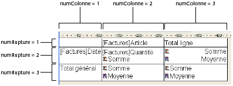

<!--REF #_command_.QR GET TOTALS DATA.Syntax-->**QR GET TOTALS DATA** ( *zone* ; *numColonne* ; *numRupture* ; *opérateur* ; *texte* )<!-- END REF-->
<!--REF #_command_.QR GET TOTALS DATA.Params-->
| Paramètre | Type |  | Description |
| --- | --- | --- | --- |
| zone | Integer | &#8594;  | Référence de la zone |
| numColonne | Integer | &#8594;  | Numéro de colonne |
| numRupture | Integer | &#8594;  | Numéro de rupture |
| opérateur | Integer | &#8592; | Opérateur de la cellule |
| texte | Text | &#8592; | Contenu de la cellule |

<!-- END REF-->

#### Description 

<!--REF #_command_.QR GET TOTALS DATA.Summary-->##### Etat en liste 

La commande **QR GET TOTALS DATA** permet de récupérer le contenu d'une ligne de rupture spécifique (sous-total ou total général).<!-- END REF--> 

Passez dans *zone* la référence de la zone d'état rapide.

Passez dans *numColonne* le numéro de colonne de la cellule que vous souhaitez lire.  
Passez dans *numRupture* le numéro de la ligne de rupture à lire (sous-total ou total général). Pour une ligne de sous-total, *numRupture* correspond au numéro de la ligne. Pour le total général, *numRupture* vaut -3 (vous pouvez également utiliser la constante *qr total général* du thème *QR Lignes pour Propriétés*). 

Le paramètre *opérateur* retourne la valeur cumulée de tous les opérateurs éventuellement présents dans la cellule. Vous pouvez utiliser les constantes du thème *QR Opérateurs* pour traiter les valeurs retournées :

| Constante             | Type        | Valeur |
| --------------------- | ----------- | ------ |
| qr average            | Entier long | 2      |
| qr count              | Entier long | 16     |
| qr max                | Entier long | 8      |
| qr min                | Entier long | 4      |
| qr standard deviation | Entier long | 32     |
| qr sum                | Entier long | 1      |

Si *opérateur* retourne 0, la cellule ne contient aucun opérateur. 

*texte* retourne le texte de la cellule.

**Note :** Les paramètres *opérateur* et *texte* sont mutuellement exclusifs ; en fonction du contenu de la cellule, seul l'un des deux paramètres retournera une valeur.

##### Etat tableau croisé 

La commande **QR GET TOTALS DATA** vous permet de recupérer le contenu d'une cellule spécifique.

Passez dans *zone* la référence de la zone d'état rapide.

Passez dans *numColonne* le numéro de colonne et dans *numRupture* le numéro de ligne de la cellule que vous souhaitez lire.

Le paramètre *opérateur* retourne la valeur cumulée de tous les opérateurs éventuellement présents dans la cellule. Utilisez les constantes du thème *QR Opérateurs* pour évaluer la valeur récupérée (cf. paragraphe précédent). 

Le paramètre *texte* retourne le contenu de la cellule. 

L'illustration suivante précise la manière dont les paramètres *numColonne* et *numRupture* sont combinés dans un tableau croisé :

Si un numéro de *zone* invalide est passé, l’erreur -9850 est générée.  
Si le paramètre *numColonne* est incorrect, l’erreur -9852 est générée.  
Si le paramètre *numRupture* est incorrect, l’erreur -9853 est générée.

#### Voir aussi 

[QR SET TOTALS DATA](qr-set-totals-data.md)  

#### Propriétés
|  |  |
| --- | --- |
| Numéro de commande | 768 |
| Thread safe | &check; |
| Modifie les variables | error |
| Interdite sur le serveur ||

