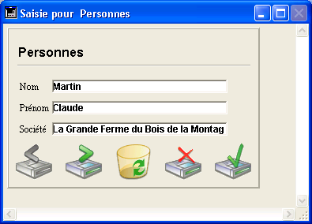
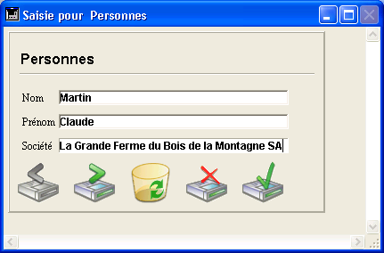

<!--REF #_command_.RESIZE FORM WINDOW.Syntax-->**RESIZE FORM WINDOW** ( *largeur* ; *hauteur* )<!-- END REF-->
<!--REF #_command_.RESIZE FORM WINDOW.Params-->
| Paramètre | Type |  | Description |
| --- | --- | --- | --- |
| largeur | Integer | &#8594;  | Pixels à ajouter ou soustraire à la largeur courante de la fenêtre formulaire |
| hauteur | Integer | &#8594;  | Pixels à ajouter ou soustraire à la hauteur courante de la fenêtre formulaire |

<!-- END REF-->

*Cette commande n'est pas thread-safe, elle ne peut pas être utilisée dans du code préemptif.*


#### Description 

<!--REF #_command_.RESIZE FORM WINDOW.Summary-->La commande **RESIZE FORM WINDOW** permet de modifier la taille de la fenêtre du formulaire courant.<!-- END REF--> 

Passez dans les paramètres *largeur* et *hauteur* le nombre de pixels que vous souhaitez ajouter aux dimensions courantes de la fenêtre. Pour ne pas modifier une dimension, passez 0 dans le paramètre correspondant. Pour réduire une dimension, passez une valeur négative dans *largeur* et *hauteur*. 

Cette commande produit exactement le même résultat qu’un redimensionnement manuel de la fenêtre à l’aide de la case de redimensionnement (si le type de fenêtre le permet). Par conséquent, la commande tient compte des propriétés de redimensionnement des objets et des contraintes de taille définies dans les propriétés du formulaire : si par exemple la commande entraîne un redimensionnement de la fenêtre supérieur à la taille maximale du formulaire, elle n’a pas d’effet. 

A noter que ce fonctionnement est différent de celui de la commande [SET WINDOW RECT](set-window-rect.md), qui ne tient pas compte des propriétés du formulaire ni de son contenu en cas de redimensionnement de la fenêtre. 

A noter également que cette commande ne modifie pas forcément les dimensions du formulaire lui-même. Pour modifier par programmation la taille d’un formulaire, reportez-vous à la description de la commande [FORM SET SIZE](form-set-size.md).

#### Exemple 

Soit la fenêtre suivante (les champs et l'encadrement ont pour propriété de redimensionnement horizontal “Agrandir”) :



Après l'exécution de cette ligne :

```4d
 RESIZE FORM WINDOW(25;0)
```

... la fenêtre a l'apparence suivante :



#### Voir aussi 

[FORM GET PROPERTIES](form-get-properties.md)  
[FORM SET SIZE](form-set-size.md)  
[SET WINDOW RECT](set-window-rect.md)  