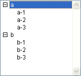
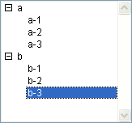
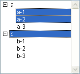

<!--REF #_command_.SELECT LIST ITEMS BY POSITION.Syntax-->**SELECT LIST ITEMS BY POSITION** ( {* ;} *liste* ; *positionElém* {; *tabPositions*} )<!-- END REF-->
<!--REF #_command_.SELECT LIST ITEMS BY POSITION.Params-->
| Paramètre | Type |  | Description |
| --- | --- | --- | --- |
| * | Opérateur | &#8594;  | Si spécifié, liste est un nom d'objet (chaîne) Si omis, liste est une référence de liste |
| liste | Integer, Text | &#8594;  | Numéro de référence de liste (si * omis) ou Nom d'objet de type liste (si * passé) |
| positionElém | Integer | &#8594;  | Position de l'élément dans la ou les liste(s) déployée(s)/contractée(s) |
| tabPositions | Integer array | &#8594;  | Tableau de positions dans la ou les liste(s) déployée(s)/contractée(s) |

<!-- END REF-->

*Cette commande n'est pas thread-safe, elle ne peut pas être utilisée dans du code préemptif.*


#### Description 

<!--REF #_command_.SELECT LIST ITEMS BY POSITION.Summary-->La commande **SELECT LIST ITEMS BY POSITION** sélectionne le ou les élément(s) dont vous avez passé la position dans *positionElém* et, facultativement, dans *tabPositions*, à l'intérieur de la liste dont vous avez passé le numéro de référence ou le nom d'objet dans *liste*.<!-- END REF--> 

Si vous passez le paramètre optionnel *\**, vous indiquez que le paramètre *liste* est un nom d’objet (chaîne) correspondant à une représentation de liste dans le formulaire. Si vous ne passez pas ce paramètre, vous indiquez que le paramètre *liste* est une référence de liste hiérarchique ([RéfListe](# "Expression de type Entier long identifiant de façon unique une liste hiérarchique")). Si vous utilisez une seule représentation de liste, vous pouvez utiliser indifféremment l’une ou l’autre syntaxe. En revanche, si vous utilisez plusieurs représentations d’une même liste, la syntaxe basée sur le nom d’objet est requise car chaque représentation peut disposer de sa propre configuration déployée/contractée.

**Note :** Si vous utilisez le caractère @ dans le nom d'objet de la liste et que le formulaire contient plusieurs listes répondant à ce nom, la commande **SELECT LIST ITEMS BY POSITION** s'appliquera au premier objet dont le nom correspond.

La position des éléments est toujours exprimée en tenant compte de l'état déployé/contracté de la liste et de ses sous-listes. Passez des positions comprises entre 1 et la valeur retournée par [Count list items](count-list-items.md). Si vous passez une valeur située en-dehors de cet intervalle, aucun élément n'est sélectionné. 

Si vous ne passez pas le paramètre *tabPositions*, le paramètre *positionElém* représente la position de l'élément à sélectionner. 

Le paramètre facultatif *tabPositions* permet de sélectionner simultanément plusieurs éléments au sein de la *liste*. Vous devez passer dans *tabPositions* un tableau dont chaque ligne indique la position d’un élément à sélectionner.   
Lorsque vous passez ce paramètre, l’élément désigné par le paramètre *positionElém* désigne parmi la sélection résultante le nouvel élément courant de la liste. Il peut appartenir ou non à l’ensemble d’éléments définis par le tableau. L’élément courant est notamment celui qui passe en mode édition si la commande [EDIT ITEM](edit-item.md) est utilisée. 

**Note :** Pour que plusieurs éléments puissent être sélectionnés simultanément dans une liste hiérarchique (manuellement ou par programmation), la propriété *multiSélection* doit avoir été activée pour cette liste. Cette propriété est définie via la commande [SET LIST PROPERTIES](set-list-properties.md). 

#### Exemple 

Soit une liste hiérarchique nommée *hList* affichée en mode Application :



Après l'exécution des lignes de code suivantes :

```4d
 SELECT LIST ITEMS BY POSITION(hList;Count list items(hList))
```

... le dernier élément visible est sélectionné :



Après l'exécution des lignes de code suivantes :

```4d
 SET LIST PROPERTIES(hList;0;0;18;0;1)
  //Il est impératif de passer 1 en dernier paramètre pour autoriser les multi-sélections
 ARRAY LONGINT($tab;3)
 $tab{1}:=2
 $tab{2}:=3
 $tab{3}:=5
 SELECT LIST ITEMS BY POSITION(hList;3;$tab)
  //Le 3e élément est désigné comme élément courant
```

... les 2e, 3e et 5e éléments de la liste hiérarchique sont sélectionnés :



#### Voir aussi 

[EDIT ITEM](edit-item.md)  
[SELECT LIST ITEMS BY REFERENCE](select-list-items-by-reference.md)  
[Selected list items](selected-list-items.md)  