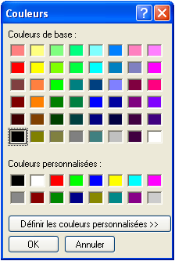

<!--REF #_command_.Select RGB Color.Syntax-->**Select RGB Color** {( *coulDefaut* {; *message*} )} : Integer<!-- END REF-->
<!--REF #_command_.Select RGB Color.Params-->
| Paramètre | Type |  | Description |
| --- | --- | --- | --- |
| coulDefaut | Integer | &#8594;  | Couleur RVB présélectionnée |
| message | Text | &#8594;  | Titre de la fenêtre de sélection |
| Résultat | Integer | &#8592; | Couleur RVB |

<!-- END REF-->

*Cette commande n'est pas thread-safe, elle ne peut pas être utilisée dans du code préemptif.*

#### Description 

<!--REF #_command_.Select RGB Color.Summary-->La commande **Select RGB Color** affiche la fenêtre système de sélection de couleur et retourne la valeur RVB de la couleur sélectionnée par l’utilisateur.<!-- END REF-->

La fenêtre système de sélection de couleur a l’apparence suivante :   

| **Macintosh**                                | **Windows**                                 |
| -------------------------------------------- | ------------------------------------------- |
|  |  |

Le paramètre facultatif *coulDéfaut* vous permet de pré-sélectionner une couleur dans la fenêtre. Ce paramètre vous permet par exemple de restituer par défaut la dernière couleur définie par l’utilisateur. Passez dans ce paramètre une valeur de couleur au format RVB (pour plus d’informations, reportez-vous à la description de la commande [OBJECT SET RGB COLORS](object-set-rgb-colors.md)). Vous pouvez utiliser l’une des constantes du thème *FIXER COULEUR RVB*. Si le paramètre *coulDéfaut* est omis ou si vous passez 0, la couleur noir est sélectionnée à l’ouverture de la boîte de dialogue.

Le paramètre facultatif *message* vous permet de personnaliser le titre de la fenêtre système. Par défaut, si ce paramètre est omis, le libellé “Couleurs” est affiché. 

La prise en compte de la validation de la boîte de dialogue diffère selon la plate-forme :

* Sous Windows, si l’utilisateur clique sur le bouton **OK**, la commande retourne la valeur de couleur sélectionnée au format RVB et la variable système *OK* prend la valeur 1\. Si l’utilisateur annule la boîte de dialogue, la commande retourne -1 et la variable système *OK* prend la valeur 0.
* Sous Mac OS, la boîte de dialogue peut uniquement être refermée via un clic sur la case de fermeture ou en appuyant sur la touche **Echap**. Dans les deux cas, la variable système *OK* prend la valeur 1, quelles que soient les actions utilisateur dans la fenêtre. La commande retourne la valeur de couleur sélectionnée au format RVB. Si l'utilisateur n'a pas sélectionné de couleur, la valeur retournée est la valeur éventuellement passée dans *coulDefaut* ou 0 si vous n'avez pas passé ce paramètre.

**Note :** Cette commande ne doit pas être exécutée sur le poste serveur ni dans le cadre d’un process Web.

#### Voir aussi 

[OBJECT SET RGB COLORS](object-set-rgb-colors.md)  