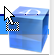

<!--REF #_command_.SET DRAG ICON.Syntax-->**SET DRAG ICON** ( *icône* {; *décalageH* {; *décalageV*}} )<!-- END REF-->
<!--REF #_command_.SET DRAG ICON.Params-->
| Paramètre | Type |  | Description |
| --- | --- | --- | --- |
| icône | Picture | &#8594;  | Icône à utiliser lors du glisser |
| décalageH | Integer | &#8594;  | Décalage horizontal du bord gauche de l’image par rapport à la position du curseur (>0 = vers la gauche, <0 = vers la droite) |
| décalageV | Integer | &#8594;  | Décalage vertical du bord supérieur de l’image par rapport à la position du curseur (>0 = vers le haut, <0 = vers le bas) |

<!-- END REF-->

*Cette commande n'est pas thread-safe, elle ne peut pas être utilisée dans du code préemptif.*


#### Description 

<!--REF #_command_.SET DRAG ICON.Summary-->La commande **SET DRAG ICON** vous permet d’associer l’image *icône* au curseur lors des glisser-déposer gérés par programmation.<!-- END REF-->

Cette commande peut être appelée uniquement dans le contexte de l’événement formulaire On Begin Drag Over (cf. commande [Form event code](form-event-code.md)).

Passez dans le paramètre *icône* l’image à utiliser. Sa taille maximale est de 256x256 pixels. Si l’une de ses dimensions excède 256 pixels, elle est automatiquement redimensionnée. 

Vous pouvez passer dans *décalageH* et *décalageV* des valeurs de décalage en pixels : 

* passez dans *décalageH* le décalage horizontal du bord gauche de l’icône par rapport à la position du curseur. Passez une valeur positive pour appliquer le décalage vers la gauche ou une valeur négative pour appliquer le décalage vers la droite.
* passez dans *décalageV* le décalage vertical du bord supérieur de l’icône par rapport à la position du curseur. Passez une valeur positive pour appliquer le décalage vers le haut ou une valeur négative pour appliquer le décalage vers le bas.

Si vous omettez ce paramètre, le curseur est placé au centre de l’icône.

#### Exemple 

Dans un formulaire, l’utilisateur peut générer une étiquette par glisser-déposer d’une ligne. Dans la méthode objet de la list box, vous écrivez :

```4d
 If(Form event code=Sur début glisser)
       READ PICTURE FILE(Get 4D folder(Current resources folder)+"splash.png";vpict)
       CREATE THUMBNAIL(vpict;vpict;48;48)
       SET DRAG ICON(vpict)
 End if
```

Lors du glisser d’une ligne, l’image apparaît :


A noter que vous pouvez modifier la position du curseur par rapport à l’image :

```4d
 SET DRAG ICON(vpict;0;0)
```



#### Voir aussi 

[Form event code](form-event-code.md)  