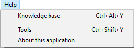

<!--REF #_command_.SET HELP MENU.Syntax-->**SET HELP MENU** ( *menuCol* )<!-- END REF-->
<!--REF #_command_.SET HELP MENU.Params-->
| Paramètre | Type |  | Description |
| --- | --- | --- | --- |
| menuCol | Collection | &#8594;  | Collection of menu objects |

<!-- END REF-->

#### Description 

<!--REF #_command_.SET HELP MENU.Summary-->La commande **SET HELP MENU** vous permet de remplacer le menu **Aide** par défaut de 4D par la collection d'éléments de menu MenuCol dans le mode d'application.<!-- END REF-->

Cette commande remplace le menu **Aide** par défaut du mode d'application dans tous les environnements 4D : interprété, compilé, fusionné, mono et client/serveur.

**Notes :** 

* Le label "Help" lui-même est géré par le système et ne peut pas être personnalisé avec cette commande.
* Les menus d'aide personnalisés ne prennent pas en charge les sous-menus, les coches, les styles ou les icônes.

Dans *menuCol*, passez une collection d'objets de menu définissant tous les éléments du menu d'aide personnalisé. Chaque objet de menu peut inclure les propriétés suivantes :

| **Propriété** | **Type**                                                                                         | **Description**                                                                                                                                                                                                                                                                                                                                                                                                                                                                                                                                                                                                                                                                                                                                                                                                                                        |
| ------------- | ------------------------------------------------------------------------------------------------ | ------------------------------------------------------------------------------------------------------------------------------------------------------------------------------------------------------------------------------------------------------------------------------------------------------------------------------------------------------------------------------------------------------------------------------------------------------------------------------------------------------------------------------------------------------------------------------------------------------------------------------------------------------------------------------------------------------------------------------------------------------------------------------------------------------------------------------------------------------ |
| title         | Texte                                                                                            | Nom de l'élément de menu                                                                                                                                                                                                                                                                                                                                                                                                                                                                                                                                                                                                                                                                                                                                                                                                                               |
| method        | Texte \| [4D.Function](https://developer.4d.com/docs/API/FunctionClass#about-4dfunction-objects) | Nom de la méthode du projet ou de l'objet de formule 4D à exécuter lorsque l'élément de menu est sélectionné. Lorsque cette propriété est utilisée, la propriété "action" ne doit pas être transmise (sinon la "method" est ignorée).                                                                                                                                                                                                                                                                                                                                                                                                                                                                                                                                                                                                                  |
| worker        | Texte \| Nombre                                                                                  | Nom du worker ou Numéro du processus qui doit gérer l'exécution du code de la "method". Plusieurs configurations sont possibles, en fonction de la valeur de la propriété "worker" :<br/> s'il s'agit d'un nom du worker (Texte), 4D utilise ou crée ce worker pour exécuter la "method" (équivalent à [CALL WORKER](call-worker.md)) si c'est un numéro de processus, 4D utilise ce processus s'il existe, sinon rien ne se passe (équivalent à [CALL WORKER](call-worker.md)) s'il est indéfini et que l'application affiche un dialogue courant (dialogue le plus en avant), 4D utilise le processus de ce dialogue (équivalent à [CALL FORM](call-form.md)) s'il est indéfini et que l'application n'affiche pas de dialogue en cours, 4D appelle et utilise le worker 1 (4D distant/mono) ou le worker 4D\_server\_interface (4D Server). |
| action        | Texte                                                                                            | *Action standard* à exécuter lorsque l'élément de menu est sélectionné. Lorsque cette propriété est utilisée, la propriété "method" est ignorée si elle est transmise.                                                                                                                                                                                                                                                                                                                                                                                                                                                                                                                                                                                                                                                                                 |
| shortcutKey   | Texte                                                                                            | Touche de raccourci de l'élément (à appeler avec la touche Ctrl/Commande)                                                                                                                                                                                                                                                                                                                                                                                                                                                                                                                                                                                                                                                                                                                                                                              |
| shortcutShift | Booléen                                                                                          | Vrai pour ajouter la touche **Shift** au raccourci de l'élément                                                                                                                                                                                                                                                                                                                                                                                                                                                                                                                                                                                                                                                                                                                                                                                        |
| shortcutAlt   | Booléen                                                                                          | Vrai pour ajouter la touche **Alt/Option** au raccourci de l'élément                                                                                                                                                                                                                                                                                                                                                                                                                                                                                                                                                                                                                                                                                                                                                                                   |

Le menu **Aide** personnalisé affichera les éléments dans le même ordre que la collection.

Pour insérer une ligne de séparation, passez **null** ou un objet vide dans la collection.

#### Exemple 

Vous souhaitez personnaliser le menu **Aide** de votre application :

```4d
 var $col : Collection
 $col:=Créer collection
 $col.push(Créer objet("title";"Knowledge base";"worker";"workerHlp";"method";"methodHlp";"shortcutAlt";True;"shortcutKey";"Y"))
 $col.push(Null) //pour ajouter une ligne de séparation
 $col.push(Créer objet("title";"Tools";"action";ak msc;"shortcutShift";True;"shortcutKey";"Y"))
 SET HELP MENU($col)
 APPELER SURÀPROPOS("À propos de cette application";"m_apropos") //pour remplacer "A propos de 4D" sur Windows
```



#### Voir aussi 

[SET ABOUT](set-about.md)  

#### Propriétés
|  |  |
| --- | --- |
| Numéro de commande | 1801 |
| Thread safe | &check; |
| Interdite sur le serveur ||


