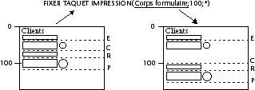
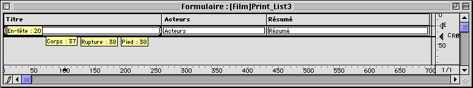
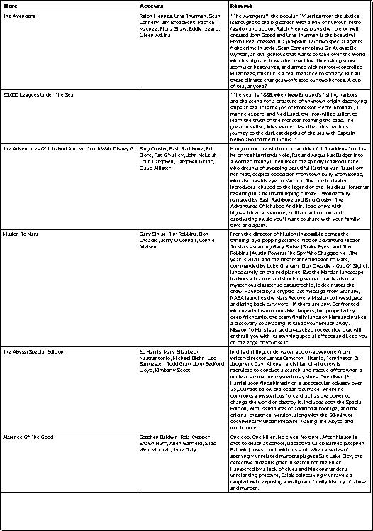

<!--REF #_command_.SET PRINT MARKER.Syntax-->**SET PRINT MARKER** ( *numTaquet* ; *position* {; *} )<!-- END REF-->
<!--REF #_command_.SET PRINT MARKER.Params-->
| Paramètre | Type |  | Description |
| --- | --- | --- | --- |
| numTaquet | Integer | &#8594;  | Numéro de taquet |
| position | Integer | &#8594;  | Nouvelle position du taquet |
| * | Opérateur | &#8594;  | Si passé = déplacer les marqueurs suivants Si omis = ne pas déplacer les marqueurs suivants |

<!-- END REF-->

#### Description 

<!--REF #_command_.SET PRINT MARKER.Summary-->La commande **SET PRINT MARKER** permet de définir la position d’un taquet au moment de l’impression.<!-- END REF--> Combinée aux commandes [Get print marker](get-print-marker.md), [OBJECT MOVE](object-move.md) ou [Print form](print-form.md), cette commande permet d’ajuster la taille des zones d’impression. 

**SET PRINT MARKER** peut être appelée dans deux contextes : 

* lors de l’événement formulaire On Header, dans le cadre de l’utilisation des commandes [PRINT SELECTION](print-selection.md) et [PRINT RECORD](print-record.md).
* lors de l’événement formulaire On Printing Detail, dans le cadre de l’utilisation de la commande [Print form](print-form.md). Ce fonctionnement facilite l’impression d’états personnalisés (voir exemple).

L’effet de la commande est limité à l’impression, aucune modification n’apparaît à l’écran. Les modifications apportées aux formulaires ne sont pas sauvegardées. 

Passez dans le paramètre *numTaquet* une des constantes du thème “*Zone de formulaire*” :

| Constante     | Type        | Valeur |
| ------------- | ----------- | ------ |
| Form break0   | Entier long | 300    |
| Form break1   | Entier long | 301    |
| Form break2   | Entier long | 302    |
| Form break3   | Entier long | 303    |
| Form break4   | Entier long | 304    |
| Form break5   | Entier long | 305    |
| Form break6   | Entier long | 306    |
| Form break7   | Entier long | 307    |
| Form break8   | Entier long | 308    |
| Form break9   | Entier long | 309    |
| Form detail   | Entier long | 0      |
| Form footer   | Entier long | 100    |
| Form header   | Entier long | 200    |
| Form header1  | Entier long | 201    |
| Form header10 | Entier long | 210    |
| Form header2  | Entier long | 202    |
| Form header3  | Entier long | 203    |
| Form header4  | Entier long | 204    |
| Form header5  | Entier long | 205    |
| Form header6  | Entier long | 206    |
| Form header7  | Entier long | 207    |
| Form header8  | Entier long | 208    |
| Form header9  | Entier long | 209    |

Passez dans *position* la nouvelle position souhaitée du taquet, exprimée en pixels.

Si vous passez le paramètre optionnel *\**, tous les marqueurs situés au-dessous du marqueur désigné par *numTaquet* seront déplacés du même nombre de pixels et dans la même direction que lui lors de l’exécution de la commande. **Attention :** dans ce cas, les objets éventuellement présents dans les zones situées au-dessous du marqueur sont également déplacés.   
Lorsque le paramètre \* est utilisé, il est donc possible de positionner le marqueur *numTaquet* au-delà de la position initiale des marqueurs qui le suivent — ces derniers étant déplacés simultanément.



**Notes :**

* Cette commande modifie la position des taquets existants uniquement. Elle ne permet pas d’ajouter des taquets. Si vous désignez un taquet qui n’existe pas dans le formulaire, la commande ne fait rien.
* Le fonctionnement des taquets d’impression en mode Développement est conservé : un taquet ne peut pas aller plus haut que celui qui le précède ni plus bas que celui qui le suit (lorsque le paramètre \* n’est pas utilisé).

#### Exemple 

Cet exemple complet permet de générer l’impression d’un état sur trois colonnes, la hauteur de chaque ligne étant calculée à la volée en fonction du contenu des champs.   
Le formulaire de sortie utilisé pour l’impression est le suivant :



L’événement formulaire On Printing Detail a été sélectionné pour le formulaire (rappelons que la commande [Print form](print-form.md) ne génère que cet événement, quelle que soit la zone imprimée).   
Pour chaque enregistrement, la hauteur de la ligne doit être adaptée en fonction du contenu de la colonne “Acteurs” ou “Résumé” (colonne ayant le plus de contenu). Voici le résultat souhaité :



La méthode projet d’impression est la suivante :

```4d
 var vLhauteur_imp;$vLhauteur;vLhauteur_imprimee : Integer
 C_STRING(31;vSimpr_zone)
 PAGE SETUP([Film];"Print_List3")
 GET PRINTABLE AREA(vLhauteur_imp)
 vLhauteur_imprimee:=0
 ALL RECORDS([Film])
 
 vSimpr_zone:="Entete" //Impression de la zone d’en-tête
 $vLhauteur:=Print form([Film];"Print_List3";Form header)
 $vLhauteur:=21   //Hauteur fixe
 vLhauteur_imprimee:=vLhauteur_imprimee+$vLhauteur
 
 While(Not(End selection([Film])))
    vSimpr_zone:="Corps" //Impression de la zone de corps
    $vLhauteur:=Print form([Film];"Print_List3";Form detail)
  //Le calcul du corps est effectué dans la méthode formulaire
    vLhauteur_imprimee:=vLhauteur_imprimee+$vLhauteur
    If(OK=0) //NE PAS VALIDER a été exécutée dans la méthode formulaire
       PAGE BREAK
       vLhauteur_imprimee:=0
       vSimpr_zone:="Entete" //Réimpression de la zone d’en-tête
       $vLhauteur:=Print form([Film];"Print_List3";Form header)
       $vLhauteur:=21
       vLhauteur_imprimee:=vLhauteur_imprimee+$vLhauteur
       vSimpr_zone:="Corps"
       $vLhauteur:=Print form([Film];"Print_List3";Form detail)
       vLhauteur_imprimee:=vLhauteur_imprimee+$vLhauteur
    End if
    NEXT RECORD([Film])
 End while
 PAGE BREAK //Assurons-nous que la dernière page est imprimée
```

La méthode du formulaire Print\_List3 est la suivante :

```4d
 var $g;$h;$d;$b;$larg_fix;$haut_préc;$g1;$h1;$d1;$b1 : Integer
 var $pos_finale;$i : Integer
 var $position_c;$position_e;$hauteur_a_imprimer;$hauteur_restante : Integer
 
 Case of
    :(vSimpr_zone="Corps") //Impression du corps en cours
       OBJECT GET COORDINATES([Film]Acteurs;$g;$h;$d;$b)
       $larg_fix:=$d-$g  //Calcul de la taille du champ texte Acteurs
       $haut_préc:=$b-$h
       OBJECT GET BEST SIZE([Film]Acteurs;$larg;$haut;$larg_fix)
  //Taille optimale du champ en fonction du contenu
       $deplacement:=$haut-$haut_préc
 
       OBJECT GET COORDINATES([Film]Résumé;$g1;$h1;$d1;$b1)
       $larg_fix1:=$d1-$g1  //Calcul de la taille du champ texte Résumé
       $haut_préc1:=$b1-$h1
       OBJECT GET BEST SIZE([Film]Résumé;$larg1;$haut1;$larg_fix1)
  //Taille optimale du champ en fonction du contenu
       $deplacement1:=$haut1-$haut_préc1
       If($deplacement1>$deplacement)
  //On détermine le champ le plus haut
          $deplacement:=$deplacement1
       End if
 
       If($deplacement>0)
          $position:=Get print marker(Form detail)
          $pos_finale:=$position+$deplacement
  //On déplace le taquet Corps et ceux qui le suivent
          SET PRINT MARKER(Form detail;$pos_finale;*)
  //Redimensionnement des zones de texte
          OBJECT MOVE([Film]Acteurs;$g;$h;$d;$haut+$h;*)
          OBJECT MOVE([Film]Résumé;$g1;$h1;$d1;$haut1+$h1;*)
 
  //Redimensionnement des lignes de séparation
          OBJECT GET COORDINATES(*;"LigneH1";$g;$h;$d;$b)
          OBJECT MOVE(*;"LigneH1";$g;$pos_finale-1;$d;$pos_finale;*)
          For($i;1;4;1)
             OBJECT GET COORDINATES(*;"LigneV"+String($i);$g;$h;$d;$b)
             OBJECT MOVE(*;"LigneV"+String($i);$g;$h;$d;$pos_finale;*)
          End for
       End if
 
  //Calcul de la place disponible
       $position_c:=Get print marker(Form detail)
       $position_e:=Get print marker(Form header)
       $hauteur_a_imprimer:=$position_c-$position_e
       $hauteur_restante:=hauteur_impression-vLhauteur_imprimee
       If($hauteur_restante<$hauteur_a_imprimer) //Hauteur insuffisante
          CANCEL //Passer la ligne sur la page suivante
       End if
 End case
```

#### Voir aussi 

[Get print marker](get-print-marker.md)  
[OBJECT GET BEST SIZE](object-get-best-size.md)  
[OBJECT GET COORDINATES](object-get-coordinates.md)  
[OBJECT MOVE](object-move.md)  
[PAGE BREAK](page-break.md)  
[Print form](print-form.md)  
[PRINT RECORD](print-record.md)  
[PRINT SELECTION](print-selection.md)  

#### Propriétés

|  |  |
| --- | --- |
| Numéro de commande | 709 |
| Thread safe | &cross; |


