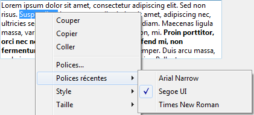
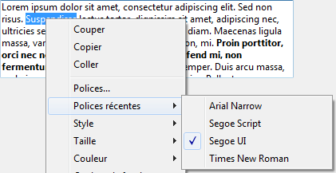

<!--REF #_command_.SET RECENT FONTS.Syntax-->**SET RECENT FONTS** ( *tabPolices* )<!-- END REF-->
<!--REF #_command_.SET RECENT FONTS.Params-->
| Paramètre | Type |  | Description |
| --- | --- | --- | --- |
| tabPolices | Text array | &#8594;  | Tableau de noms de polices |

<!-- END REF-->

*Cette commande n'est pas thread-safe, elle ne peut pas être utilisée dans du code préemptif.*


#### Description 

<!--REF #_command_.SET RECENT FONTS.Summary-->La commande **SET RECENT FONTS** permet de modifier la liste des polices récentes affichées dans le menu contextuel des "polices récentes".<!-- END REF--> 

Ce menu contient les noms des dernières polices sélectionnées durant la session. Il est notamment utilisé par les zones de *Notes de programmation*. 

#### Exemple 

Vous souhaitez ajouter une police au menu des polices récentes :



Vous exécutez le code suivant :

```4d
 ARRAY TEXT($tTRecentes;0)
 FONT LIST($tTRecentes;2)
 APPEND TO ARRAY($tTRecentes;"Segoe Script")
 SET RECENT FONTS($tTRecentes)
```

Le menu contient alors :



#### Voir aussi 

[FONT LIST](font-list.md)  