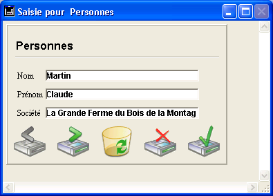
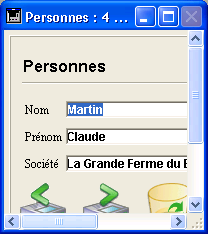

<!--REF #_command_.SET WINDOW RECT.Syntax-->**SET WINDOW RECT** ( *gauche* ; *haut* ; *droite* ; *bas* {; *fenêtre*}{; *} )<!-- END REF-->
<!--REF #_command_.SET WINDOW RECT.Params-->
| Paramètre | Type |  | Description |
| --- | --- | --- | --- |
| gauche | Integer | &#8594;  | Coordonnée gauche de l'intérieur de la fenêtre |
| haut | Integer | &#8594;  | Coordonnée supérieure de l'intérieur de la fenêtre |
| droite | Integer | &#8594;  | Coordonnée droite de l'intérieur de la fenêtre |
| bas | Integer | &#8594;  | Coordonnée inférieure de l'intérieur de la fenêtre |
| fenêtre | Integer | &#8594;  | Numéro de référence de la fenêtre ou Fenêtre de premier plan du process si ce paramètre est omis |
| * | Opérateur | &#8594;  | Si omis (défaut) = passer la fenêtre au premier plan<br/>Si passé = ne pas changer le plan de la fenêtre |

<!-- END REF-->

*Cette commande n'est pas thread-safe, elle ne peut pas être utilisée dans du code préemptif.*


#### Description 

<!--REF #_command_.SET WINDOW RECT.Summary-->La commande **SET WINDOW RECT** modifie les coordonnées globales de la fenêtre dont vous avez passé le numéro de référence [RefFen](# "Expression de type Entier long identifiant de façon unique une fenêtre ouverte") dans le paramètre *fenêtre*.<!-- END REF--> Si la fenêtre n'existe pas, la commande ne fait rien.

Si vous omettez le paramètre *fenêtre*, **SET WINDOW RECT** s'applique à la fenêtre de premier plan du process courant.

Ces coordonnées doivent être exprimées relativement au coin supérieur gauche de la zone de contenu de la fenêtre d'application (sous Windows en mode MDI) ou de l'écran principal (sous macOS et Windows en mode SDI). Les coordonnées décrivent le rectangle correspondant à la zone de contenu de la fenêtre (en excluant les barres de titres et les bordures).

**Attention :** Utilisez cette commande avec précaution, car vous pouvez déplacer une fenêtre en-dehors des limites de la fenêtre principale (sous Windows) ou de l'écran (sous Mac OS). Pour éviter cela, vous pouvez utiliser des fonctions telles que [Screen width](screen-width.md) et [Screen height](screen-height.md) pour bien vérifier les nouvelles coordonnées de la fenêtre.

Par défaut, l’exécution de la commande fait automatiquement passer au premier plan la fenêtre désignée par le paramètre *fenêtre* (lorsque ce paramètre est utilisé). Vous pouvez inactiver ce fonctionnement en passant *\** en dernier paramètre. Dans ce cas, la commande ne modifie pas le plan initial de la fenêtre (coordonnée "z"). 

Cette commande n’affecte pas les objets du formulaire. Si la fenêtre contient un formulaire, les objets du formulaire ne sont pas déplacés ou redimensionnés par la commande (quelles que soient leurs propriétés). Seule la fenêtre est modifiée. Pour modifier une fenêtre de formulaire en tenant compte de ses propriétés de redimensionnement et des objets qu’elle contient, vous devez utiliser la commande [RESIZE FORM WINDOW](resize-form-window.md).

#### Exemple 1 

Reportez-vous à l'exemple de la commande [WINDOW LIST](window-list.md).

#### Exemple 2 

Soit la fenêtre suivante :



Après l'exécution de la ligne suivante :

```4d
 SET WINDOW RECT(100;100;300;300)
```

La fenêtre apparaît ainsi :



#### Voir aussi 

[CONVERT COORDINATES](convert-coordinates.md)  
[DRAG WINDOW](drag-window.md)  
[GET WINDOW RECT](get-window-rect.md)  
[RESIZE FORM WINDOW](resize-form-window.md)  