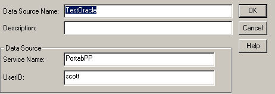

<!--REF #_command_.SQL End selection.Syntax-->**SQL End selection**  : Boolean<!-- END REF-->
<!--REF #_command_.SQL End selection.Params-->
| Paramètre | Type |  | Description |
| --- | --- | --- | --- |
| Résultat | Boolean | &#8592; | Limites de l’ensemble de recherche atteintes |

<!-- END REF-->

*Cette commande n'est pas thread-safe, elle ne peut pas être utilisée dans du code préemptif.*


#### Description 

<!--REF #_command_.SQL End selection.Summary-->La commande **SQL End selection** indique si les limites de l’ensemble résultat ont été atteintes.<!-- END REF--> 

#### Exemple 

Le code ci-dessous se connecte à une source de données externe (Oracle) à l’aide des paramètres suivants :



```4d
 var vName : Text
 
 SQL LOGIN("TestOracle";"scott";"tiger")
 If(OK=1)
    SQL EXECUTE("SELECT ename FROM emp";vName)
    While(Not(SQL End selection))
       SQL LOAD RECORD
    End while
    SQL LOGOUT
 End if
```

Cet exemple retournera dans la variable 4D *vName* les noms (ename) stockés dans la table nommée emp.
