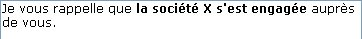
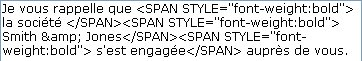

<!--REF #_command_.ST SET PLAIN TEXT.Syntax-->**ST SET PLAIN TEXT** ( {* ;} *objet* ; *nouvTexte* {; *débutSél* {; *finSél*}} )<!-- END REF-->
<!--REF #_command_.ST SET PLAIN TEXT.Params-->
| Paramètre | Type |  | Description |
| --- | --- | --- | --- |
| * | Opérateur | &#8594;  | Si spécifié, objet est un nom d'objet (chaîne) <br/>Si omis, objet est une variable ou un champ |
| objet | any | &#8594;  | Nom d'objet (si * est spécifié) ou <br/>Variable ou champ (si * est omis) |
| nouvText | Text | &#8594;  | Texte brut à insérer |
| débutSél | Integer | &#8594;  | Début de la sélection |
| finSél | Integer | &#8594;  | Fin de la sélection |

<!-- END REF-->

*Cette commande n'est pas thread-safe, elle ne peut pas être utilisée dans du code préemptif.*


#### Description 

<!--REF #_command_.ST SET PLAIN TEXT.Summary-->La commande **ST SET PLAIN TEXT** insère le texte passé dans le paramètre *nouvTexte* dans le champ ou la variable de texte multistyle désigné(e) par le paramètre *objet*.<!-- END REF--> Cette commande s’applique uniquement au texte brut du paramètre *objet*, sans modifier les éventuelles balises de style qu’il contient. 

A la différence de la commande [ST SET TEXT](st-set-text.md), **ST SET PLAIN TEXT** permet d’insérer uniquement du texte sans style. Le texte *nouvTexte* ne doit pas contenir de balises de style. S’il contient les caractères <, > ou &, ils seront considérés comme des caractères standard et seront convertis en entités HTML :

* '&' est converti en &amp;
* '<' est converti en &lt;
* '>' est converti en &gt;

##### 

Si vous passez le paramètre optionnel *\**, vous indiquez que le paramètre *objet* est un nom d’objet (une chaîne). A l'exécution, si l'objet a le focus, la commande s'applique uniquement à l'objet en cours d'édition et non à sa source de données (variable ou champ). Les modifications ne sont reportées dans la source (et donc dans les éventuels autres objets utilisant la même source) que lorsque l'objet en cours d'édition est validé via une perte de focus ou la touche **Entrée**. Si l'objet n'a pas le focus, la commande s'applique directement à la source de données et les modifications sont immédiatement répercutées aux éventuels autres objets utilisant la même source.   
Si vous omettez le paramètre *\**, vous indiquez que le paramètre *objet* est un champ ou une variable. Dans ce cas, vous ne passez pas une chaîne mais une référence de champ ou de variable. La commande s'applique directement au champ ou à la variable et les modifications sont répercutées à tous les objets utilisant cette source, y compris l'objet ayant le focus. 

##### 

Passez dans *nouvTexte* le texte brut à insérer. 

Les paramètres optionnels *débutSél* et *finSél* vous permettent de désigner une sélection de texte dans *objet*. Les valeurs *débutSél* et *finSél* expriment une sélection de texte brut, sans tenir compte des balises de style éventuellement présentes dans le texte. L’action de la commande diffère en fonction des paramètres facultatifs *débutSél* et *finSél* :

* si vous omettez *débutSél* et *finSél*, [ST SET PLAIN TEXT](st-set-plain-text.md) remplace la totalité du texte de *objet* par *nouvTexte*,
* si vous passez uniquement *débutSél* ou si les valeurs de *débutSél* et *finSél* sont égales, [ST SET PLAIN TEXT](st-set-plain-text.md) insère le texte *nouvTexte* dans *objet* à partir de *débutSél*,
* si vous passez *débutSél* et *finSél*, [ST SET PLAIN TEXT](st-set-plain-text.md) remplace le texte brut défini par ces bornes avec le texte *nouvTexte*.
* vous pouvez passer 0 dans *finSél* afin de désigner automatiquement le dernier caractère du texte (passez 1 dans *débutSél* pour désigner le premier caractère).

4D propose des constantes prédéfinies afin de désigner automatiquement des bornes de sélection dans les paramètres *débutSél* et *finSél*. Ces constantes sont placées dans le thème "*Texte multistyle*" : 

| Constante          | Type        | Valeur | Comment                                                                          |
| ------------------ | ----------- | ------ | -------------------------------------------------------------------------------- |
| ST End highlight   | Entier long | \-1001 | Désigne le dernier caractère de la sélection courante de texte dans l’objet (\*) |
| ST End text        | Entier long | 0      | Désigne le dernier caractère du texte contenu dans l’objet                       |
| ST Start highlight | Entier long | \-1000 | Désigne le premier caractère de la sélection courante de texte dans l’objet (\*) |
| ST Start text      | Entier long | 1      | Désigne le premier caractère du texte contenu dans l’objet                       |

(\*) Vous devez passer un nom d’objet dans *objet* pour pouvoir utiliser cette constante. Si vous passez une référence de variable ou de champ, la commande s’appliquera à l’ensemble du texte de l’objet.

Le style du premier caractère remplacé sera utilisé pour la totalité du texte *nouvTexte*. 

Si *débutSél* est supérieur à *finSél*, le texte n'est pas modifié et la variable OK prend la valeur 0 (hormis lorsque *finSél* vaut 0, cf. ci-dessus). 

#### Exemple 

Soit la variable texte multistyle suivante :



Vous voulez insérer des noms de sociétés stockés dans un champ texte. Ces noms peuvent comporter par exemple le caractère "&". Dans ce cas, il est nécessaire d'utiliser la commande [ST SET PLAIN TEXT](st-set-plain-text.md) :

```4d
 ST SET PLAIN TEXT(monTexteStyl;[Société]Nom;33;34)
```

Le résultat est alors :


Voici le texte brut contenu dans la variable :



Vous pouvez constater que le texte inséré a été encapsulé au sein d'une paire de balises de style supplémentaires. Ces balises correspondent au style du caractère précédent l'insertion. Ce mécanisme permet de garantir un affichage correct des champs multistyles dans tous les cas de figure. 

**Note :** Si vous aviez utilisé la commande [ST SET TEXT](st-set-text.md) dans ce cas, 4D n'aurait rien inséré, car la présence du caractère "&" non encodé empêcherait l'interprétation des balises de style présentes dans la variable. Pour plus d'informations, reportez-vous à la description de cette commande. 

#### Variables et ensembles système 

A l’issue de l’exécution de cette commande, la variable OK prend la valeur 1 si aucune erreur n’a été rencontrée et 0 dans le cas contraire. C’est le cas notamment lorsque l’évaluation des balises de style échoue (balise incorrecte ou manquante). 

A noter qu’en cas d’erreur, la variable n’est pas modifiée. Lorsqu’une erreur se produit sur une variable lors de l’évaluation du texte, 4D transforme le texte en texte brut ; par conséquent, les caractères <, > et & seront convertis en entités HTML.

#### Voir aussi 

[ST Get plain text](st-get-plain-text.md)  
[ST SET TEXT](st-set-text.md)  