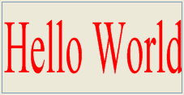

<!--REF #_command_.SVG EXPORT TO PICTURE.Syntax-->**SVG EXPORT TO PICTURE** ( *refElément* ; *vVarImage* {; *typeExport*} )<!-- END REF-->
<!--REF #_command_.SVG EXPORT TO PICTURE.Params-->
| Paramètre | Type |  | Description |
| --- | --- | --- | --- |
| refElément | Text | &#8594;  | Référence d’élément XML racine |
| vVarPicture | Picture | &#8594;  | Variable image devant recevoir l’arbre XML (image SVG) |
| typeExport | Integer | &#8594;  | 0=Ne pas stocker la source de données, 1=Copier la source de données  (par défaut), 2 = Prendre possession de la source de données |

<!-- END REF-->

#### Description 

<!--REF #_command_.SVG EXPORT TO PICTURE.Summary-->La commande **SVG EXPORT TO PICTURE** permet de sauvegarder dans la variable ou le champ image désigné(e) par le paramètre *vVarImage* une image au format SVG contenue dans un arbre XML.<!-- END REF--> 

**Note :** Pour plus d'informations sur le format SVG, reportez-vous à la section *Présentation des commandes XML génériques*. 

Passez dans *refElément* la référence de l’élément XML racine contenant l’image SVG. 

Passez dans *vVarImage* le nom de la variable image ou du champ image 4D devant contenir l’image SVG. L’image est exportée dans son format natif (description XML) et est dessinée via le moteur de rendu SVG au moment de l’affichage. 

Le paramètre facultatif *typeExport* vous permet de définir la manière dont la source de données XML doit être prise en charge par la commande. Vous pouvez passer dans ce paramètre une des constantes suivantes, placées dans le thème “*XML*” :

| Constante            | Type        | Valeur | Comment                                                                                                                                                                                                                                                              |
| -------------------- | ----------- | ------ | -------------------------------------------------------------------------------------------------------------------------------------------------------------------------------------------------------------------------------------------------------------------- |
| Copy XML data source | Entier long | 1      | 4D conserve une copie de l’arbre DOM avec l’image, ce qui permet de la sauvegarder dans un champ image de la base de données et de la réafficher ou de l’exporter à tout moment. Ce mode d’exportation est utilisé par défaut si le paramètre *typeExport* est omis. |
| Get XML data source  | Entier long | 0      | 4D lit uniquement la source de données XML, elle n’est pas conservée avec l’image. Ce paramétrage accélère sensiblement l’exécution de la commande, toutefois l’arbre DOM n’étant pas conservé, il ne sera pas possible de stocker ni d’exporter l’image.            |
| Own XML data source  | Entier long | 2      | 4D exporte l’arbre DOM avec l’image. L’image pourra être stockée ou exportée et l’exécution de la commande est rapide. Toutefois, la référence XML *refElément* n’est alors plus utilisable par les autres commandes 4D.                                             |

#### Exemple 

L’exemple suivant permet d’afficher “Hello World” dans une image 4D :  
  
```4d
 var vImage : Picture
 $svg:=DOM Create XML Ref("svg";"http://www.w3.org/2000/svg")
 $ref:=DOM Create XML element($svg;"text";"font-size";26;"fill";"red")
 DOM SET XML ATTRIBUTE($ref;"y";"1em")
 DOM SET XML ELEMENT VALUE($ref;"Hello World")
 SVG EXPORT TO PICTURE($svg;vImage;Copy XML data source)
 DOM CLOSE XML($svg)
```
  
  
  

#### Voir aussi 

[DOM EXPORT TO FILE](dom-export-to-file.md)  
[DOM EXPORT TO VAR](dom-export-to-var.md)  