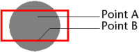

<!--REF #_command_.SVG Find element ID by coordinates.Syntax-->**SVG Find element ID by coordinates** ( {* ;} *objetImage* ; *x* ; *y* ) : Text<!-- END REF-->
<!--REF #_command_.SVG Find element ID by coordinates.Params-->
| Paramètre | Type |  | Description |
| --- | --- | --- | --- |
| * | Opérateur | &#8594;  | Si spécifié, objetImage est un nom d’objet (chaîne) Si omis, objetImage est un champ ou une variable |
| objetPicture | Picture | &#8594;  | Nom d’objet (si * spécifié) ou Champ ou Variable (si * omis) |
| x | Integer | &#8594;  | Coordonnée X en pixels |
| y | Integer | &#8594;  | Coordonnée Y en pixels |
| Résultat | Text | &#8592; | ID de l’élément se trouvant à l’emplacement x,y |

<!-- END REF-->

*Cette commande n'est pas thread-safe, elle ne peut pas être utilisée dans du code préemptif.*

#### Description 

<!--REF #_command_.SVG Find element ID by coordinates.Summary-->La commande **SVG Find element ID by coordinates** retourne l’ID (attribut "id" ou "xml:id") de l’élément XML situé à l’emplacement défini par les coordonnées (*x*,*y*) dans l’image SVG désignée par le paramètre *objetImage*.<!-- END REF--> Cette commande permet notamment de créer des interfaces graphiques interactives utilisant des objets SVG. 

**Note :** Pour plus d'informations sur le format SVG, reportez-vous à la section *Présentation des commandes XML génériques*. 

Si vous passez le paramètre optionnel *\**, vous indiquez que le paramètre *objetImage* est un nom d’objet (une chaîne). Si vous ne passez pas le paramètre, vous indiquez que le paramètre *objetImage* est un champ ou une variable. Dans ce cas, vous ne passez pas une chaîne mais une référence de champ ou de variable (champ ou variable objet uniquement). 

A noter qu’il n’est pas obligatoire que l’image soit affichée dans un formulaire. Dans ce cas, la syntaxe de type "nom d’objet" n’est pas valide, vous devez passer un nom de champ ou de variable.

Les coordonnées passées dans les paramètres *x* et *y* doivent être exprimées en pixels relativement à l’angle supérieur gauche de l’image (0,0). Dans le contexte d’une image affichée dans un formulaire, vous pouvez utiliser les valeurs retournées par les *variables système* MouseX et MouseY. Ces variables sont mises à jour dans les événements formulaire On Clicked, On Double Clicked et On Mouse Up ainsi que On Mouse Enter et On Mouse Move. 

**Note :** Dans le système de coordonnées des images, MouseX et MouseY définissent toujours le même point de l'image, quel que soit son format d’affichage (hormis pour le format "mosaïque"), même si l'image a défilé ou a été zoomée. 

Le point pris en compte est le premier point atteint. Par exemple, dans le cas ci-dessous, la commande retournera l’ID du cercle si les coordonnées du point A sont passées et celui du rectangle si les coordonnées du point B sont passées :

Si les coordonnées correspondent à des objets superposés ou composites, la commande retourne l’ID du premier objet disposant d’un attribut ID valide en remontant si nécessaire parmi les éléments parents.

La commande retourne une chaîne vide si :

* la racine est atteinte sans qu’un attribut "id" ait été trouvé,
* le point de coordonnées n’appartient à aucun objet,
* l’attribut "id" est une chaîne vide.

**Note :** Cette commande ne permet pas de détecter des objets dont la valeur d'opacité (attribut "fill-opacity") est inférieure à 0,01 

#### Variables et ensembles système 

Si *objetImage* ne contient pas une image SVG valide, la commande retourne une chaîne vide et la variable système OK prend la valeur 0\. Sinon, si la commande a été exécutée correctement, la variable système OK prend la valeur 1\. 

#### Voir aussi 

[SVG Find element IDs by rect](svg-find-element-ids-by-rect.md)  