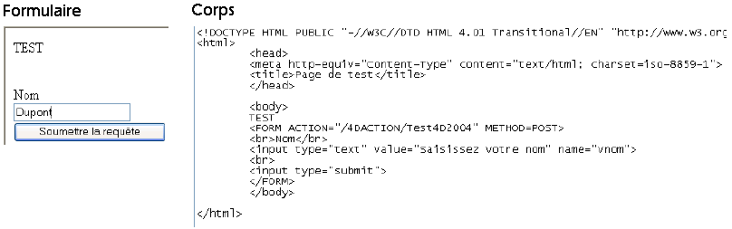

<!--REF #_command_.WEB GET HTTP BODY.Syntax-->**WEB GET HTTP BODY** ( *corps* )<!-- END REF-->
<!--REF #_command_.WEB GET HTTP BODY.Params-->
| Paramètre | Type |  | Description |
| --- | --- | --- | --- |
| corps | Blob, Text | &#8592; | Champ corps (Body) de la requête HTTP |

<!-- END REF-->

#### Description 

<!--REF #_command_.WEB GET HTTP BODY.Summary-->La commande **WEB GET HTTP BODY** retourne le corps (body) de la requête HTTP en cours de traitement.<!-- END REF--> Le corps HTTP est retourné tel quel, sans traitement ni analyse. 

Cette commande peut être appelée depuis la *Méthode base Sur authentification Web*, la [QR SET DESTINATION](qr-set-destination.md) ou toute méthode Web. 

Vous pouvez passer dans le paramètre *corps* une variable ou un champ de type BLOB ou Texte. Le type Texte sera généralement suffisant (le paramètre *corps* peut recevoir jusqu'à 2 Go de texte). 

Cette commande permet par exemple d’effectuer des recherches dans le corps des requêtes. Elle permet également aux utilisateurs avancés de mettre en place un serveur WebDAV au sein d’une base 4D.

#### Exemple 

Dans cet exemple, une requête simple est envoyée au serveur Web de 4D et le contenu du champ HTTP corps est visualisé dans le débogueur. Voici le formulaire envoyé au serveur Web de 4D, ainsi que le code HTML correspondant :



Voici la méthode Test4D2004 :

```4d
 var $requete : Blob
 var $texteRequete : Text
 
 WEB GET HTTP BODY($requete)
 $texteRequete:=BLOB to text($requete;UTF8 text without length)
 WEB SEND FILE("page.html")
```

**Note :** Cette méthode a été déclarée “Disponible via les balises HTML et les URLs 4D (4DACTION...)” dans ses propriétés. 

Lorsque le formulaire est soumis au serveur Web, la variable $texteRequete reçoit le texte du champ body de la requête HTTP, soit "*vnom=Dupont*".

#### Voir aussi 

[WEB GET BODY PART](web-get-body-part.md)  
[WEB GET HTTP HEADER](web-get-http-header.md)  