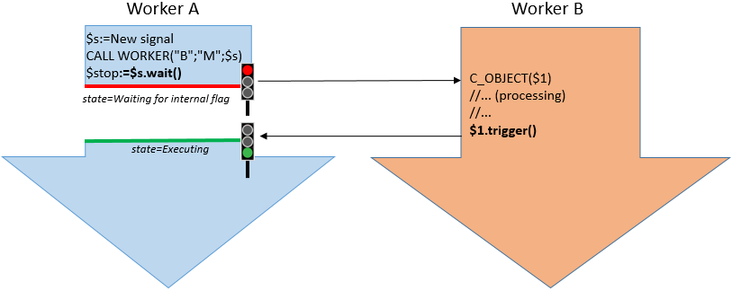

Les signaux sont des outils fournis par le langage 4D pour gérer les interactions et éviter les conflits entre les process dans une application multiprocessus. Les signaux vous permettent de vous assurer qu'un ou plusieurs process attendront la fin d'une tâche spécifique avant de poursuivre leur exécution. Tout process peut attendre et/ou libérer un signal.

> Les sémaphores peuvent également être utilisés pour gérer les interactions. Les sémaphores permettent de s'assurer que deux ou plusieurs process ne modifient pas la même ressource (fichier, enregistrement...) en même temps. Seul le process qui a posé le sémaphore peut le retirer.

### Objet signal

Un signal est un objet partagé qui doit être passé comme paramètre aux commandes qui appellent ou créent des workers ou des process.

Un objet `4D.Signal` contient les méthodes et propriétés intégrées suivantes :

- [`.wait()`](#wait)
- [`.trigger()`](#trigger)
- [`.signaled`](#signaled)
- [`.description`](#description).

Tout worker/process appelant la méthode `.wait()` suspend son exécution jusqu'à ce que la propriété `.signaled` soit mise à true. Lorsque vous êtes en attente d'un signal, le process appelant n'utilise pas de CPU. Cela peut être très intéressant pour les performances des applications multiprocess. La propriété `.signaled` devient est mise à True lorsqu'un worker/processus appelle la méthode `.trigger()`.

A noter que pour éviter les situations de blocage, la méthode `.wait()` peut également revenir après qu'un délai d'attente défini ait été atteint.

Les objets Signal sont créés avec la commande [`New signal`](../commands/new-signal.md).

### Travailler avec des signaux

Dans 4D, vous créez un nouvel objet signal en appelant la commande [`New signal`](../commands/new-signal.md). Une fois créé, ce signal doit être passé en paramètre aux commandes `New process` ou `CALL WORKER` afin qu'elles puissent le modifier lorsqu'elles ont terminé la tâche que vous souhaitez attendre.

- `signal.wait()` doit être appelé par le worker/process qui a besoin qu'un autre worker/process termine une tâche pour pouvoir continuer.
- `signal.trigger()` doit être appelé par le worker/process qui a terminé son exécution afin de libérer tous les autres.



Une fois qu'un signal a été libéré par un appel à `signal.trigger()`, il ne peut plus être réutilisé. Si vous souhaitez définir un autre signal, vous devez à nouveau appeler la commande `New signal`.

Etant donné qu'un objet signal est un [objet partagé](Concepts/shared.md), vous pouvez l'utiliser pour retourner les résultats des workers/process appelés, à condition de ne pas oublier d'écrire les valeurs dans une structure `Use...End use` (voir exemple

### Exemple

```4d
 var $signal : 4D.Signal

  // Création d'un signal
 $signal:=New signal

  // appel du process principal et exécution de la méthode OpenForm
 CALL WORKER(1;"OpenForm";$signal)
  // autre calcul
 ...
  // En attente de la fin du process
 $signaled:=$signal.wait()

  // Traitement des résultats
 $calc:=$signal.result+...
```

Méthode ***OpenForm*** :

```4d
 #DECLARE ($signal : 4D.Signal)  
 var $form : Object
 $form:=New object("value";0)

  // Ouvrir le form
 $win:=Open form window("Information";Movable form dialog box)
 DIALOG("Information";$form)
 CLOSE WINDOW($win)

  // Ajout d'un nouvel attribut à votre objet partagé $signal pour passer votre résultat à l'autre process :
 Use($signal)
    $signal.result:=$form.value
 End use

  // Envoyer le signal au process en attente
 $signal.trigger()
```

### Sommaire

|                                                                                                                        |
| ---------------------------------------------------------------------------------------------------------------------- |
| [<!-- INCLUDE #SignalClass.description.Syntax -->](#description)<br/><!-- INCLUDE #SignalClass.description.Summary --> |
| [<!-- INCLUDE #SignalClass.signaled.Syntax -->](#signaled)<br/><!-- INCLUDE #SignalClass.signaled.Summary -->          |
| [<!-- INCLUDE #SignalClass.trigger().Syntax -->](#trigger)<br/><!-- INCLUDE #SignalClass.trigger().Summary -->         |
| [<!-- INCLUDE #SignalClass.wait().Syntax -->](#wait)<br/><!-- INCLUDE #SignalClass.wait().Summary -->                  |

<!-- REF SignalClass.description.Desc -->

## .description

<details><summary>Historique</summary>

| Release | Modifications |
| ------- | ------------- |
| 17 R4   | Ajout         |

</details>

<!-- REF #SignalClass.description.Syntax -->**.description** : Text<!-- END REF -->

#### Description

La propriété `.description` <!-- REF #SignalClass.description.Summary -->contient une description personnalisée pour l'objet `Signal`<!-- END REF -->.

`.description` peut être définie à la création de l'objet signal ou à tout moment. Notez que comme l'objet `Signal` est un objet partagé, tout accès en mode écriture à la propriété `.description` doit être encadré par les mots-clés `Use...End use`.

Cette propriété est en **lecture-écriture**.

<!-- END REF -->

<!-- REF SignalClass.signaled.Desc -->

## .signaled

<details><summary>Historique</summary>

| Release | Modifications |
| ------- | ------------- |
| 17 R4   | Ajout         |

</details>

<!-- REF #SignalClass.signaled.Syntax -->**.signaled** : Boolean<!-- END REF -->

#### Description

La propriété `.signaled` <!-- REF #SignalClass.signaled.Summary -->contient le statut courant de l'objet `Signal`<!-- END REF -->. Lorsque le signal est créé, `.signaled` est **False**. Elle devient **True** lorsque la fonction `.trigger( )` est appelée sur l'objet.

Cette propriété est en **lecture seule**.

<!-- END REF -->

<!-- REF SignalClass.trigger().Desc -->

## .trigger()

<details><summary>Historique</summary>

| Release | Modifications |
| ------- | ------------- |
| 17 R4   | Ajout         |

</details>

<!-- REF #SignalClass.trigger().Syntax -->**.trigger( )**<!-- END REF -->

<!-- REF #SignalClass.trigger().Params -->

| Paramètres | Type |     | Description                 |
| ---------- | ---- | :-: | --------------------------- |
|            |      |     | Ne requiert aucun paramètre |

<!-- END REF -->

#### Description

La fonction `.trigger()` <!-- REF #SignalClass.trigger().Summary -->met la propriété `signaled` de l'objet signal à **true**<!-- END REF --> et réveille tous les workers ou process attendant ce signal.

Si le signal est déjà dans l'état signaled (i.e., la propriété `signaled` est déjà **true**), la fonction ne fait rien.

<!-- END REF -->

<!-- REF SignalClass.wait().Desc -->

## .wait()

<details><summary>Historique</summary>

| Release | Modifications |
| ------- | ------------- |
| 17 R4   | Ajout         |

</details>

<!-- REF #SignalClass.wait().Syntax -->**.wait**( { *timeout* : Real } ) : Boolean <!-- END REF -->

<!-- REF #SignalClass.wait().Params -->

| Paramètres | Type    |                             | Description                                   |
| ---------- | ------- | --------------------------- | --------------------------------------------- |
| timeout    | Real    | ->                          | Délai d'attente maximum du signal en secondes |
| Résultat   | Boolean | <- | Etat de la propriété `.signaled`              |

<!-- END REF -->

#### Description

La fonction `.wait()` <!-- REF #SignalClass.wait().Summary -->place le process courant en attente jusqu'à ce que la propriété `.signaled` de l'objet signal devienne **true** ou que le *timeout* optionnel expire<!-- END REF -->.

Pour prévenir tout code bloquant, vous pouvez passez un temps d'attente maximum en secondes dans le paramètre *timeout* (les décimales sont acceptées).

> **Attention** : L'appel de `.wait( )` sans *timeout* dans le process principal de 4D n'est pas recommandé car il pourrait geler l'ensemble de l'application 4D.

|

La fonction retourne la valeur de la propriété `.signaled`. Evaluer cette valeur permet de savoir si la fonction a retourné à cause de l'appel de `.trigger( )` (`.signaled` est **true**) ou si le *timeout* a expiré (`.signaled` est **false**).

> L'état d'un process qui attend un signal est `En attente d'un marqueur interne`.

<!-- END REF -->
