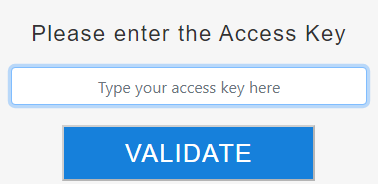
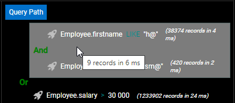

L'Explorateur de données fournit une interface Web pour visualiser, interroger et modifier les données de votre datastore. Grâce à cet outil, vous pouvez facilement naviguer parmi toutes vos entités et rechercher, ordonner ou filtrer les valeurs des attributs. Il vous aide à identifier rapidement les problèmes à chaque étape du processus de développement, ainsi qu'à contrôler et à modifier les données.


## Configuration

L'Explorateur de données s'appuie sur le composant serveur web [`WebAdmin`](webAdmin.md) pour les paramètres
de configuration et d'authentification.

- **configuration** : la configuration de l'Explorateur de données réutilise les paramètres du serveur web [`WebAdmin`](webAdmin.md#webadmin-settings),
- **authentification** : l'accès à l'Explorateur de données est accordé lorsque [l'utilisateur de la session est authentifié](webAdmin.md#authentication-and-session) et détient le privilège "WebAdmin". Lorsque l'on accède à l'Explorateur de données via l'élément de menu **Explorateur de données** (voir ci-dessous), une authentification automatique est fournie.

> L'accès à l'Explorateur de données peut être désactivé à l'aide de la fonction [`.setAdminProtection()`](API/DataStoreClass.md#setadminprotection).

## Ouverture de l'Explorateur de données

[Le serveur web `WebAdmin`](webAdmin.md#starting-the-webadmin-web-server) est démarré automatiquement si nécessaire lorsque l'on clique sur l'Explorateur de données.

Pour se connecter à la page web de l'Explorateur de données :

- A partir d'une application 4D (avec interface) :
  - Pour ouvrir une nouvelle fenêtre 4D avec la page de l'Explorateur de données affichée dans une zone web, sélectionnez **Explorateur de données** dans le menu **Enregistrements** ou cliquez sur le bouton **Données** dans la barre d'outils principale.
  - Pour ouvrir l'Explorateur de données dans un onglet de navigateur externe, sélectionnez **Explorateur de données dans le navigateur** dans le menu **Enregistrements** ou appuyez sur la touche **Alt** (Windows)/**Option** (macOS) et cliquez sur le bouton \*

- À partir de 4D Server, sélectionnez **Explorateur de données dans le navigateur** dans le menu **Fenêtre** (l'Explorateur de données ne peut être ouvert que dans un navigateur externe).

- Que vous utilisiez une application 4D sans interface ou non, vous pouvez ouvrir votre navigateur web et entrer l'adresse suivante :

`IPaddress:HTTPPort/dataexplorer` or `IPaddress:HTTPSPort/dataexplorer`

Dans ce contexte, vous serez invité à saisir la [clé d'accès](webAdmin.md#access-key) pour ouvrir une session `WebAdmin` sur le serveur :



> Les valeurs [HTTPPort](webAdmin.md#http-port) et [HTTPSPort](webAdmin.md#https-port) sont configurées dans les paramètres de `WebAdmin`.

## Conditions requises

L'Explorateur de données prend en charge les navigateurs Web suivants :

- Chrome
- Safari
- Edge
- FireFox

La résolution minimale pour utiliser l'Explorateur de données est de 1280x720. La résolution recommandée est de 1920x1080.

## Parcourir les données

En plus d'une vue complète et personnalisable de vos données, l'Explorateur de données vous permet de rechercher et d'ordonner vos données.

### Principes de base

L'Explorateur de données fournit un accès global au modèle de données ORDA conformément aux [règles de mapping ORDA](ORDA/dsMapping.md#general-rules).

:::info

Lorsque les données ou le modèle ORDA sont modifiés du côté de la base de données (ajout de table, enregistrement édité ou supprimé, etc.), il suffit de rafraîchir la page de l'Explorateur de données dans le navigateur (à l'aide de la touche F5, par exemple).

:::

Vous pouvez passer au thème d'affichage **mode sombre** à l'aide du sélecteur situé en bas de la page :


La page contient plusieurs zones :

- Sur le côté gauche, se trouvent la **zone des Dataclass** et la **zone des attributs**, pour sélectionner les dataclass et les attributs à afficher. Les attributs sont classés selon l'ordre de création de la structure sous-jacente. Les clés primaires et les attributs indexés ont une icône spécifique. Vous pouvez filtrer la liste des noms de dataclasses et d'attributs proposés en utilisant les zones de recherche respectives.
  

- La partie centrale contient la **Zone de recherche** et la **Grille de données** (liste des entités de la dataclass sélectionnée). Chaque colonne de la grille représente un attribut du datastore.
  - Par défaut, toutes les entités sont affichées. Vous pouvez filtrer les entités affichées en utilisant la zone de recherche. Deux modes de requête sont disponibles : [Requête sur les attributs](#query-on-attributes) (sélectionné par défaut), et la [Requête avancée avec expression](#advanced-query-with-expression). Vous sélectionnez le mode de requête en cliquant sur le bouton correspondant (le bouton **X** permet de réinitialiser la zone de requête et donc de stopper le filtrage):
    
  - Le nom de la dataclass sélectionnée est ajouté sous forme d'onglet au-dessus de la grille de données. A l'aide de ces onglets, vous pouvez passer d'une dataclasse à une autre qui a déjà été sélectionnée. Vous pouvez supprimer une dataclasse référencée en cliquant sur l'icône "supprimer" à droite du nom de la dataclass.
  - Vous pouvez réduire le nombre de colonnes en décochant les attributs dans la partie gauche. Vous pouvez également changer les colonnes dans la grille de données à l'aide du glisser-déposer. Vous pouvez cliquer sur l'en-tête d'une colonne pour [trier les entités](#ordering-entities) en fonction de ses valeurs (lorsque cela est possible).
  - Si une opération nécessite beaucoup de temps, une barre de progression s'affiche. Vous pouvez arrêter l'opération en cours à tout moment en cliquant sur le bouton rouge :<br/>
    

- Sur la droite se trouve la zone **Détails** : elle affiche les valeurs des attributs de l'entité actuellement sélectionnée ainsi que les **données liées**, le cas échéant. Vous pouvez naviguer entre les entités de la dataclass en cliquant sur les liens **Premier** / **Précédent** / **Suivant** / **Dernier** en bas de la zone.
  - Tous les types d'attributs sont affichés, y compris les images, les objets (exprimés en json) ainsi que les [attributs calculés](../ORDA/ordaClasses.md#computed-attributes-1) et les [alias](../ORDA/ordaClasses.md#alias-attributes-1) .
  - Les données liées (relations N-vers-1 et 1-vers-N) peuvent être affichées par le biais de zones extensibles/réductibles :<br/>
    
  - **Ctrl+Clic** (Windows) ou **Command+Clic** (macOS) sur un nom d'attribut lié dans la zone de droite affiche les valeurs de l'attribut dans une zone flottante indépendante :<br/>
    

### Ordonner les entités

Vous pouvez réorganiser la liste des entités affichées en fonction des valeurs des attributs. Tous les types d'attributs peuvent être utilisés pour un tri, sauf l'image et l'objet.

- Cliquez sur un en-tête de colonne pour ordonner les entités en fonction des valeurs d'attribut correspondantes. Par défaut, le tri est ascendant. Cliquez deux fois pour un tri décroissant. Une colonne utilisée pour trier les entités est affichée avec une petite icône et son nom est en _italique_.


- Vous pouvez trier les attributs sur plusieurs niveaux. Par exemple, vous pouvez trier les employés par ville, puis par salaire. Pour ce faire, maintenez la touche **Maj** enfoncée et cliquez successivement sur chaque en-tête de colonne à inclure dans l'ordre de tri.

### Requête sur les attributs

Dans ce mode, vous pouvez filtrer les entités en saisissant les valeurs à rechercher (ou à exclure) dans les zones situées au-dessus de la liste des attributs. Vous pouvez filtrer un ou plusieurs attributs. La liste des entités est automatiquement mise à jour lors de la saisie.


Si vous saisissez plusieurs attributs, un "ET" est automatiquement appliqué. Par exemple, le filtre suivant affiche les entités dont l'attribut _prénom_ commence par "flo" ET la valeur de l'attribut _salaire_ > 50000 :


Le bouton **X** permet de supprimer les attributs saisis et de stopper ainsi le filtrage.

Différents opérateurs et options de requête sont disponibles, en fonction du type de données de l'attribut.

> Vous ne pouvez pas filtrer sur les attributs d'image ou d'objet.

#### Opérateurs numériques

Avec les attributs numériques, de date et d'heure, l'opérateur "=" est sélectionné par défaut. Toutefois, vous pouvez sélectionner un autre opérateur dans la liste des opérateurs (cliquez sur l'icône "=" pour afficher la liste) :


#### Dates

Avec les attributs de date, vous pouvez saisir la date à utiliser à l'aide d'un widget de sélection de date (cliquez sur la zone de la date pour afficher le calendrier) :


#### Booléens

Lorsque vous cliquez sur une zone d'attribut booléen, vous pouvez filtrer sur les valeurs **true**/**false** mais aussi sur les valeurs **null**/**not null** :


- **null** indique que la valeur de l'attribut n'a pas été définie
- **not null** indique que la valeur de l'attribut est définie (donc true ou false).

#### Text

Les filtres texte ne sont pas diacritiques (a = A).

Le filtre est du type "commence par". Par exemple, si vous saisissez "Jim", vous obtiendrez les valeurs "Jim" et "Jimmy".

Vous pouvez également utiliser le caractère générique (@) pour remplacer un ou plusieurs caractères de départ. Par exemple :

| Un filtre avec      | Résultats                                                 |
| ------------------- | --------------------------------------------------------- |
| Bel                 | Toutes les valeurs qui commencent par "Bel"               |
| @do    | Toutes les valeurs contenant "do"                         |
| Bel@do | Toutes les valeurs commençant par "Bel" et contenant "do" |

Si vous souhaitez créer des requêtes plus spécifiques, telles que "est exactement", vous devrez utiliser la fonction de requêtes avancées.

### Requêtes avancées avec des expressions

Lorsque vous sélectionnez cette option, une zone de requête s'affiche au-dessus de la liste des entités, et vous permet de saisir une expression à utiliser pour filtrer le contenu :


Vous pouvez saisir des requêtes avancées qui ne sont pas disponibles en tant que requêtes d'attributs. Par exemple, si vous voulez trouver des entités dont l'attribut _firstname_ contient "Jim" mais pas "Jimmy", vous pouvez écrire :

```
firstname=="Jim"
```

Vous pouvez utiliser n'importe quelle expression de requête ORDA comme documenté dans la fonction [`query()`] (API/DataClassClass.md#query), avec les limitations ou différences suivantes :

- Par sécurité, vous ne pouvez pas exécuter de formules en utilisant `eval()`.
- Les placeholders ne peuvent pas être utilisés ; vous devez saisir une _queryString_ avec des valeurs.
- Les valeurs de chaîne contenant des caractères d'espacement doivent être intégrées dans des guillemets doubles ("").

Par exemple, avec la dataclass Employee, vous pouvez écrire :

```
firstname = "Marie Sophie" ET manager.lastname = "@th"
```

Vous pouvez cliquer sur l'icône `v` pour afficher à la fois le [`queryPlan`](API/DataClassClass.md#queryplan) et le [`queryPath`](API/DataClassClass.md#querypath). Dans cette zone, vous pouvez survoler les blocs de sous-requêtes pour avoir des informations détaillées par sous-requête :



Faites un clic droit dans la zone des requêtes pour afficher les précédentes requêtes valides :


## Modifier les données

L'explorateur de données vous permet de modifier les valeurs des attributs, d'ajouter ou de supprimer des entités. Cette fonctionnalité est destinée aux administrateurs, par exemple pour tester des mises en œuvre ou résoudre des problèmes liés à des données non valides.

### Autoriser les modifications

Pour des raisons de sécurité, pour pouvoir modifier les données via l'Explorateur de données, vous devez d'abord activer le mode d'édition en utilisant le sélecteur **Allow editing**. Lorsque cette option est activée, des boutons de modification sont affichés sur le côté droit :


Ce sélecteur est activé **par dataclass** et **par session de navigation**.

:::info

Le sélecteur est destiné à éviter les modifications accidentelles car aucune boîte de dialogue de confirmation n'est affichée lors de l'édition de données via l'Explorateur de données.

:::

### Saisie des valeurs

Lorsque le sélecteur **Allow editing** est activé pour une dataclass, vous pouvez saisir des valeurs pour une nouvelle entité ou une entité sélectionnée par le biais de widgets de saisie dédiés dans la zone **Détails** de la dataclass sélectionnée.

Les valeurs d'attributs scalaires suivants peuvent être modifiées :

- text
- boolean
- numérique
- date
- time
- image (vous pouvez télécharger ou glisser-déposer une image)
- object (JSON string)

Les attributs Blob ne peuvent pas être modifiés.

Les valeurs nouvelles ou modifiées sont stockées dans le cache local, vous devez [les enregistrer explicitement](#enregistrer-les-modifications) pour les stocker dans les données.

### Création d'entités

Vous pouvez créer une nouvelle entité vide dans la table sélectionnée en cliquant sur le bouton de création . Vous pouvez alors [entrer les valeurs](#saisie-des-valeurs) pour cette entité.

La nouvelle entité est conservée dans le cache local, vous devez [la sauvegarder explicitement](#enregistrer-les-modifications) pour la stocker dans les données.

:::info

Les valeurs d'attributs qui doivent être calculées par 4D (ID, attributs calculés) ne seront renvoyées qu'après l'enregistrement de l'entité.

:::

### Rechargement des valeurs

Le bouton **reload**  recharge les valeurs des attributs de l'entité à partir du fichier de données. Ce bouton est utile par exemple lorsque vous voulez vous assurer que les valeurs affichées sont les valeurs enregistrées les plus récentes.

### Enregistrer les modifications

À l'exception de la [suppression](#deleting-entities) (voir ci-dessous), les modifications de l'entité sont effectuées localement et doivent être sauvegardées afin d'être enregistrées dans le fichier de données.

Pour sauvegarder les modifications ou pour sauvegarder une entité que vous avez créée dans l'Explorateur de données, cliquez sur le bouton **Save** .

:::info

Les modifications sur une entité existante sont automatiquement enregistrées lorsque vous sélectionnez une autre entité de la même dataclass.

:::

En cas de conflit (par ex. un autre utilisateur a modifié la même valeur d'attribut sur la même entité), un message d'erreur est affiché au bas de l'Explorateur de données. Vous pouvez cliquer sur le bouton [**Reload**](#reloading-values) pour obtenir la nouvelle valeur depuis les données, puis appliquer et enregistrer vos modifications.

### Suppression d'entités

Vous pouvez supprimer des entités en cliquant sur le bouton **supprimer** .

Pour supprimer un ensemble d'entités, sélectionnez deux entités ou plus dans la zone de liste en utilisant **Maj+clic** (sélection continue) ou **Ctrl/Command+clic** (sélection discontinue) et cliquez sur le bouton de **suppression**.

:::note

Si certaines entités n'ont pas pu être supprimées à cause d'un conflit (par exemple, des entités verrouillées sur le serveur), elles sont surlignées dans la liste.

:::

:::caution

Aucune boîte de dialogue de confirmation n'est affichée lorsque vous supprimez des entités. Les entités sélectionnées sont immédiatement supprimées des données.

:::
