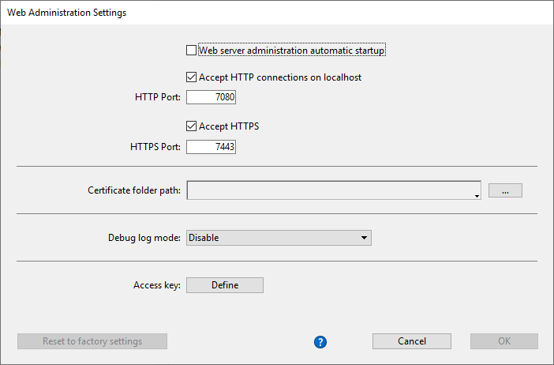

4D et 4D Server ont un composant intégré appelé `WebAdmin` qui permet de lancer un serveur web qui fournit un accès sécurisé à des outils de gestion de données, tel que l'[Explorateur de données Web](dataExplorer.md). Ce serveur est accessible en local ou à distance, depuis un navigateur ou une application web, et permet d'accéder à l'application 4D associée.

Le WebAdmin gère l'authentification des utilisateurs via des privilèges "WebAdmin", leur permettant d'ouvrir des sessions en tant qu'administrateurs et d'accéder à des interfaces dédiées.

Cette fonctionnalité est disponible pour les applications 4D avec ou sans interfaces.

## Démarrer le serveur web WebAdmin

Par défaut, le serveur web `WebAdmin` ne démarre pas automatiquement. Il faut configurer son lancement automatique au démarrage, ou (dans les versions avec une interface) le lancer manuellement via un menu.

### Lancement au démarrage

Vous pouvez configurer le server web `WebAdmin` pour qu'il se lance au démarrage de 4D ou 4D Server (avant l'ouverture d'un projet).

- Si vous utilisez une application 4D avec une interface, sélectionnez **Fichier > Administration Web > Propriétés...**.


Cochez l'option **Lancer le serveur WebAdmin au démarrage** dans la boîte de dialogue des paramètres :


- Que vous utilisiez une application 4D avec ou sans interface, vous pouvez activer le lancement automatique au démarrage en utilisant l'argument suivant dans *L'interface de ligne de commande* :

```
open ~/Desktop/4D.app --webadmin-auto-start true
```

> Si le port TCP utilisé par le serveur web `WebAdmin` ([HTTPS](#https-port) ou [HTTP](#http-port) selon les paramètres) n'est pas disponible au démarrage, 4D essaiera avec les 20 ports suivants et utilisera le premier disponible. Si aucun port n'est disponible, le serveur web ne se lance pas et un message d'erreur s'affiche. Pour les applications sans interface, il apparaît dans la console.

### Démarrage et arrêt

Si vous utilisez une application 4D avec une interface, vous pouvez démarrer ou arrêter le serveur web `WebAdmin` de votre projet à tout moment :

Sélectionnez **Fichier> Administration web > Démarrer le serveur**.


Le menu affiche **Arrêter le Server** une fois le serveur lancé. Sélectionnez **Arrêter le Server** pour arrêter le serveur web `WebAdmin`.

## Propriétés WebAdmin

La configuration du composant `WebAdmin` est obligatoire, en particulier pour définir la [**clé d'accès**](#access-key). Par défaut, quand la clé d'accès n'est pas configurée, les connexions via url ne sont pas autorisées.

Vous pouvez configurer le composant `WebAdmin` dans la [fenêtre de configuration](#settings-dialog-box)(voir ci-dessous).

> Si vous utilisez une application 4D sans interface, vous pouvez utiliser les [arguments de l'*Interface de ligne de commande*](#webadmin-headless-configuration) pour définir les paramètres de base. La définition de paramètres avancés se fait via le fichier de paramètres.

### Boîte de dialogue des Propriétés

Pour ouvrir la fenêtre de configuration des paramètres d'administration web, sélectionnez **Fichier > Administration web > Propriétés...**.


La fenêtre suivante s'affiche :



#### Lancer le serveur WebAdmin au démarrage

Cochez cette option pour lancer le serveur web `WebAdmin` automatiquement au démarrage de 4D ou 4D Server (voir [ci-dessus](#launching-at-startup)). Cette option n'est pas cochée par défaut.

#### Connexions HTTP sur localhost acceptées

Quand cette option est cochée, il est possible de se connecter au serveur `WebAdmin` via HTTP sur la même machine que l'application 4D. Cette option est activée par défaut.

**Notes :**

- Les connections HTTP autres que sur localhost ne sont jamais acceptées.
- Même si cette option est activée, quand [HTTPS Accepté](#accept-https) est activé et que la configuration TLS est valide, les connections sur localhost se font via HTTPS.

#### Port HTTP

Numéro de port utilisé pour les connexions au serveur web `WebAdmin` via HTTP quand **Connexions HTTP sur localhost acceptées** est activé. La valeur par défaut est 7080.

#### HTTPS Accepté

Lorsque cette option est activé, vous pourrez vous connecter au serveur web `WebAdmin` via HTTPS. Cette option est activée par défaut.

#### Port HTTPS

Numéro de port utilisé pour les connexions au serveur web `WebAdmin` via HTTPS quand **HTTPS accepté** est activé. La valeur par défaut est 7443.

#### Chemin du dossier de certificat

Chemin du dossier qui contient les fichiers de certificat TLS. Par défaut, le chemin du dossier de certificat est vide, et 4D ou 4D server utilise les fichiers de certificat contenus dans l'application 4D (les certificats personnalisés doivent être stockés au niveau du dossier de projet).

#### Mode du debug log

Statut ou format du fichier de logs des requêtes HTTP (HTTPDebugLog_*nn*.txt, stocké dans le dossier "Logs" de l'application. --*nn* représente le numéro du fichier). Les options suivantes sont disponibles :

- **Désactivé** (valeur par défaut)
- **Avec tous les body** - activé avec toutes les parts des body des requêtes et réponses
- **Sans les body** - activé sans les parts des body (la taille du body est indiquée)
- **Avec les body des requêtes** - activé avec les parts des body uniquement dans les requêtes
- **Avec la réponse corps** - activé avec les parts des body uniquement dans les réponses

#### Clé d'accès

La configuration d'une clé d'accès est obligatoire pour débloquer l'accès au serveur web `webAdmin` via des URL (l'accès via les menus ne requiert pas de clé d'accès). Lorsque aucune clé d'accès n'est définie, il n'est pas possible pour les clients web d'accéder aux interfaces d'administration web telles que l'[Explorateur de données](dataExplorer.md) via des URL. En cas de requête de connexion, une page d'erreur est retournée:


Une clé d'accès est similaire à un mot de passe, mais sans login associé.

- Pour définir une nouvelle clé d'accès, cliquez sur le bouton **Définir**, entrez une chaîne de caractères et cliquez sur **OK**. Une fois fait, le label du bouton devient **Modifier**.
- Pour modifier la clé d'accès, cliquez sur **Modifier**, entrez la nouvelle clé d'accès et cliquez sur **OK**.
- Pour supprimer la clé d'accès, cliquez sur **Modifier**, laissez le champ d'entrée vide et cliquez sur **OK**.

#### Activer l'accès à Qodly Studio

:::note

Cette option n'apparaît que si la licence Qodly Studio est activée.

:::

Cette option permet l'accès utilisateur à [Qodly Studio](../WebServer/qodly-studio.md) au niveau de l'application 4D. Notez que vous devez également [activer l'accès au niveau de chaque projet](../settings/web.md#enable-access-to-qodly-studio).

## Configuration de WebAdmin sans interface

Pour gérer le contenu du fichier, vous pouvez utiliser la [fenêtre de paramètres WebAdmin](#settings-dialog-box) de l'application 4D avec une interface, et la lancer sans interface ensuite. Par défaut, il existe un fichier `WebAdmin.4DSettings` par application 4D et 4D Server.

Dans le cas d'une application 4D ou 4D Server sans interface, vous pouvez configurer et utiliser le fichier `WebAdmin.4DSettings` par défaut, ou désigner un fichier `.4DSettings` personnalisé.

Pour gérer le contenu du fichier, vous pouvez utiliser la [fenêtre de paramètres WebAdmin](#settings-dialog-box) de l'application 4D avec une interface, et la lancer sans interface ensuite. Par défaut, il existe un fichier `WebAdmin.4DSettings` par application 4D et 4D Server.

Vous pouvez aussi définir un fichier `.4DSettings`. (format XML) et l'utiliser à la place du fichier par défaut. Plusieurs arguments dédiés sont disponibles dans [l'interface de ligne de commande](cli.md) pour prendre en charge cette fonctionnalité.

> Cette clé d'accès n'est pas stockée de façon transparente dans le fichier `.4DSettings`.

Voici un exemple :

```
"%HOMEPATH%\Desktop\4D Server.exe" MyApp.4DLink --webadmin-access-key 
	"my Fabulous AccessKey" --webadmin-auto-start true   
	--webadmin-store-settings

```

## Authentification et Session

- Lorsqu'on accède à une page de gestion web en entrant une URL et sans identification préalable, une authentification est nécessaire. L'utilisateur doit entrer la [clé d'accès](#access-key) dans une fenêtre d'authentification. Si aucune clé d'accès n'a été définie dans les propriétés `WebAdmin`, aucun accès via URL n'est possible.

- Qand une page d'administration web est ouverte directement depuis un menu 4D ou 4D Server, tel que **Enregistrements> Data Explorer**ou**Fenêtre> Explorateur de données**(4D Server), l'accès est autorisé sans authentification.

Une fois l'accès autorisé, une [session web](WebServer/sessions.md) est créée avec les privilèges "WebAdmin" sur l'application 4D. Tant que la session courante a le privilège "WebAdmin", le composant `WebAdmin` sert les pages demandées dans les requêtes.
