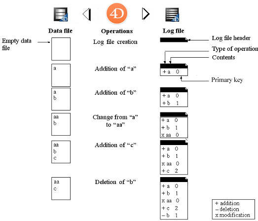

Une application exploitée de manière continue enregistre en permanence des modifications, des ajouts ou des suppressions d’enregistrements. Réaliser des sauvegardes régulières des données est important mais ne permet pas, en cas d’incident, de récupérer les données saisies depuis la dernière sauvegarde. Pour répondre à ce besoin, 4D dispose d’un outil particulier : le fichier d’historique. Ce fichier permet d’assurer la sécurité permanente des données.

En outre, 4D travaille en permanence avec un cache de données situé en mémoire. Toute modification apportée aux données de l'application est stockée temporairement dans le cache avant d'être écrite sur le disque dur. Ce principe permet d’accélérer le fonctionnement des applications ; en effet, les accès mémoire sont bien plus rapides que les accès disque. Si un incident survient sur l'application avant que les données stockées dans le cache aient pu être écrites sur le disque, vous devrez intégrer le fichier d’historique courant afin de récupérer entièrement l'application.

Enfin, 4D dispose d'une fonction d'analyse du contenu du fichier d'historique, permettant également de faire remonter en arrière les opérations exécutées sur les données de l'application. Ces fonctions sont accessibles via le CSM : reportez-vous aux sections [Page Analyse d'activités](MSC/analysis.md) et [Page Retour arrière](MSC/rollback.md).

## Fonctionnement du fichier d'historique

L’historique généré par 4D se présente sous la forme d’un fichier dans lequel toutes les opérations effectuées sur les données des tables journalisées de l'application viennent s’inscrire séquentiellement. Par défaut, toutes les tables sont journalisées, c'est-à-dire incluses dans l'historique, mais vous pouvez en désélectionner certaines via la propriété **Inclure dans le fichier d'historique**.

Ainsi, chaque opération effectuée par un utilisateur provoque deux actions simultanées : une première sur le fichier de données (l’instruction est exécutée normalement) et une seconde dans le fichier d’historique (la description de l’opération y est enregistrée). Le fichier d’historique se construit de manière indépendante, sans gêner ni ralentir le travail de l’utilisateur. Le fichier d’historique se construit de manière indépendante, sans gêner ni ralentir le travail de l’utilisateur. Le fichier d’historique enregistre les types d’opérations suivants :

- Ouvertures et fermetures du fichier de données,
- Ouvertures et fermetures de process (contextes),
- Ajouts d’enregistrements et de BLOBs,
- Modifications d’enregistrements,
- Suppressions d’enregistrements,
- Créations et fermetures de transactions.

Pour plus d’informations sur ces actions, reportez-vous à la section [Page Analyse d'activités](MSC/analysis.md) du CSM.

Le fichier d’historique est géré par 4D. Il prend en compte indifféremment toutes les opérations affectant le fichier de données, que ce soient des manipulations effectuées par un utilisateur, des méthodes 4D, le moteur SQL, des plug-ins, un navigaeur Web ou une application mobile.

Ce schéma résume le principe général de fonctionnement du fichier d’historique :

Le fichier d’historique courant est automatiquement sauvegardé avec le fichier de données courant. Ce mécanisme procure deux avantages principaux :

- Eviter la saturation du disque accueillant le fichier d’historique. En effet, sans sauvegarde, l’historique grossirait indéfiniment au fur et à mesure de l’exploitation de la base et finirait par saturer votre disque. A chaque sauvegarde du fichier de données, 4D ou 4D Server ferme le fichier d’historique courant et débute immédiatement un nouveau fichier vide, évitant ainsi le risque de saturation. L’ancien fichier d’historique est alors archivé puis éventuellement détruit, conformément au mécanisme des jeux de sauvegarde.
- Conserver les fichiers d’historique correspondant aux sauvegardes, afin de pouvoir analyser ou réparer a posteriori une application. En effet, l’intégration du fichier d’historique ne peut se faire que dans l'application qui lui correspond. Il est donc important, pour pouvoir intégrer correctement un fichier d’historique dans une sauvegarde, de disposer de sauvegardes et d’historiques archivés simultanément.

## Créer le fichier d’historique

Par défaut, toute application créée avec 4D utilise un fichier d’historique (option définie dans la Page **Général** des Préférences de 4D). Le fichier d’historique est nommé par défaut _data.journal_ et est placé dans le dossier Data.

Vous pouvez à tout moment savoir si votre application utilise un fichier d’historique : l’option **Utiliser le fichier d’historique** est cochée dans la Page **Sauvegarde/Configuration** des Propriétés. Si vous avez désélectionné cette option ou si vous utilisez une application sans fichier d’historique et souhaitez mettre en place une stratégie de sauvegarde avec fichier d’historique, il vous appartient d’en créer un.

Pour créer un fichier d’historique :

1. Dans la page **Backup/Configuration** des Paramètres de structure, cochez l'option **Use Log** .
   Le programme affiche une boîte de dialogue standard d'ouverture/création de fichier. Par défaut, le fichier journal est nommé _data.journal_.

2. Conservez le nom par défaut ou renommez-le, puis sélectionnez l'emplacement du fichier.
   Si vous disposez d'au moins deux disques durs, il est recommandé de placer le fichier journal sur un disque autre que celui contenant le projet d'application. En cas de perte du disque dur de l'application, vous pouvez toujours rappeler votre fichier journal.

3. Cliquez sur **Enregistrer**.
   Le disque et le nom du fichier journal ouvert sont maintenant affichés dans la zone **Use Log** de la boîte de dialogue. Vous pouvez cliquer sur cette zone pour afficher un menu contextuel contenant le chemin d'accès au journal sur le disque.

4. Validez la boîte de dialogue des Propriétés.

Pour que vous puissiez directement créer un fichier d’historique, les données doivent se trouver dans une des situations suivantes :

- Le fichier de données est vierge,
- Vous venez d’effectuer une sauvegarde et aucune modification sur les données n’a encore été effectuée.

Si vous cliquez sur <strong x-id="1">OK</strong>, la sauvegarde démarre immédiatement puis l’historique est activé. Si vous cliquez sur **OK**, la sauvegarde démarre immédiatement puis l’historique est activé. Si vous cliquez sur **Annuler**, la requête est enregistrée mais la création du fichier d’historique est différée et sera créée uniquement après la prochaine sauvegarde de l'application. Cette précaution est indispensable car il vous faudra, pour restituer une application après un éventuel incident, disposer d’une copie de l'application dans laquelle pourront s’intégrer les opérations enregistrées dans le fichier d’historique.

Sans autre manipulation de votre part, toutes les opérations effectuées sur les données s’inscriront dans ce fichier, et il sera utilisé également lors des ouvertures ultérieures de l'application.

Vous devrez créer un autre fichier d’historique si vous créez un nouveau fichier de données. Vous devrez désigner ou créer un autre fichier d’historique si vous ouvrez un autre fichier de données non associé à un fichier d’historique (ou si le fichier d’historique est manquant).

## Paramètres du fichier journal

Les [paramètres du fichier journal](settings.md#log-file-management) sont basés sur deux informations : une valeur booléenne et un chemin d'accès.

1. **Valeur booléenne** : indique si la fonction "Use Log File" est activée ou désactivée dans l'application. Par défaut, la valeur booléenne est stockée dans _catalog.4DCatalog_. Toutefois, lorsque les [paramètres utilisateur](../Desktop/user-settings.md) sont activés, la configuration du fichier _catalog.4DCatalog_ est remplacée, et la valeur booléenne peut alors être définie soit dans le fichier _Backup.4DSettings_ [à côté du fichier de données](../Project/architecture.md#settings-user-data) ou dans le fichier _Backup.4DSettings_ [dans le dossier du projet](../Project/architecture.md#settings-user) (voir également la documentation de la clé xml backup `JournalFileEnabled` sur [doc.4d.com](https://doc.4d.com)).

2. **Chemin**: une chaîne pointant vers l'emplacement du fichier journal. Le chemin d'accès du fichier journal est toujours enregistré dans le fichier de données lié.

## Fermer l’historique

Si vous souhaitez interrompre l’enregistrement du fichier d’historique courant, désélectionnez l’option **Utiliser le fichier d’historique** dans la Page **Sauvegarde/Configuration** des Propriétés.

4D affiche alors un message d’alerte afin d’attirer votre attention sur le fait que cette action vous prive de la sécurité apportée par le fichier d’historique :

Si vous cliquez sur le bouton **Fermer**, le fichier d’historique courant est immédiatement refermé (il n’est pas nécessaire que la boîte de dialogue des Propriétés soit ensuite validée).

Si vous souhaitez fermer votre fichier d’historique courant parce qu’il devient trop important, il est préférable d’effectuer une sauvegarde du fichier de données, ce qui entraînera la sauvegarde de l’historique.

> **4D Server** : La commande `New log file` permet de refermer automatiquement l’historique courant et d’en démarrer un nouveau.
> Si le fichier d'historique devient inaccessible au cours de la session de travail, l'erreur 1274 est générée et 4D Server ne permet plus aux utilisateurs d'écrire ou de modifier des données. Lorsque le fichier d'historique est de nouveau accessible, il est nécessaire d'effectuer une sauvegarde.
