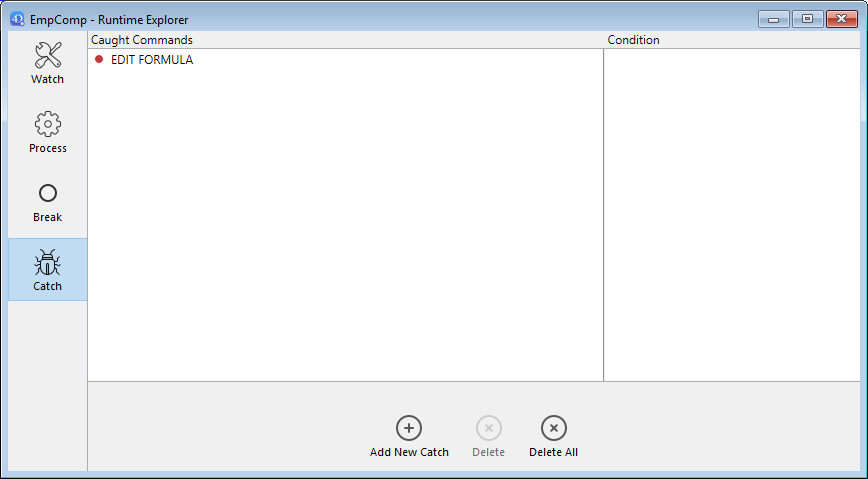

## Vue d’ensemble

Les points d'arrêt et les points d'arrêts sur commande sont des techniques de débogage très efficaces. Elles ont toutes deux le même effet : elles interrompent l'exécution du code (et affichent la fenêtre du débogueur si elle n'est pas déjà affichée) à une étape souhaitée.

Définissez des points d'arrêt sur n'importe quelle ligne de code où vous souhaitez interrompre l'exécution. Vous pouvez associer une condition au point d'arrêt.

Les points d'arrêt sur commande vous permettent de commencer à tracer l'exécution d'un process dès qu'une commande est appelée par ce process.

## Points d'arrêt

Pour créer un point d'arrêt, cliquez dans la marge gauche de la fenêtre d'évaluation du code du débogueur ou dans l'éditeur de code.

In the following example, a break point (the red bullet) has been set, in the debugger, on the line `If (Value type(request.reponse.headers...`:

Dans l'exemple ci-dessus, en cliquant sur le bouton [**No Trace**](./debugger.md/#no-trace), l'exécution normale reprend jusqu'à la ligne marquée avec le point d'arrêt. Cette ligne n'est pas exécutée - vous retournez en mode trace. Le fait de définir un point d'arrêt au-delà du compteur du programme et de cliquer sur le bouton **No Trace** vous permet de sauter des parties de la méthode tracée.

Pour supprimer un point d'arrêt, cliquez sur la puce correspondante.

### Propriétés des points d'arrêt

Vous pouvez modifier le comportement d'un point d'arrêt à l'aide de la fenêtre Propriétés du point d'arrêt :

Cette fenêtre est disponible depuis l'éditeur de code ou la [fenêtre d'évaluation du code](debugger.md#source-code-pane). Vous pouvez :

- faites un clic droit sur une ligne et sélectionnez **Modifier le point d'arrêt** dans le menu contextuel, ou
- .`Alt+clic` (Windows) ou `Option+clic` (macOS) dans la marge de gauche.

Si un point d'arrêt existe déjà, la fenêtre s'affiche pour ce point d'arrêt. Sinon, un point d'arrêt est créé et la fenêtre s'affiche pour le point d'arrêt nouvellement créé.

Voici une description des propriétés :

- **Emplacement** : indique le nom de la méthode et le numéro de ligne associés au point d'arrêt.
- **Arrêt lorsque l’expression suivante est vraie** : Vous pouvez créer des **points d'arrêt conditionnels** en saisissant une formule 4D qui retourne `Vrai` ou `Faux`. Par exemple, insérez `Records in selection(\[aTable])=0` pour vous assurer que l'arrêt se produit uniquement si aucun enregistrement n'est sélectionné pour la table \[aTable]. Les conditions d'arrêt sont disponibles dans la colonne **Condition** de la [liste des arrêts](#break-list).
- **Nombre d’occurrences exécutées avant arrêt** : Vous pouvez associer un point d'arrêt à une ligne située dans une boucle (While, Repeat ou For) ou située dans une sous-routine ou une fonction appelée depuis une boucle.
- **Point d’arrêt désactivé** : Si vous n'avez actuellement pas besoin d'un point d'arrêt, mais que vous pourriez en avoir besoin plus tard, vous pouvez le désactiver temporairement. Un point d'arrêt désactivé apparaît sous la forme d'un tiret (-) au lieu d'une puce (•)|

### Points d'arrêt dans le débogueur distant

La liste des points d'arrêt est stockée localement. En mode de débogage à distance, si le débogueur connecté est un 4D distant, la liste des points d'arrêt distants remplace temporairement la liste des points d'arrêt du serveur pendant la session de débogage.

La liste de points d'arrêt du serveur est automatiquement restaurée s'il redevient le débogueur associé.

### Liste des points d'arrêt

La liste des points d'arrêt est une page de l'Explorateur d'exécution qui vous permet de gérer les points d'arrêt créés dans la fenêtre du débogueur ou dans l'éditeur de code. Pour plus d'informations sur l'Explorateur d'exécution, voir sa page dédiée dans [le manuel de Développement](https://doc.4d.com/4Dv19/4D/19/Runtime-Explorer.200-5416614.en.html).

Pour ouvrir la page de la liste des points d'arrêt :

1. Dans le **menu Exécuter**, cliquez sur **Explorateur d'exécution...**

2. Cliquez sur l'onglet **Break** pour afficher la liste des points d'arrêts :

À l'aide de cette fenêtre, vous pouvez :

- Définir des conditions pour les points d'arrêt dans la colonne **Conditions**
- Activer ou désactiver les points d'arrêt en cliquant sur les puces dans la marge. Les points d'arrêt désactivés affichent des puces transparentes
- Supprimer des points d'arrêt en appuyant sur la touche `Delete` ou `Backspace`, ou en cliquant sur le bouton **Delete** sous la liste.
- Ouvrez les méthodes où se trouvent les points d'arrêt en doube-cliquant sur n'importe quelle ligne de la liste

Vous ne pouvez pas ajouter de nouveaux points d'arrêt à partir de cette fenêtre. Les points d'arrêt ne peuvent être créés qu'à partir de la fenêtre du débogueur ou de l'éditeur de code.

## Points d'arrêts sur commandes

L'onglet **Catch** de l'Explorateur d'exécution vous permet d'ajouter des points d'arrêt supplémentaires à votre code via des appels aux commandes 4D. Contrairement à un point d'arrêt, qui est situé dans une méthode de projet particulière (et qui déclenche donc une exception de traçage uniquement lorsqu'il est atteint), la portée de la capture d'une commande inclut tous les process qui exécutent le code 4D et appellent cette commande.

Les points d'arrêt sur une commande sont un moyen pratique de tracer de grandes portions de code sans avoir à définir des points d'arrêt à des endroits arbitraires. Par exemple, si un enregistrement qui ne devrait pas être supprimé l'est malgré tout après avoir exécuté un ou plusieurs process, vous pouvez essayer de réduire le champ de votre investigation via des points d'arrêt sur des commandes telles que \`DELETE RE Chaque fois que ces commandes sont appelées, vous pouvez vérifier si l'enregistrement en question a été supprimé, et ainsi isoler la partie défectueuse du code.

N'hésitez pas à combiner les points d'arrêt et les points d'arrêt sur commandes.

Pour ouvrir la page des points d'arrêt sur commandes :

1. Cliquez sur **Exécuter** > **Explorateur d'exécution...** pour ouvrir l'explorateur d'exécution.

2. Cliquez sur **Catch** pour afficher la liste des points d'arrêt sur commandes :

Cette page répertorie les points d'arrêt sur commande pendant l'exécution. Elle est composée de deux colonnes :

- La colonne de gauche affiche l'état d'activation/désactivation du point d'arrêt sur commande, suivi du nom de la commande
- La colonne de droite affiche la condition associée au point d'arrêt sur commande, le cas échéant

Pour ajouter un point d'arrêt sur commande :

1. Cliquez sur le bouton **Add New Catch** (en forme de +) situé en dessous de la liste. Une nouvelle entrée est ajoutée à la liste avec la commande `ALERT` par défaut
2. Cliquez sur l'étiquette **ALERT**, tapez le nom de la commande que sur laquelle vous souhaitez mettre un point d'arrêt, puis appuyez sur **Entrée**.

Pour activer ou désactiver un point d'arrêt sur commande, cliquez sur la puce (•) devant l'étiquette de la commande.
La puce est transparente lorsque la commande est désactivée.

> La désactivation d'un point d'arrêt sur commande a pratiquement le même effet que sa suppression. Pendant l'exécution, le débogueur ne passe presque pas de temps sur l'entrée. L'avantage de désactiver une entrée est de ne pas avoir à la recréer lorsque vous en avez à nouveau besoin.

Pour supprimer un point d'arrêt sur commande :

1. Sélectionnez une commande dans la liste.
2. Appuyez sur la touche **Backspace** ou **Delete** sur votre clavier ou cliquez sur le bouton **Delete** sous la liste (**Delete All** supprime toutes les commandes de la liste).

### Définir une condition pour un point d'arrêt sur commande

1. Cliquez sur l'entrée dans la colonne de droite
2. Saisissez une formule 4D (expression, appel de commande ou méthode de projet) qui retourne une valeur booléenne.

> Pour supprimer une condition, supprimez sa formule.

L'ajout de conditions vous permet d'arrêter l'exécution lorsque la commande est invoquée uniquement si la condition est remplie. Par exemple, si vous associez la condition `Records in selection(\[Emp]>10)` au point d'arrêt de la commande `DELETE SELECTION`, le code ne sera pas arrêté pendant l'exécution de la commande `DELETE SELECTION` si la sélection courante de la table \[Emp] ne contient que 9 enregistrements (ou moins).

L'ajout de conditions aux points d'arrêt sur commandes ralentit l'exécution, car la condition doit être évaluée chaque fois qu'une exception est rencontrée. En revanche, l'ajout de conditions accélère le processus de débogage, car 4D ignore automatiquement les occurrences qui ne correspondent pas aux conditions.
