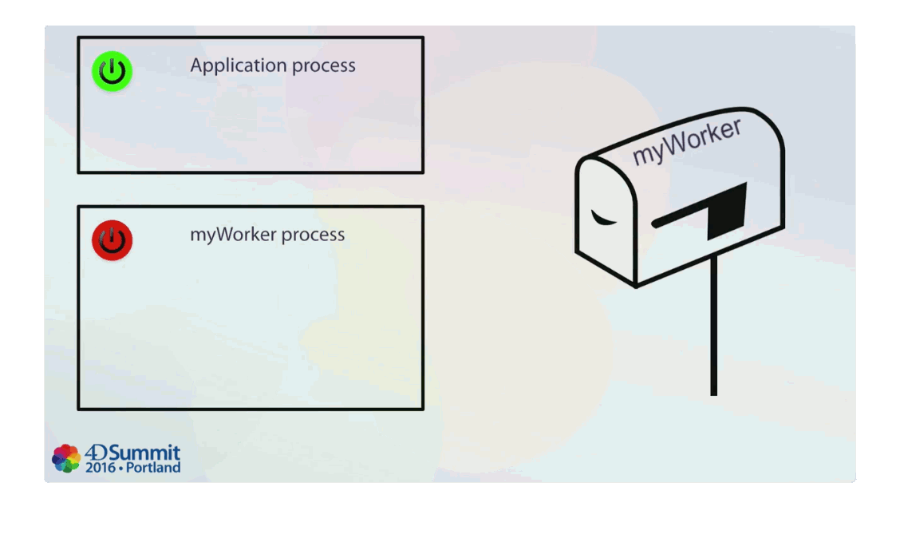

Le multitâche dans 4D est la capacité d'exécuter plusieurs opérations simultanément. Ces opérations sont appelées **process**. Les process multiples sont comme plusieurs utilisateurs sur le même ordinateur, chacun travaillant à sa propre tâche. Cela signifie essentiellement que chaque méthode peut être exécutée en tant que tâche distincte de la base de données.

Si vous écrivez du code thread-safe, vous pouvez créer des [**process préemptifs**](preemptive.md) qui pourront tirer parti des ordinateurs multi-cœurs dans vos applications compilées, pour une exécution plus rapide.

:::note

L'application 4D crée des process pour ses propres besoins, par exemple le process Main pour gérer l'affichage des fenêtres de l'interface utilisateur, le process Design pour gérer les fenêtres et les éditeurs de l'environnement de Développement (notez que tous deux sont des [process workers](#process-workers)), le process Web Server, le process Cache Manager, le process Indexing ou le process On Event Manager.

:::

## Créer et supprimer des process

Il existe plusieurs façons de créer un nouveau process :

- Exécuter une méthode en mode Développement en sélectionnant la case à cocher **Nouveau process** dans la boîte de dialogue d'exécution de méthode. La méthode choisie dans ce dialogue est la méthode process.
- Utiliser la commande [`New process`](https://doc.4d.com/4dv20/help/command/fe/page317.html). La méthode passée en tant que paramètre à la commande `New process` est la méthode process.
- Utiliser la commande [`Execute on server`](https://doc.4d.com/4dv20/help/command/en/page373.html) afin de créer une procédure stockée sur le serveur. La méthode passée en paramètre à la commande est la méthode process.
- Utiliser la commande [`CALL WORKER`](https://doc.4d.com/4dv20/help/command/fe/page1389.html). Si le process du worker n'existe pas déjà, il est créé.

:::note

Dans les applications Desktop, des process peuvent être exécutés lors de la sélection de commandes de menu. Dans l'[Éditeur de barre de menus](../Menus/creating.md), sélectionnez la commande de menu et cliquez sur la case à cocher **Démarrer un nouveau process**. La méthode associée à la commande de menu est la méthode de process.

:::

Un process peut être effacé dans les conditions suivantes (les deux premières sont automatiques) :

- Lorsque l'exécution de la méthode du process est terminée
- Lorsque l'utilisateur quitte l'application
- Si vous arrêtez le process de manière procédurale ou si vous utilisez le bouton **Abort** dans le débogueur ou dans l'Explorateur d'exécution
- Si vous appelez la commande [`KILL WORKER`](https://doc.4d.com/4dv20/help/command/en/page1390.html) (pour supprimer un process worker uniquement).

Un process peut créer un autre process. Les process ne sont pas organisés de manière hiérarchique - tous les process sont égaux, quel que soit le process à partir duquel ils ont été créés. Une fois que le process "parent" a créé un process "enfant", le process enfant se poursuit, que le process parent soit toujours en cours d'exécution ou non.

## Éléments d'un process

Chaque process contient des éléments spécifiques qu'il peut traiter indépendamment des autres process.

### Éléments de langage

- Variables : Chaque process possède ses propres [variables process] (../Concepts/variables#variables-process). Les variables process ne sont reconnues que dans le cadre de leur process natif.
- Ensembles process : Chaque process a ses propres ensembles process. `LockedSet` est un ensemble process. Les ensembles process sont effacés dès que la méthode process est terminée.
- [Méthode de gestion des erreurs](../Concepts/error-handling#installing-an-error-handling-method) : Chaque process peut avoir sa propre méthode de gestion des erreurs.
- [Fenêtre du débogueur](../Debugging/debugger#calling-the-debugger) : Chaque process peut avoir sa propre fenêtre de débogage.

### Éléments d'interface

Les éléments d'interface sont utilisés dans les [Applications Desktop] (../category/desktop-applications). Il s'agit des éléments suivants :

- [Barre de menus](../Menus/creating.md) : Chaque process peut avoir sa propre barre de menus courante. La barre de menus du process au premier plan est la barre de menus courante de l'application.
- Une ou plusieurs fenêtres : Chaque processus peut avoir plusieurs fenêtres ouvertes simultanément. A l'inverse, des process peuvent n'avoir pas de fenêtre du tout.
- Une fenêtre active (de premier plan) : Bien qu'un process puisse disposer de plusieurs fenêtres ouvertes simultanément, chaque process n'a qu'une fenêtre active. Pour avoir plusieurs fenêtres actives à la fois, vous devez démarrer plusieurs process.
- Formulaires d'entrée et de sortie : Les formulaires d'entrée et de sortie par défaut peuvent être définis de manière procédurale pour chaque table dans chaque process.

:::info

- Par défaut, les process ne comportent pas de barre de menus, ce qui signifie que les raccourcis standard du menu **Edition** (notamment couper / copier / coller) ne sont pas disponibles dans les fenêtres des process. Lorsque vous appelez les dialogues ou les éditeurs de 4D (éditeur de formules, éditeur de recherches...) depuis un process, assurez-vous que l'équivalent d'un menu **Edition** est installé dans le process si vous souhaitez que l'utilisateur bénéficie des raccourcis clavier de type copier/coller.
- Les process exécutés sur le serveur (procédures stockées) et les [process préemptifs](preemptive.md) ne doivent pas contenir d'éléments d'interface.

:::

:::note

Chaque process a également une sélection courante et un enregistrement courant par table. Pour plus d'informations sur ces concepts, veuillez vous référer à [doc.4d.com](https://doc.4d.com/4Dv20/4D/20.1/Displaying-and-selecting-records.300-6602144.fr.html).

:::

## Process globaux et locaux

Les process peuvent être globaux ou locaux dans leur portée. Par défaut, tous les process sont globaux.

S process globaux peuvent effectuer n'importe quelle opération, y compris accéder aux données et les manipuler. Dans la plupart des cas, vous utiliserez des process globaux. Les process locaux ne doivent être utilisés que pour des opérations qui n'accèdent pas aux données. Par exemple, vous pouvez utiliser un process local pour contrôler les éléments d'interface comme les palettes flottantes ou exécuter une méthode de gestion d'événements.

Vous spécifiez qu'un process est local via son nom. Le nom d'un process local doit commencer par le symbole dollar ($).

:::warning

Si vous tentez d'accéder aux données à partir d'un process local, vous accédez aux données par l'intermédiaire du Process principal (process #1), et prenez donc le risque d'entrer en conflit avec les opérations effectuées dans ce process.

:::

### 4D Server

L'utilisation de process locaux côté distant pour les opérations qui ne nécessitent pas d'accès aux données permet de réserver davantage de temps de traitement pour les tâches à forte intensité sur le serveur. Lorsque vous créez un process local au client (à l'aide de `New process` par exemple), il n'existe que sur le 4D distant.

Lorsque vous créez un process global sur le client, un process "jumeau" est créé sur le serveur, consommant donc les ressources du serveur, pour gérer l'accès aux données et le contexte de base de données. Toutefois, pour des raisons d'optimisation, le process jumeau n'est créé qu'en cas de nécessité, c'est-à-dire la première fois que le process global doit accéder à des données.

## Process Workers

L'utilisation d'un process Worker est un moyen simple et puissant d'échanger des informations entre les process. Cette fonctionnalité est basée sur un système de messagerie asynchrone qui permet d'appeler des process et des formulaires et de leur demander d'exécuter des méthodes avec des paramètres dans leur propre contexte.

Un process worker peut être "engagé" par n'importe quel process (en utilisant la commande [`CALL WORKER`](https://doc.4d.com/4dv20/help/command/en/page1389.html)) pour exécuter des méthodes projet avec des paramètres dans leur propre contexte, permettant ainsi l'accès à des informations partagées.

:::info

Dans les applications Desktop, une méthode projet peut également être exécutée avec des paramètres dans le contexte de n'importe quel formulaire en utilisant la commande [`CALL FORM`](https://doc.4d.com/4dv20/help/command/fr/page1391.html).

:::

Cette fonctionnalité répond aux besoins suivants en matière de communication interprocess de 4D :

- Étant donné qu'ils sont pris en charge par les process coopératifs et préemptifs, ils constituent la solution idéale pour la communication interprocessus dans les [process préemptifs] (preemptive.md) ([les variables interprocess sont dépréciées] (https://doc.4d.com/4Dv20/4D/20/Deprecated-or-Removed-Features.100-6259787.en.html#5868705) et ne sont pas autorisées dans les processus préemptifs).
- Ils constituent une alternative simple aux sémaphores, qui peuvent être lourds à mettre en place et complexes à utiliser

:::note

Bien qu'ils aient été conçus principalement pour la communication interprocess dans le contexte des process préemptifs, `CALL WORKER` et `CALL FORM` peuvent être utilisés avec des process coopératifs.

:::

### Utilisation des workers

Un worker est utilisé pour demander à un process d'exécuter des méthodes projet. Un worker est composé de :

- un nom unique (*attention : le nom est sensible à la casse*), également utilisé pour nommer le process qui lui est associé
- un process associé, qui peut exister ou non à un moment donné
- une boîte aux lettres
- une méthode de démarrage (facultatif)

Vous demandez à un worker d'exécuter une méthode projet en appelant la commande `CALL WORKER`. Le worker et sa boîte aux lettres sont créés lors de la première utilisation ; le process qui lui est associé est également lancé automatiquement lors de la première utilisation. Si le process worker meurt par la suite, la boîte aux lettres reste ouverte et tout nouveau message dans la boîte lancera un nouveau process worker.

L'animation suivante illustre cette séquence :

Contrairement à un process créé avec la commande `New process`, un process worker **reste en vie après la fin de l'exécution de la méthode process**. Cela signifie que toutes les exécutions de méthodes pour le même worker seront exécutées dans le même process, qui conserve toutes les informations relatives à l'état du process (variables process, enregistrement courant et sélection courante, etc.). Par conséquent, les méthodes exécutées successivement accèdent aux mêmes informations et les partagent, ce qui permet la communication entre les process. La boîte aux lettres du worker traite les appels successifs de manière asynchrone.

`CALL WORKER` encapsule à la fois le nom de la méthode et les arguments de la commande dans un message qui est posté dans la boîte aux lettres du worker. Le process worker est alors lancé, s'il n'existe pas déjà, et il lui est demandé d'exécuter le message. Cela signifie que `CALL WORKER` retournera généralement avant que la méthode ne soit réellement exécutée (le traitement est asynchrone). C'est pourquoi `CALL WORKER` ne renvoie aucune valeur. Si vous avez besoin qu'un worker renvoie des informations au process qui l'a appelé (callback), vous devez utiliser `CALL WORKER` à nouveau pour transmettre les informations nécessaires à l'appelant. Bien entendu, dans ce cas, l'appelant lui-même doit être un worker.

Il n'est pas possible d'utiliser `CALL WORKER` pour exécuter une méthode dans un process créé par la commande `New process`. Seuls les process worker ont une boîte aux lettres et peuvent donc être appelés par `CALL WORKER`. Notez qu'un process créé par `New process` peut appeler un worker, mais ne peut pas être rappelé.

Les process Worker peuvent être créés sur 4D Server par le biais de procédures stockées : par exemple, vous pouvez utiliser la commande `Execute on server` pour exécuter une méthode qui appelle la commande `CALL WORKER`.

Un process worker est fermé par un appel à la commande [`KILL WORKER`](https://doc.4d.com/4dv20/help/command/en/page1390.html), qui vide la boîte aux lettres du worker et demande au process associé d'arrêter de traiter les messages et de terminer son exécution dès que la tâche en cours est terminée.

La méthode de démarrage d'un worker est la méthode utilisée pour créer le worker (à la première utilisation). Si `CALL WORKER` est appelé avec un paramètre *méthode* vide, la méthode de démarrage est automatiquement réutilisée comme méthode à exécuter.

Le process principal créé par 4D lors de l'ouverture d'une base de données pour les modes utilisateur et application est un process worker et peut être appelé en utilisant `CALL WORKER`. Notez que le nom du process principal peut varier en fonction de la langue de localisation de 4D, mais il a toujours le numéro de process 1 ; par conséquent, il est plus pratique de le désigner par son numéro de process plutôt que par son nom lors de l'appel à `CALL WORKER`.

### Identifier les process worker

Tous les process worker, à l'exception du processus principal, ont le type de process `Worker process` (5) renvoyé par la commande [`PROCESS PROPERTIES`] (https://doc.4d.com/4dv20/help/command/en/page336.html).

Des [icônes spécifiques](../ServerWindow/processes#process-type) identifient les process worker.

### Voir également

Pour plus d'informations, veuillez consulter [cet article de blog] (https://blog.4d.com/4d-summit-2016-laurent-esnault-presents-workers-and-ui-in-preemptive-mode/) sur l'utilisation des workers.
