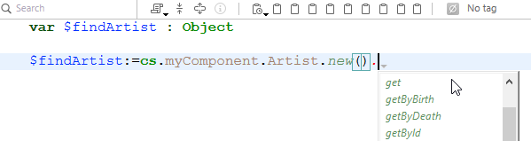

Un composant 4D est un ensemble de fonctions, méthodes et de formulaires 4D représentant une ou plusieurs fonctionnalité(s) qu’il est possible [d’installer et d'utiliser dans des applications 4D](Concepts/components.md). Par exemple, vous pouvez développer un composant 4D de courrier électronique gérant tous les aspects de l’envoi, la réception et le stockage d’emails au sein des applications 4D.

Vous pouvez développer des composants 4D pour vos propres besoins et les garder privés. Vous pouvez également [partager vos composants avec la communauté 4D](https://github.com/topics/4d-component).

## Définitions

- **Projet utilisé comme matrice** : Projet 4D utilisé pour le développement du composant. C'est un projet standard, sans attribut spécifique. Il constitue un seul composant.
- **Projet hôte :** projet dans lequel un composant est installé et utilisé.
- **Composant** : Projet de matrice qui peut être compilé et [construit](Desktop/building.md#build-component), [installé dans l'application hôte](../Project/components.md#basics) et dont le contenu est utilisé dans l'application hôte.

## Principes de base

La création et l’installation des composants 4D s’effectuent directement depuis 4D :

- Pour utiliser un composant, il suffit de [l'installer dans votre application](../Project/components.md#basics).
- Un projet peut être à la fois "matrice" et "hôte", c'est-à-dire qu'un projet utilisé comme matrice peut lui-même utiliser un ou plusieurs composants. En revanche, un composant ne peut pas lui-même utiliser de "sous-composants".
- Un composant peut appeler la plupart des éléments 4D : des classes, des fonctions, des méthodes projet, des formulaires projet, des barres de menus, des listes à choix multiples, etc. Il ne peut pas appeler des méthodes base et des triggers.
- Il n’est pas possible d’exploiter le datastore, des tables standard ou des fichiers de données dans les composants 4D. En revanche, un composant peut créer et/ou utiliser des tables, des champs et des fichiers de données via les mécanismes des bases externes. Les bases externes sont des bases 4D indépendantes manipulées via les commandes SQL.
- Un projet hôte fonctionnant en mode interprété peut utiliser des composants interprétés ou compilés. Un projet hôte fonctionnant en mode compilé ne peut pas utiliser de composants interprétés. Dans ce cas, seuls les composants compilés peuvent être utilisés.

## Portée des commandes du langage

Hormis les [commandes non utilisables](#unusable-commands), un composant peut utiliser toute commande du langage 4D.

Lorsqu'elles sont appelées depuis un composant, elles sont exécutées dans le contexte du composant, à l'exception de la commande [`EXECUTE METHOD`](https://doc.4d.com/4dv20/help/command/fr/page1007.html) et de la commande [`EXECUTE FORMULA`](https://doc.4d.com/4dv20/help/command/fr/page63.html) qui utilisent le contexte de la méthode spécifiée par la commande. A noter également que les commandes de lecture du thème “Utilisateurs et groupes” sont utilisables depuis un composant mais lisent les utilisateurs et les groupes du projet hôte (un composant n’a pas d’utilisateurs et groupes propres).

Les commandes [`SET DATABASE PARAMETER`](https://doc.4d.com/4dv20/help/command/fe/page7836.html) et [`Get database parameter`](https://doc.4d.com/4dv20/help/command/fe/page7837.html) sont une exception : leur portée est globale à l'application. Lorsque ces commandes sont appelées depuis un composant, elles s’appliquent au projet d'application hôte.

Par ailleurs, des dispositions spécifiques sont définies pour les commandes `Structure file` et `Get 4D folder` lorsqu’elles sont utilisées dans le cadre des composants.

La commande [`COMPONENT LIST`](https://doc.4d.com/4dv20/help/command/fr/page1001.html) permet de connaître la liste des composants chargés par le projet hôte.

### Commandes non utilisables

Les commandes suivantes ne sont pas compatibles avec une utilisation dans le cadre d’un composant car elles modifient le fichier de structure — ouvert en lecture. Leur exécution dans un composant provoque l’erreur -10511, “La commande NomCommande ne peut pas être appelée depuis un composant” :

- `ON EVENT CALL`
- `Method called on event`
- `SET PICTURE TO LIBRARY`
- `REMOVE PICTURE FROM LIBRARY`
- `SAVE LIST`
- `ARRAY TO LIST`
- `EDIT FORM`
- `CREATE USER FORM`
- `DELETE USER FORM`
- `CHANGE PASSWORD`
- `EDIT ACCESS`
- `Set group properties`
- `Set user properties`
- `DELETE USER`
- `CHANGE LICENSES`
- `BLOB TO USERS`
- `SET PLUGIN ACCESS`

**Notes :**

- La commande `Current form table` retourne `Nil` lorsqu’elle est appelée dans le contexte d’un formulaire projet. Par conséquent, elle ne peut pas être utilisée dans un composant.
- Les commandes de langage de définition de données SQL (`CREATE TABLE`, `DROP TABLE`, etc.) ne peuvent pas être utilisées dans le projet de composant. Elles sont néanmoins prises en charge avec des bases de données externes (voir la commande SQL `CREATE DATABASE`).

## Partage des méthodes projet

Toutes les méthodes projet d’un projet utilisé comme matrice sont par définition incluses dans le composant (le projet est le composant), ce qui signifie qu’elles peuvent être appelées et exécutées dans le composant.

En revanche, par défaut ces méthodes projet ne seront ni visibles ni appelables par le projet hôte. Dans le projet matrice, vous devez désigner explicitement les méthodes que vous souhaitez partager avec le projet hôte et ses composants en cochant la case **Partagée entre composants et projet hôte** dans la boîte de dialogue des propriétés de la méthode :


Les méthodes projet partagée peuvent être appelées dans le code du projet hôte (mais elles ne peuvent pas être modifiées dans l'éditeur de code du projet hôte). Ces méthodes constituent les **points d’entrée** du composant.

A l’inverse, pour des raisons de sécurité, par défaut un composant ne peut pas exécuter de méthode projet appartenant au projet hôte. Dans certains cas, vous pourrez avoir besoin d’autoriser un composant à accéder à des méthodes projet de votre projet hôte. Pour ce faire, vous devez explicitement désigner les méthodes projet du projet hôte que vous souhaitez rendre accessibles aux composants (dans les propriétés de la méthode, cochez la case **Partagée entre composants et projet hôte**).


Une fois que les méthodes projet des projets hôtes sont disponibles pour les composants, vous pouvez exécuter une méthode du projet hôte à partir d'un composant en utilisant la commande [`EXECUTE FORMULA`](https://doc.4d.com/4dv20/help/command/en/page63.html) ou la commande [`EXECUTE METHOD`](https://doc.4d.com/4dv20/help/command/en/page1007.html). Par exemple :

```4d
// Méthode hôte
component_method("host_method_name")
```

```4d
// component_method
#DECLARE ($param : Text)
EXECUTE METHOD($param)
```

> Vous pouvez compiler ou effectuer une vérification syntaxique dans une base hôte interprétée qui contient des composants interprétés si elle n'appelle pas de méthodes du composant interprété. Dans le cas contraire, une boîte de dialogue d'avertissement apparaît lorsque vous tentez de lancer la compilation ou un contrôle syntaxique et il n'est pas possible d'effectuer l'opération.\
> N'oubliez pas qu'une méthode interprétée peut appeler une méthode compilée, mais pas l'inverse, sauf via l'utilisation des commandes `EXECUTE METHOD` et `EXECUTE FORMULA`.

## Partage des classes

Par défaut, les classes de composants ne peuvent pas être appelées à partir de l'éditeur de code 4D du projet hôte. Si vous voulez que vos classes de composants soient exposées dans le projet hôte et ses composants chargés, vous devez **déclarer un namespace de composant**. En outre, vous pouvez contrôler la manière dont les classes de composants sont suggérées dans l'éditeur de code de l'hôte.

### Déclaration du namespace

Pour permettre aux classes de votre composant d'être exposées dans les projets hôtes et leurs composants chargés, saisissez une valeur dans l'option [**namespace du composant dans le class store** de la page Général](../settings/general.md#component-namespace-in-the-class-store) des paramètres du projet matrice. Par défaut, l'espace est vide : les classes du composant ne sont pas disponibles en dehors du contexte du composant.


:::note

Un _namespace_ garantit qu'aucun conflit n'émerge lorsqu'un projet hôte utilise différents composants dont les classes ou les fonctions ont des noms identiques. Un namespace doit être conforme aux [règles de dénomination des propriétés](../Concepts/identifiers.md#object-properties).

:::

Lorsque vous entrez une valeur, vous déclarez que les classes de composants seront disponibles dans le [user class store (**cs**)](../Concepts/classes.md#cs) du projet hôte ainsi que dans ses composants chargés, à travers le namespace `cs.<value>`. Par exemple, si vous entrez "eGeometry" comme namespace, en supposant que vous avez créé une classe `Rectangle` contenant une fonction `getArea()`, une fois votre projet installé comme composant, le développeur du projet hôte peut écrire :

```4d
//dans le projet hôte ou l'une de ses composantes
var $rect: cs.eGeometry.Rectangle
$rect:=cs.eGeometry.Rectangle.new(10;20)
$area:=$rect.getArea()
```

:::info

Le namespace d'un composant [compilé](#protection-of-components-compilation) est ajouté entre parenthèses après le nom du composant dans la [page Méthodes composant](../Concepts/components.md#utiliserlescomposants) des projets hôtes :


:::

Bien entendu, il est recommandé d'utiliser un nom distinctif pour éviter tout conflit. Si une classe utilisateur portant le même nom que le namespace d'un composant qui existe déjà dans le projet, la classe utilisateur est prise en compte et les classes de composants sont ignorées.

Les classes ORDA d'un composant ne sont pas disponibles dans le projet hôte. Par exemple, s'il existe une dataclass nommée Employees dans votre composant, vous ne pourrez pas utiliser une classe "cs.Mycomponent.Employee" dans le projet hôte.

### Classes cachées

Comme dans tout projet, vous pouvez créer des classes et des fonctions cachées dans le composant en préfixant les noms par un caractère de soulignement ou ("_"). Lorsqu'un [namespace est défini](#declaring-the-component-namespace), les classes et fonctions cachées du composant n'apparaîtront pas comme des suggestions lors de l'utilisation de la complétion de code.

Notez cependant qu'elles peuvent toujours être utilisées si vous connaissez leurs noms. Par exemple, la syntaxe suivante est valable même si la classe `_Rectangle` est cachée :

```4d
$rect:=cs.eGeometry._Rectangle.new(10;20)
```

> Les fonctions non cachées à l'intérieur d'une classe cachée apparaissent comme des suggestions lorsque vous utilisez la complétion de code avec une classe qui en [hérite](../Concepts/classes.md#inheritance). Par exemple, si un composant possède une classe `Teacher` qui hérite d'une classe `_Person`, la complétion de code pour `Teacher` suggère des fonctions non cachées de `_Person`.

## Complétion de code pour les composants compilés

Pour rendre votre composant plus facile à utiliser pour les développeurs, vous pouvez cocher l'option [**Générer le fichier de syntaxe pour l'auto-complétion à la compilation** dans la page Général](../settings/general.md#component-namespace-in-the-class-store) des propriétés du projet matrice.

Un fichier de syntaxe (format JSON) est alors automatiquement créé lors de la phase de compilation, rempli avec la syntaxe des classes, fonctions et [méthodes exposées](#sharing-of-project-methods) de votre composant, et placé dans le dossier `\Resources\en.lproj` du projet du composant. 4D utilise le contenu de ce fichier syntaxique pour générer une aide contextuelle dans l'éditeur de code, telle que la complétion de code et la syntaxe des fonctions :




Si vous ne saisissez pas de [namespace](#declaring-the-component-namespace), les ressources des classes et des méthodes 'exposed' ne sont pas générées, même si l'option de fichier de syntaxe est cochée.

## Passage de variables

Les composants et les projets hôtes ne partagent pas de variables locales, process ou interprocess. La seule façon de modifier les variables de composants du projet hôte et vice versa est d'utiliser des pointeurs.

Exemple utilisant un tableau :

```4d
//Dans le projet hôte :
    ARRAY INTEGER(MyArray;10)
    AMethod(->MyArray)

//Dans le composant, la méthode projet UneMéthode contient : 
     APPEND TO ARRAY($1->;2)
```

Exemples utilisant des variables :

```4d
C_TEXT(myvariable)
component_method1(->myvariable)
```

```4d
C_POINTER($p)
$p:=component_method2(...)
```

Sans pointeur, un composant peut toujours accéder à la valeur d'une variable de base hôte (mais pas à la variable elle-même) et vice versa :

```4d
//Dans la base hôte
C_TEXT($input_t)
$input_t:="DoSomething"
component_method($input_t)
// component_method obtient "DoSomething" in $1 (mais pas la variable $input_t)
```

L’utilisation de pointeurs pour faire communiquer les composants et le projet hôte nécessite de prendre en compte les spécificités suivantes :

- La commande `Get pointer` ne retournera pas un pointeur vers une variable du projet hôte si elle est appelée depuis un composant et inversement.

- L'architecture des composants permet la coexistence, au sein du même projet interprété, de composants à la fois interprétés et compilés (inversement, seuls des composants compilés peuvent être utilisés dans un projet compilé). L’usage de pointeurs dans ce cas doit respecter le principe suivant : l’interpréteur peut dépointer un pointeur construit en mode compilé mais à l’inverse, en mode compilé, il n’est pas possible de dépointer un pointeur construit en mode interprété.
  Illustrons ce principe par l’exemple suivant : soient deux composants, C (compilé) et I (interprété) installés dans le même projet hôte.

- Si le composant C définit la variable `mavarC`, le composant I peut accéder à la valeur de cette variable en utilisant le pointeur `->mavarC`.

- Si le composant I définit la variable `mavarI`, le composant C ne peut pas accéder à cette variable en utilisant le pointeur `->mavarI`. Cette syntaxe provoque une erreur d’exécution.

- La comparaison des pointeurs en utilisant la commande `RESOLVE POINTER` n'est pas recommandée avec les composants, car le principe de partitionnement des variables permet la coexistence de variables ayant le même nom mais avec un contenu radicalement différent dans un composant et le projet hôte (ou un autre composant). Le type de la variable peut même être différent dans les deux contextes. Si les pointeurs `monptr1` et `monptr2` pointent chacun sur une variable, la comparaison suivante produira un résultat erroné :

```4d
     RESOLVE POINTER(monptr1;vNomVar1;vnumtable1;vnumchamp1)
      RESOLVE POINTER(monptr2;vNomVar2;vnumtable2;vnumchamp2)
      If(vNomVar1=vNomVar2)
       //Ce test retourne Vrai alors que les variables sont différentes
```

Dans ce cas, il est nécessaire d’utiliser la comparaison de pointeurs :

```4d
     If(monptr1=monptr2) //Ce test retourne Faux
```

## Gestion des erreurs

Une [méthode de gestion d'erreurs](Concepts/error-handling.md) installée par la commande `ON ERR CALL` s'applique à l'application en cours d'exécution uniquement. En cas d'erreur générée par un composant, la méthode d'appel sur erreur `ON ERR CALL` du projet hôte n'est pas appelée, et inversement.

## Accès aux tables du projet hôte

Bien que les composants ne puissent pas utiliser de tables, les pointeurs permettent au projet hôte et au composant de communiquer. Par exemple, voici une méthode pouvant être appelée depuis un composant :

```4d
// appeler une méthode composant
methCreateRec(->[PERSONNES];->[PERSONNES]Nom;"Julie Andrews")
```

Dans le composant, le code de la méthode `methCreateRec` :

```4d
C_POINTER($1) //Pointeur vers une table du projet hôte
C_POINTER($2) //Pointeur vers un champ du projet hôte
C_TEXT($3) // Valeur à insérer

$tablepointer:=$1
$fieldpointer:=$2
CREATE RECORD($tablepointer->)

$fieldpointer->:=$3
SAVE RECORD($tablepointer-
```

> Dans le contexte d'un composant, 4D suppose qu'une référence à un formulaire table est une référence au formulaire table hôte (car les composants ne peuvent pas avoir de tables)

## Utilisation de tables et de champs

Un composant ne peut pas utiliser les tables et les champs définis dans la structure 4D du projet utilisé comme matrice. En revanche, il peut créer et utiliser des bases externes, et donc utiliser des tables et des champs en fonction de ses besoins. Les bases externes sont créées et gérées via le langage SQL. En revanche, il peut créer et utiliser des bases externes, et donc utiliser des tables et des champs en fonction de ses besoins. Utiliser une base externe signifie désigner temporairement cette base comme base courante, c’est-à-dire comme base cible des requêtes SQL exécutées par 4D. Les bases externes sont créées à l'aide de la commande SQL `CREATE DATABASE`.

### Exemple

Le code suivant est inclus dans un composant et effectue trois actions élémentaires avec une base de données externe :

- création de la base de données externe si elle n'existe pas déjà,
- ajout de données dans la base de données externe,
- lecture de données depuis la base de données externe.

Création de la base de données externe :

```4d
<>MyDatabase:=Get 4D folder+"\MyDB" // (Windows) stocke les données dans un répertoire autorisé
 Begin SQL
        CREATE DATABASE IF NOT EXISTS DATAFILE :[MyDatabase];
        USE DATABASE DATAFILE :[MyDatabase];
        CREATE TABLE IF NOT EXISTS KEEPIT
        (
        ID INT32 PRIMARY KEY,
        kind VARCHAR,
        name VARCHAR,
        code TEXT,
        sort_order INT32
        );

        CREATE UNIQUE INDEX id_index ON KEEPIT (ID);

        USE DATABASE SQL_INTERNAL;

 End SQL
```

Ecriture dans la base de données externe :

```4d
 $Ptr_1:=$2 // récupère les données à partir du projet hôte via des pointeurs
 $Ptr_2:=$3
 $Ptr_3:=$4
 $Ptr_4:=$5
 $Ptr_5:=$6
 Begin SQL

        USE DATABASE DATAFILE :[MyDatabase];

        INSERT INTO KEEPIT
        (ID, kind, name, code, sort_order)
        VALUES
        (:[$Ptr_1], :[$Ptr_2], :[$Ptr_3], :[$Ptr_4], :[$Ptr_5]);

        USE DATABASE SQL_INTERNAL;


 End SQL
```

Lecture dans une base de données externe :

```4d
 $Ptr_1:=$2 // accède aux données du projet hôte via des pointeurs
 $Ptr_2:=$3
 $Ptr_3:=$4
 $Ptr_4:=$5
 $Ptr_5:=$6

 Begin SQL

    USE DATABASE DATAFILE :[MyDatabase];

    SELECT ALL ID, kind, name, code, sort_order
    FROM KEEPIT
    INTO :$Ptr_1, :$Ptr_2, :$Ptr_3, :$Ptr_4, :$Ptr_5;

    USE DATABASE SQL_INTERNAL;

 End SQL
```

## Utilisation de formulaires

- Seuls les "formulaires projet" (formulaires non associés à une table en particulier) peuvent être exploités directement dans un composant. Tous les formulaires projet présents dans le projet matrice peuvent être utilisés par le composant.
- Un composant peut faire appel à des formulaires table du projet hôte. A noter qu’il est nécessaire dans ce cas d’utiliser des pointeurs plutôt que des noms de table entre [] pour désigner les formulaires dans le code du composant.

> Si un composant utilise la commande `ADD RECORD`, le formulaire Entrée courant du projet hôte sera affiché, dans le contexte du projet hôte. Par conséquent, si le formulaire comporte des variables, le composant n’y aura pas accès.

- Vous pouvez [publier des formulaires de composants en tant que sous-formulaires](../FormEditor/properties_FormProperties.md#published-as-subform) dans les projets hôtes. Avec ce principe, vous pouvez notamment développer des composants proposant des objets graphiques. Par exemple, les Widgets proposés par 4D sont basés sur l’emploi de sous-formulaires en composants.

> Dans le contexte d'un composant, tout formulaire projet référencé doit appartenir au composant. Par exemple, à l'intérieur d'un composant, le fait de référencer un formulaire projet hôte à l'aide de `DIALOG` ou de `Open form window` déclenchera une erreur.

## Utilisation de ressources

Les composants peuvent utiliser des ressources situées dans le dossier Ressources du composant.

Les mécanismes automatiques sont opérationnels : les fichiers XLIFF présents dans le dossier Resources d’un composant seront chargés par ce composant.

Dans un projet hôte contenant un ou plusieurs composants, chaque composant ainsi que les projets hôtes ont leur propre «chaîne de ressources» Les ressources sont réparties entre les différents projets : il n'est pas possible d'accéder aux ressources du composant A à partir du composant B ou du projet hôte.

## Exécution du code d'initialisation

Un composant peut exécuter automatiquement du code 4D lors de l'ouverture ou de la fermeture de la base hôte, par exemple pour charger et/ou sauvegarder les préférences ou les états utilisateur liés au fonctionnement de la base hôte.

L'exécution du code d'initialisation ou de fermeture se fait au moyen de la méthode base `On Host Database Event`.

> Pour des raisons de sécurité, vous devez autoriser explicitement l'exécution de la méthode base `On Host Database Event` dans la base hôte afin de pouvoir l'appeler. Pour ce faire, vous devez cocher l'option [**Exécuter la méthode "Sur événement base hôte" des composants**](../settings/security.md#options) dans la page Sécurité des Propriétés du projet.

## Protection des composants : la compilation

Par défaut, tout le code d’un projet utilisé comme matrice installé comme composant est virtuellement visible depuis le projet hôte. En particulier :

- Les méthodes projet partagées sont accessibles dans la Page Méthodes de l’Explorateur et peuvent être appelées dans les méthodes du projet hôte. Leur contenu peut être sélectionné et copié dans la zone de prévisualisation de l’Explorateur. Elles peuvent également être visualisées dans le débogueur. Cependant, il n'est pas possible de les ouvrir dans l'éditeur de code ou de les modifier.
- Les autres méthodes projet du projet utilisé comme matrice n’apparaissent pas dans l’Explorateur mais peuvent également être visualisées dans le débogueur du projet hôte.
- Les classes et fonctions non cachées peuvent être visualisées dans le débogueur [si un namespace est déclaré](#declaring-the-component-namespace).

Pour assurer la protection du code d'un composant, [compilez et générerez](Desktop/building.md#build-component) simplement le projet utilisé comme matrice et fournissez-le sous forme de fichier .4dz. Lorsqu’un projet compilé utilisé comme matrice est installé comme composant :

- Les méthodes projet, classes et fonctions partagées peuvent être appelées dans les méthodes du projet hôte et sont également visibles dans la page Méthodes de l'explorateur. En revanche, leur contenu n’apparaît pas dans la zone de prévisualisation ni dans le débogueur.
- Les autres méthodes projet du projet utilisé comme matrice n’apparaissent jamais.

## Partage des composants

Nous vous encourageons à soutenir la communauté des développeurs 4D en partageant vos composants, de préférence sur la [plateforme GitHub](https://github.com/topics/4d-component). Afin d'être correctement référencé, nous vous recommandons d'utiliser le "topic" **`4d-component`**.
