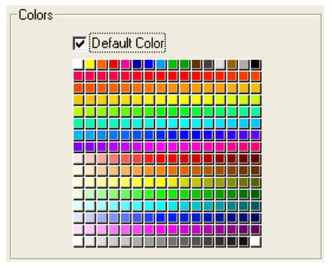

Une grille de boutons est un objet transparent placé sur une image. L’image doit correspondre à la forme d’un tableau. Lorsque l'utilisateur clique sur un graphique, ce dernier aura un aspect comprimé :

Vous pouvez utiliser une grille de boutons pour déterminer où l’utilisateur clique dans l’image. Votre méthode objet utilise alors l’événement `Sur clic` et gère les actions suivant l’emplacement du clic souris.

## Créer une grille de boutons

Pour créer une grille de boutons, placez une image d’arrière-plan puis dessinez une grille de boutons par dessus. Spécifiez le nombre de [lignes](properties_Crop.md#rows) et de [colonnes](properties_Crop.md#columns).

4D utilise une grille de boutons pour les palettes de couleurs :

## Utiliser une grille de boutons

Les boutons de la grille sont numérotés de gauche à droite et de haut en bas, à partir de l’angle supérieur gauche vers l’angle inférieur droit. Dans cet exemple, la grille est dotée de 16 rangées et 16 colonnes. Le bouton situé en haut à gauche est le bouton n° 1. Le dernier bouton de la deuxième rangée est le bouton n° 32.
Si aucun élément n'est sélectionné, la valeur est de 0

### Aller à page

Vous pouvez assigner l'[action standard](https://doc.4d.com/4Dv17R5/4D/17-R5/Standard-actions.300-4163633.en.html) `gotoPage` à une grille de boutons. Lorsque cette action est activée, 4D affiche automatiquement la page du formulaire correspondant au numéro du bouton sélectionné dans la grille de boutons. Par exemple, si l’utilisateur clique sur le 10e bouton de la grille, 4D affichera la page 10 du formulaire courant (si elle existe).

## Propriétés prises en charge

[Style de bordure](properties_BackgroundAndBorder.md#border-line-style) - [Bas](properties_CoordinatesAndSizing.md#bottom) - [Classe](properties_Object.md#css-class) - [Colonnes](properties_Crop.md#columns) - [Hauteur](properties_CoordinatesAndSizing.md#height) - [Conseil d'aide](properties_Help.md#help-tip) - [Dimensionnement horizontal](properties_ResizingOptions.md#horizontal-sizing) - [Gauche](properties_CoordinatesAndSizing.md#left) - [Nom de l'objet](properties_Object.md#object-name) - [Droite](properties_CoordinatesAndSizing.md#right) - [Lignes](properties_Crop.md#rows) - [Action standard](properties_Action.md#standard-action) - [Haut](properties_CoordinatesAndSizing.md#top) - [Type](properties_Object.md#type) - [Variable ou expression](properties_Object.md#variable-or-expression) - [Dimensionnement vertical](properties_ResizingOptions.md#vertical-sizing) - [Largeur](properties_CoordinatesAndSizing.md#width) - [Visibilité](properties_Display.md#visibility)
